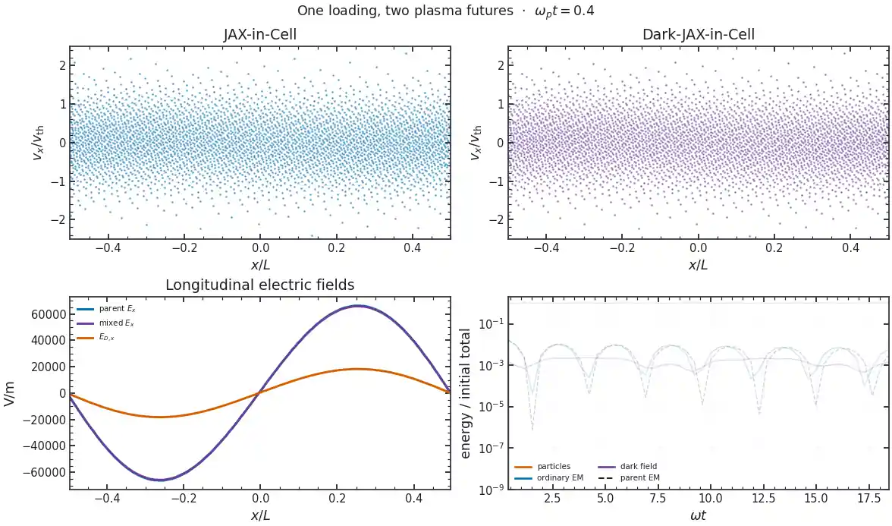

# 🌑 Dark-JAX-in-Cell

[](LICENSE)
[](https://github.com/uwplasma/Dark-JAX-in-Cell/actions/workflows/test.yml)
[](https://github.com/uwplasma/Dark-JAX-in-Cell/commits/main)
[](pyproject.toml)
[](https://github.com/uwplasma/JAX-in-Cell/pull/42)

**Differentiable Maxwell–Proca particle-in-cell simulation on CPUs and GPUs.** Dark-JAX-in-Cell adds a massive vector field to [JAX-in-Cell](https://github.com/uwplasma/JAX-in-Cell)'s 1D3V electromagnetic PIC. Charged particles create both fields and feel their combined Lorentz force. The parent supplies loading, charge-conserving deposition, gathering, Boris pushing, ordinary Maxwell evolution, diagnostics and restart machinery; the extra physics stays in this small companion package.



*The same loaded electrons evolve with and without a dynamical dark field. This [movie](docs/_static/movies/phase_space/run.json) uses 128 cells, 32,768 particles (3,641 plotted per panel) and about 16 stored frames per plasma cycle. An 8,192-particle replay changes the first-mode histories by 2.3–2.5% RMS; the fitted results below use their own full presets.*

## Features

- Self-consistent longitudinal and transverse Maxwell–Proca fields, with potentials, both Gauss laws and a closed energy ledger.
- End-to-end JAX gradients through particle loading, fields and trajectories; CPU and GPU execution.
- TOML, CLI and Python runs with complete particle and field restart; matched parent controls and independent analytic checks.

## Install and run

```sh
git clone https://github.com/uwplasma/Dark-JAX-in-Cell.git
cd Dark-JAX-in-Cell
python -m pip install -e .
darkjaxincell examples/input.toml --steps 160 --save artifacts/cold_run
```

The default JAX installation runs on a CPU. For a GPU, install the appropriate accelerator-enabled [JAX wheel](https://docs.jax.dev/en/latest/installation.html) first; `jax.devices()` shows the selected backend. The forward solver and a density gradient have been exercised on an NVIDIA RTX A4000. The [TOML input](examples/input.toml) uses JAX-in-Cell's tables plus `[dark]`; CLI flags override steps, seed, mixing and mass frequency. `--save` writes a complete restart and provenance. From Python:

```python
from darkjaxincell import load_toml

simulation, run = load_toml("examples/input.toml")
output = simulation.run(**run)
print("🌘 dark Gauss residual:", abs(output.dark_gauss()).max())
print("🦇 closed energy:", output.energy()["total_with_dark"][-1])
```

## Equations and scope

With mixing strength $\eta$ and dark rest frequency $\Omega_D$, the massive field obeys

$$
\begin{aligned}
\partial_t\mathbf E_D &= c^2\nabla\times\mathbf B_D+\Omega_D^2\mathbf A_D-\eta\mathbf J/\epsilon_0,\\
\partial_t\mathbf B_D &= -\nabla\times\mathbf E_D,\\
\nabla\cdot\mathbf E_D+\Omega_D^2\phi_D/c^2 &= \eta\rho_{\rm total}/\epsilon_0.
\end{aligned}
$$

Particles feel $q[\mathbf E+\eta\mathbf E_D+\mathbf v\times(\mathbf B+\eta\mathbf B_D)]$. The ordinary and dark Gauss laws share the same neutralizing background, and the physical mean current remains in both Ampère updates. For a closed run, the diagnostic includes particle kinetic energy and

$$
U_{\rm fields}=\frac{\epsilon_0}{2}\int\left(|\mathbf E|^2+c^2|\mathbf B|^2+|\mathbf E_D|^2+c^2|\mathbf B_D|^2+\Omega_D^2\left[|\mathbf A_D|^2+\phi_D^2/c^2\right]\right)dx.
$$

A prescribed dark drive is a separate external-force control with a work ledger; it has no finite dark reservoir. The supported solver is periodic explicit 1D3V PIC without collisions or absorbing Proca boundaries. [Physics and staggering](docs/physics.md) give the full equations and units.

## Cold exchange: a known answer

A homogeneous transverse dark field drives a cold electron plasma. The full [example](examples/dark_photon.py) follows the ordinary and dark mean fields through $\omega_0t=20$ and compares both with an independent four-state matrix exponential. The largest field error is **$2.922\times10^{-4}$** of the initial dark field; closed-energy drift is **$8.705\times10^{-5}$**. This checks the coupling, mean current and potential-energy ledger before kinetic effects enter. [Settings and arrays](docs/_static/figures/cold_exchange/run.json) are saved with the figure.


## Kinetic Landau response

A seeded Maxwellian tests a damped mode, using the same initial particles in the parent and mixed runs. For $s=\omega^2-c^2k^2$, the independent Vlasov–Proca root solves $(s-\Omega_D^2)(1+\chi_L)+\eta^2s\chi_L=0$. The full PIC fit gives $\omega/\omega_p=1.43207-0.14576i$ against the mixed root $1.43695-0.14186i$; the parent gives $1.41195-0.15338i$ against $1.41566-0.15336i$. The fitted envelope ends at a measured late floor, so it is not extended into the nonlinear/noisy tail. See the [full fit and limits](docs/kinetic.md) and [run record](docs/_static/figures/mixed_kinetic/run.json).


## Two streams: growth and a long-time limit

Two current-neutral cold electron beams grow at $0.33228\omega_p$ in JAX-in-Cell and $0.34069\omega_p$ with the dark field; independent cold roots give $0.33847$ and $0.34670$. After trapping, a [five-case grid/particle/timestep check](docs/_static/figures/two_stream_saturation/run.json) finds dark closed-energy drift of **0.680%** at 64 cells and **0.190%** at 128 cells at fixed timestep. At $120\leq\omega_pt\leq200$, a [four-case replay](docs/_static/figures/two_stream_extended/run.json) finds that the dark-minus-parent first-mode RMS changes from **−5.2%** on 128 cells to **+14.9%** on 256 cells at the *same* timestep. Thus the late difference has not converged, even in sign; a small energy drift alone does not settle it. The [full comparison](docs/kinetic.md) states the loading and windows.


## Conservation and long-time clocks

The [source-free Proca comparison](docs/scripts/benchmark_time_integrators.py) evolves longitudinal and transverse fields to $\Omega_Dt=200$ against a matrix exponential. The explicit split bounds field-energy error at **2.37%** for $\Delta t\Omega_D=0.2$ and **0.577%** at half that step. Implicit midpoint preserves this vacuum field energy to roundoff but has **1.53** final relative state error at the larger step; DOP853 reaches **$3.0\times10^{-8}$** state error with tight tolerances. Phase accuracy and total PIC energy require separate checks: exact field-only conservation does not close the particle–field work ledger. [Methods and timings](docs/performance.md#which-clock-to-trust) and the [full record](docs/_static/figures/time_integrators/run.json) give the comparison.


## Differentiate and optimize a physical objective

JAX derivatives pass through particle loading and weights, fields, the PIC run and the measured objective. The [density calibration](examples/optimize_dark_photon.py) maximizes coherent electric plus cold bulk energy on one fixed physical interval, with $p=n/n_{\rm ref}$:

$$
\mathcal C(p)=\frac1{30}\int_{45}^{75}\left[\left(\frac{E_y}{D_0}\right)^2+\frac1p\left(\frac{J_y}{\epsilon_0\omega_0D_0}\right)^2\right]d(\omega_0t).
$$

The full PIC optimum is **$p=1.0016225$**; an independent cold matrix exponential and Fréchet derivative give **$1.0016317$**. Finite differences and time refinement check the PIC gradient. This is a known-answer optimization, not a fitted target. [Methods and limits](docs/optimization.md) and the [full run](docs/_static/figures/density_calibration/run.json) give the error measures. To evaluate the same differentiable objective:

```python
from examples.optimize_dark_photon import build_objective

objective, value_and_gradient, steps = build_objective(16, 64, 45, 75)
value, density_gradient = value_and_gradient(0.97)
```


## A finite dark packet crosses a designed slab

The [profile example](examples/dark_profile.py) keeps the slab's total electron column fixed while changing four smooth density weights. It measures **outgoing ordinary-photon flux at a detector**, rather than a homogeneous field amplitude. A JAX gradient design raises the held-out photon-energy fraction from **0.0020826** to **0.0021179**; a finer particle/grid replay gives a **1.81–1.82%** relative gain. An independent cold scattering solve predicts the same ordering. Finite-amplitude kinetic replay changes the yield but finds **no reliable additional gain** from re-optimization. This extends the tested setting from cold wave conversion and prescribed drives to a finite, self-consistent reservoir and a kinetic objective; it makes no detector or priority claim. See [constraints, reference and replay](docs/profile.md).


*The [packet movie](docs/_static/movies/slab_packet/run.json) uses 512 cells, about 26 cells across the slab, 256 particles per basis per species and 80 stored frames. It shows propagation; the full optimization record carries the flux and convergence claims.*

## Other checks and related codes

The [examples](examples/) also test all three vacuum polarizations, oblique magnetized 3V response, a transverse-anisotropy mode, a prescribed-drive control, mobile ions and complete restart. [Validation](docs/validation.md) separates each resolved result from open convergence work. In particular, the [Hook–Huang–Shalaby study](https://doi.org/10.1103/98cx-7t43) uses high-order PIC with mobile ions and a prescribed homogeneous dark drive; our short finite-reservoir control has not reproduced its long heating curve. [Corelli *et al.*](https://arxiv.org/abs/2410.16357) study cold-fluid wave conversion at multiple crossings, while [Caputo *et al.*](https://github.com/smsharma/dark-photons-perturbations) provide inhomogeneous-universe conversion notebooks.

| Documented feature | This code | [JAX-in-Cell](https://github.com/uwplasma/JAX-in-Cell/tree/83d327118163833f93e2588edcb5029241f6ba2a) | [PIConGPU](https://github.com/ComputationalRadiationPhysics/picongpu) | [Caputo *et al.* notebooks](https://github.com/smsharma/dark-photons-perturbations) |
|---|:---:|:---:|:---:|:---:|
| Self-consistent charged-particle PIC | ✅ | ✅ | ✅ | ❌ |
| Finite massive-vector field sourced by PIC current | ✅ | ❌ | ❌ | ❌ |
| Inhomogeneous dark-photon conversion model | ✅ | ❌ | ❌ | ✅ |
| Gradients through the PIC trajectory | ✅ | ✅ | ❌ | ❌ |
| Constrained PIC-gradient profile design | ✅ | ❌ | ❌ | ❌ |
| CPU and GPU execution | ✅ | ✅ | ✅ | ❌ |
| Complete particle/field restart | ✅ | ✅ | ✅ | ❌ |

✅ means the linked implementation documents the feature; ❌ means it does not provide that feature in its reviewed scope. The codes solve different problems: PIConGPU is a large-scale multidimensional Maxwell PIC, while the Caputo notebooks calculate cosmological conversion without kinetic particles. The [literature and method comparison](docs/validation.md#other-numerical-approaches) gives more context.

Regenerate full figures, records and measured documentation with `python docs/scripts/make_all.py`. Regenerate the two compressed README loops with `python docs/scripts/make_movies.py` after `python -m pip install -e '.[media]'`. Quick presets are smoke tests, not the full evidence quoted above.

MIT licensed. JAX-in-Cell and its human contributors retain upstream authorship and licenses. The parent [draft PR #42](https://github.com/uwplasma/JAX-in-Cell/pull/42) remains separate.
