# 🌑 Dark-JAX-in-Cell

[](LICENSE)
[](https://github.com/uwplasma/Dark-JAX-in-Cell/actions/workflows/test.yml)
[](https://github.com/uwplasma/Dark-JAX-in-Cell/commits/main)
[](pyproject.toml)
[](https://github.com/uwplasma/JAX-in-Cell/pull/42)

**Differentiable Maxwell–Proca particle-in-cell simulation on CPUs and GPUs.** Dark-JAX-in-Cell adds a massive vector field to [JAX-in-Cell](https://github.com/uwplasma/JAX-in-Cell)'s 1D3V electromagnetic PIC. Charged particles create both fields and feel their combined Lorentz force. The parent supplies loading, charge-conserving deposition, gathering, Boris pushing, ordinary Maxwell evolution, diagnostics and restart machinery; the extra physics stays in this small companion package.

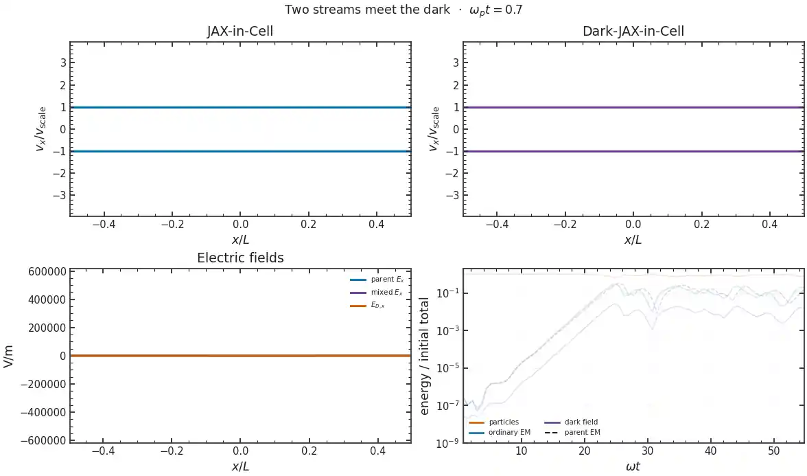

*Two cold electron streams start from identical particle arrays in both solvers. This 128-cell [movie](docs/_static/movies/two_stream/run.json) advances 262,144 particles (2,048 per cell) through ωₚt = 120, plots 8,192 per panel, and stores 6.3 frames per plasma period. Its 120-frame WebP is 2.9 MB. It illustrates trapping; the growth fit and long-time convergence limits use the separate runs below.*

[Movie script](docs/scripts/make_movies.py) · `full=True`, `movies=("two_stream",)`.

*The two-stream and bump movies are longitudinal, so their magnetic fields vanish by symmetry. The [slab movie](#a-finite-dark-packet-crosses-a-designed-slab) shows the evolving ordinary and dark electric **and** magnetic waves.*

## Features

- Self-consistent longitudinal and transverse Maxwell–Proca fields, with potentials, both Gauss laws and a closed energy ledger.
- End-to-end JAX gradients through particle loading, fields and trajectories; CPU and GPU execution.
- TOML, CLI and Python runs with complete particle and field restart; matched parent controls and independent analytic checks.

## Install and run

```sh
git clone https://github.com/uwplasma/Dark-JAX-in-Cell.git
cd Dark-JAX-in-Cell
python -m pip install -e .
darkjaxincell examples/input.toml --steps 160 --save artifacts/cold_run
```

For the figure and movie scripts, install `python -m pip install -e ".[media]"`. Companion scripts linked below each result place editable inputs after their imports. Run a script with `python examples/dark_photon.py`; set `full=True` for the published preset. Defaults are short smoke runs, with live progress and output under `artifacts/`. Batch studies pass the same input names through `runpy.run_path(..., run_name="__main__", init_globals={...})` and run one simulation process at a time.

The default JAX installation runs on a CPU. For a GPU, install the appropriate accelerator-enabled [JAX wheel](https://docs.jax.dev/en/latest/installation.html) first; `jax.devices()` shows the selected backend. The forward solver and a density gradient have been exercised on an NVIDIA RTX A4000 ([device smoke record](docs/_static/figures/gpu_smoke/run.json)). The [TOML input](examples/input.toml) uses JAX-in-Cell's tables plus `[dark]`; CLI flags override steps, seed, mixing and mass frequency. `--save` writes a complete restart and provenance. [GPU and gradient companion](examples/optimize_dark_photon.py) · `full=False`, `cells=8`, `particles=32`, `start=5`, `stop=12`.

From Python:

```python
from darkjaxincell import load_toml

simulation, run = load_toml("examples/input.toml")
output = simulation.run(**run)
print("🌘 dark Gauss residual:", abs(output.dark_gauss()).max())
print("🦇 closed energy:", output.energy()["total_with_dark"][-1])
```

## Equations and scope

With mixing strength $\eta$ and dark rest frequency $\Omega_D$, the massive field obeys

$$
\begin{aligned}
\partial_t\mathbf E_D &= c^2\nabla\times\mathbf B_D+\Omega_D^2\mathbf A_D-\eta\mathbf J/\epsilon_0,\\
\partial_t\mathbf B_D &= -\nabla\times\mathbf E_D,\\
\partial_t\mathbf A_D &= -\mathbf E_D-\nabla\phi_D,\\
\partial_t\phi_D &= -c^2\nabla\cdot\mathbf A_D,\\
\nabla\cdot\mathbf E_D+\Omega_D^2\phi_D/c^2 &= \eta\rho_{\rm total}/\epsilon_0.
\end{aligned}
$$

The ordinary fields obey $\partial_t\mathbf E=c^2\nabla\times\mathbf B-\mathbf J/\epsilon_0$, $\partial_t\mathbf B=-\nabla\times\mathbf E$ and $\nabla\cdot\mathbf E=\rho_{\rm total}/\epsilon_0$. Particles feel $q[\mathbf E+\eta\mathbf E_D+\mathbf v\times(\mathbf B+\eta\mathbf B_D)]$. Both Gauss laws use the same neutralizing background, and the physical mean current remains in both Ampère updates. For a closed run, the diagnostic includes particle kinetic energy and

$$
U_{\rm fields}=\frac{\epsilon_0}{2}\int\left(|\mathbf E|^2+c^2|\mathbf B|^2+|\mathbf E_D|^2+c^2|\mathbf B_D|^2+\Omega_D^2\left[|\mathbf A_D|^2+\phi_D^2/c^2\right]\right)dx.
$$

A prescribed dark drive is a separate external-force control with a work ledger; it has no finite dark reservoir. [Physics and staggering](docs/physics.md) give the full equations and units.

## Numerical method and constraints

The solver is periodic, explicit **1D3V PIC**: fields vary along one spatial coordinate, while particles carry three velocity components. JAX-in-Cell transfers charge and gathers fields with quadratic, three-cell weights by default; `Solver(shape_order=5)` selects six-cell quintic weights. Current deposition balances changing cell charge with current flowing across cell faces and preserves the box's physical mean current. A Boris push advances particles in the combined ordinary and dark Lorentz force. [Weighting and its SHARP comparison](docs/physics.md#particle-weighting) describe the optional scheme and its validation limits.

The ordinary electric and magnetic fields follow staggered Ampère and Faraday updates. Dark $\mathbf E_D,\mathbf A_D$ live on grid faces and $\mathbf B_D,\phi_D$ at cell centres; symmetric Proca kick and drift updates surround the particle push. Initialization projects the longitudinal dark electric field onto Gauss' law and reports the correction size. Charge-conserving current and compatible grid derivatives then carry both Gauss constraints through the run, while the potential update maintains $\mathbf B_D=\nabla\times\mathbf A_D$. The energy ledger includes particle, Maxwell and full Proca field and potential energies, referenced to the actual initial state; all-step conservation and Gauss maxima survive sparse output and restart. The examples use collisionless particles and unsmoothed sources. [Discrete equations, stability and measured energy drift](docs/physics.md) describe the scheme in detail.

## Conservation and the choice of timestep

The [coupled benchmark](docs/scripts/benchmark_pic_conservation.py) follows identical warm electron streams and mobile ions for $40/\omega_p$, using 24,576 particles. Ordinary explicit and implicit PIC solve the same Maxwell problem; the Proca rows add $\eta=0.3$, $\Omega_D=0.7\omega_p$. The closed energy includes the massive-field potentials above, and longitudinal momentum includes $\epsilon_0\Omega_D^2\int\phi_D A_{D,x}\,dx/c^2$.

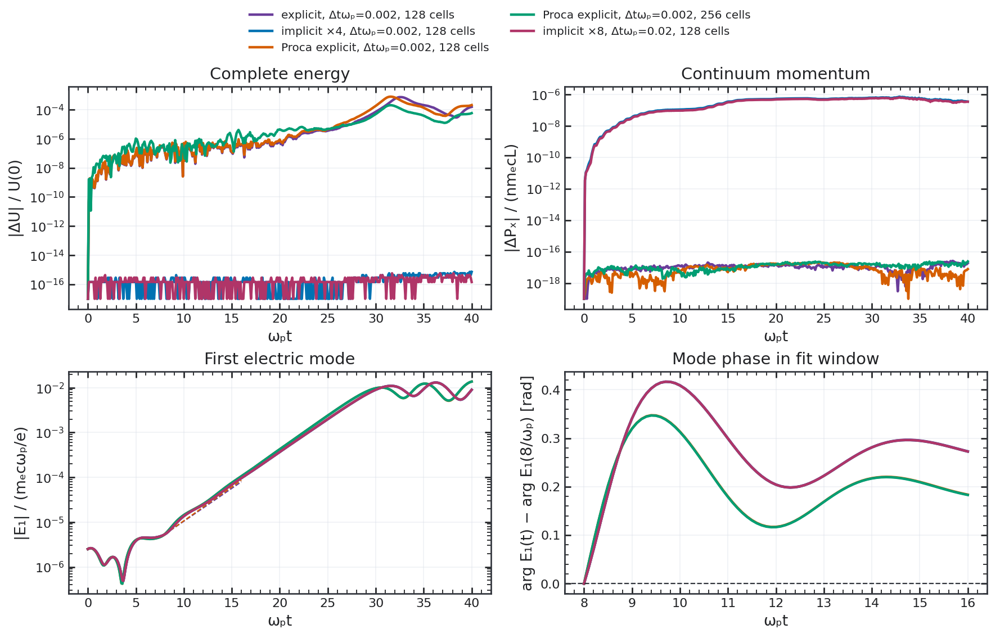

| Method | Cells | $\Delta t\omega_p$ | Maximum $\lvert\Delta U\rvert/U_0$ | Maximum $\lvert\Delta P\rvert/(nm_ecL)$ |
|---|---:|---:|---:|---:|
| Ordinary explicit | 128 | 0.002 | $7.46\times10^{-4}$ | $2.94\times10^{-17}$ |
| Ordinary implicit, four iterations | 128 | 0.002 | $8.53\times10^{-16}$ | $7.13\times10^{-7}$ |
| Proca explicit | 128 | 0.002 | $7.98\times10^{-4}$ | $2.34\times10^{-17}$ |
| Proca explicit | 256 | 0.002 | $2.06\times10^{-4}$ | $2.97\times10^{-17}$ |

Charge, continuity and both Gauss residuals remain below $4.6\times10^{-13}$ in their stated normalizations. The implicit energy/charge balance agrees with the [discrete-gradient PIC construction](https://arxiv.org/abs/1910.04000), while momentum has a finite error. On this GPU workload, four implicit iterations cost about five times the explicit run at the same step; a tenfold larger step recovers that cost, with phase and nonlinear accuracy still requiring validation. Proca total-energy error falls about fourfold on grid doubling; its much smaller dark-sector work defect falls fourfold on timestep halving. Spatial particle–mesh work dominates this short benchmark; the long driven case has a separate timestep check below. [All twelve rows, timings, phase accuracy and method limits](docs/performance.md#coupled-kinetic-methods).

[Benchmark script](docs/scripts/benchmark_pic_conservation.py) · `full=True`.

A [prescribed-drive implicit control](docs/performance.md#energy-balance-and-resolved-phase) follows 4,096 particles through $\omega_pt=1000$ with energy-minus-source-work defects below $3\times10^{-16}nm_ec^2L$. Halving the step reduces early waveform error fourfold. Its discrete velocity beams develop spatial modes, and momentum retains a finite defect; this control validates work balance and short-time derivatives, with late Maxwellian accuracy requiring separate tests.

[Companion benchmark](docs/scripts/benchmark_implicit_drive.py) · `cells=256`, `nodes=8`, `horizon=1000`, `dt=.02`; [full input sets](docs/scripts/make_all.py).

### Gaussian implicit control

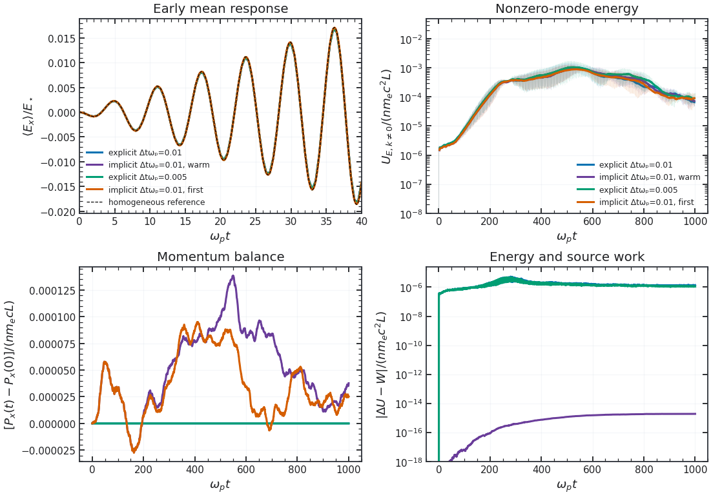

With the **206,000-particle Gaussian loading** of the resonant-drive case, the implicit energy/work defect is $1.90\times10^{-15}nm_ec^2L$, while momentum changes by $1.39\times10^{-4}nm_ecL$. Repeated calls to the same compiled solver differ by **12.3%** in nonzero-mode energy through $\omega_pt=1000$. The [matched fields, momentum, conservation and timings](docs/performance.md#gaussian-loading-and-a-fixed-compiled-solver) guide method selection alongside spatial and particle refinement. A separate [exact-state four/eight-iteration check](docs/performance.md#independent-implicit-orbit-and-iteration-checks) leaves early momentum drift unchanged; independent orbit and charge reconstruction verify the accepted impulse.

[Implicit simulation](docs/scripts/benchmark_implicit_drive.py) · `paper_loading=True`; [comparison and plot](docs/scripts/compare_replays.py) · `implicit=True` ([replay inputs](docs/scripts/make_all.py)).

### Mesh and orbit accuracy

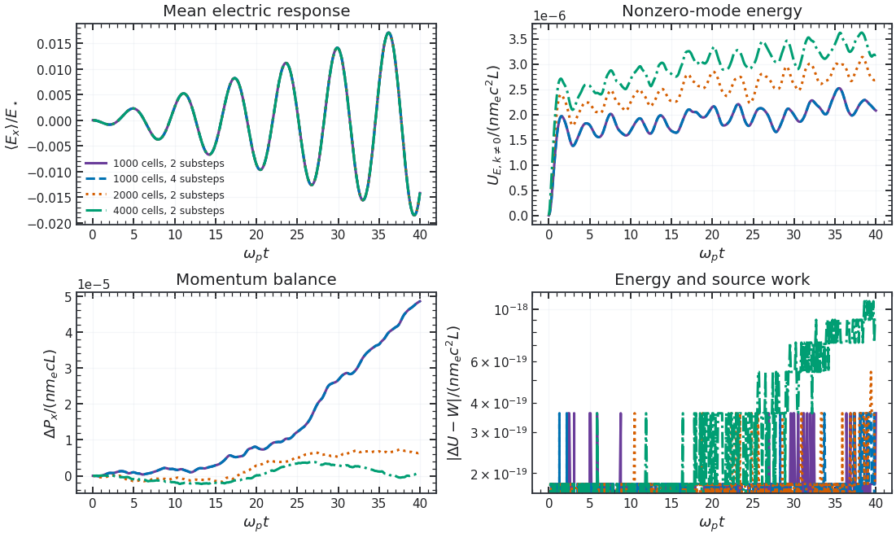

At fixed **206,000 particles**, $\Delta t\omega_p=0.01$ and $\omega_pt=40$, increasing orbit substeps from two to four doubles runtime while leaving momentum drift unchanged. Refining **1,000→2,000→4,000 cells** reduces its maximum from $4.86\times10^{-5}$ to $7.36\times10^{-6}$ to $3.83\times10^{-6}nm_ecL$; energy/work and Gauss remain near roundoff. Nonzero-mode energy still differs by **31.3% / 18.9%** between successive meshes. Conserved energy/Gauss with finite momentum drift also appears in [variational PIC, Figure 3](https://link.springer.com/article/10.1007/s10915-022-01781-3#Fig3), with different parameters. A converged late conversion curve remains open. [Parameters, raw arrays, independent checks and method limits](docs/performance.md#mesh-and-particle-substep-controls).

[Implicit simulation](docs/scripts/benchmark_implicit_drive.py) · `paper_loading=True`; [comparison and plot](docs/scripts/compare_replays.py) · `method_controls=True` ([four matched inputs](docs/scripts/make_all.py)).

### A force check between grid points

A neutral, periodic one-step test translates identical particles by zero, a quarter and half a grid cell. The ordinary explicit force cancels to roundoff. The implicit method conserves energy to roundoff but retains a phase-dependent net force: on 64 cells, the quarter-cell value is about $-2.25\times10^{-7}nm_ecL\omega_p$ at both tested timesteps. Independent orbit integration reproduces the accepted impulse. This **192-particle algorithm check** isolates a discrete force defect; the larger Gaussian studies above test its relevance to resolved plasma dynamics. [Raw rows, normalization and limits](docs/performance.md#fractional-cell-force-audit).

[Companion benchmark](docs/scripts/benchmark_pic_conservation.py) · `translations=True`, `particles=64`, `dt=.004`.

### Gaussian loading between grid points

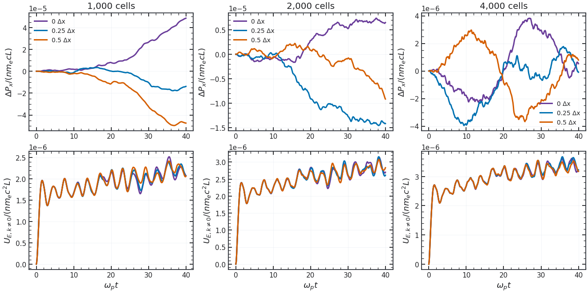

[Implicit simulation](docs/scripts/benchmark_implicit_drive.py) · `paper_loading=True`, `grid_phase=0`, `.25` or `.5`; [comparison and plot](docs/scripts/compare_replays.py) · `phase_controls` ([full inputs](docs/scripts/make_all.py)).

Nine controls translate the same **206,000-particle Gaussian loading** through fractions of a cell, with 1,000/2,000/4,000 cells, $\Delta t\omega_p=0.01$ and $\omega_pt\leq40$. Across the three translations, maximum momentum drift is **$4.96\times10^{-5}$ / $1.45\times10^{-5}$ / $3.96\times10^{-6}nm_ecL$** on those meshes. Energy/work remains at roundoff, while nonzero-mode energy changes by **1.81–4.30%** relative to zero translation. Identical-input repeats differ by at most $4.11\times10^{-8}$ in relative $L^2$ over this short window. Independent accepted-field orbit checks verify the impulse. These results resolve early mesh-phase sensitivity; [records, force norms and limits](docs/performance.md#gaussian-grid-phase-controls) give the accuracy gates for longer runs.

## Cold exchange: a known answer

A homogeneous transverse dark field drives a cold electron plasma. The full [example](examples/dark_photon.py) follows the ordinary and dark mean fields through $\omega_0t=20$ and compares both with an independent four-state matrix exponential. The largest field error is **$2.922\times10^{-4}$** of the initial dark field; closed-energy drift from the physical time-zero state is **$8.709\times10^{-5}$**. This checks the coupling, mean current and potential-energy ledger before kinetic effects enter. [Settings and arrays](docs/_static/figures/cold_exchange/run.json) are saved with the figure.

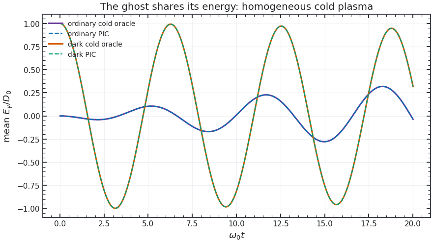

[Companion script](examples/dark_photon.py) · `full=True`.

## Kinetic Landau response

A seeded Maxwellian tests a damped mode, using the same initial particles in the parent and mixed runs. For $s=\omega^2-c^2k^2$, the independent Vlasov–Proca root solves $(s-\Omega_D^2)(1+\chi_L)+\eta^2s\chi_L=0$. The full PIC fit gives $\omega/\omega_p=1.43207-0.14576i$ against the mixed root $1.43695-0.14186i$; the parent gives $1.41195-0.15338i$ against $1.41566-0.15336i$. The fitted envelope ends at a measured late floor, so it is not extended into the nonlinear/noisy tail. See the [full fit and limits](docs/kinetic.md) and [run record](docs/_static/figures/mixed_kinetic/run.json).


[Companion script](examples/dark_kinetic.py) · `full=True`.

A clean-source [low-speed replay](docs/kinetic.md#a-physical-speed-landau-replay) fixes $\sigma/c=0.05$ and $\Omega_D=kc$ across three resolutions. With 128 cells and 160,000 particles, the mixed fit is **$1.42499-0.14522i$**, against **$1.43243-0.14580i$** from Vlasov–Proca theory; complete-energy drift stays below **$2.44\times10^{-7}$**. The smaller parent-to-dark damping difference remains sensitive to resolution and fit window. These runs replace a generator whose simulated and reference masses differed; [provenance and corrected fits](docs/kinetic.md#a-physical-speed-landau-replay) document the correction.


[Companion script](examples/dark_kinetic.py) · `physical=True`, `full=True`, `cells=128`, `particles=160000`, `steps=12000`.

## Two streams: growth and a long-time limit

Two current-neutral cold electron beams grow at $0.33228\omega_p$ in JAX-in-Cell and $0.34069\omega_p$ with the dark field; independent cold roots give $0.33847$ and $0.34670$. A Coulomb-plus-Yukawa reference explains **99.679%** of the analytic rate shift, identifying screening as the dominant linear effect in this case. After trapping, a [five-case grid/particle/timestep check](docs/_static/figures/two_stream_saturation/run.json) finds dark closed-energy drift of **0.680%** at 64 cells and **0.190%** at 128 cells at fixed timestep. At $120\leq\omega_pt\leq200$, a [four-case replay](docs/_static/figures/two_stream_extended/run.json) finds that the dark-minus-parent first-mode RMS changes from **−5.2%** on 128 cells to **+14.9%** on 256 cells at the *same* timestep. Thus the late difference has not converged, even in sign; a small energy drift alone does not settle it. The [full comparison](docs/kinetic.md) states the loading and windows.

At 128 cells and the same timestep, the 262,144-particle movie loading can be compared with the full run's 16,000 particles. Parent/dark growth fits over $10\leq\omega_pt\leq20$ are **0.33541/0.34388** $\omega_p$, near **0.33435/0.34302** in the smaller run. The first-mode RMS differences are **0.09%/0.14%** over $40\leq\omega_pt\leq55$, then **10.0%/11.3%** over $80\leq\omega_pt\leq120$. The longer particle replay exposes late loading sensitivity; it does not settle the spatial-convergence warning above. The largest stored-frame change in complete dark-run energy is **0.188%**; its final change is **0.0046%**. [Movie measurements and arrays](docs/_static/movies/two_stream/run.json).


[Companion script](examples/dark_saturation.py) · `extended=True`; [linear growth check](examples/dark_instabilities.py) · `mode="two-stream"`, `full=True`.

## Warm two streams and a stable loading

Two Maxwellian streams at $\pm0.05c$ grow from the same loaded particles in both solvers; a hotter, single-humped control phase mixes without sustained growth. The [warm example](examples/dark_instabilities.py) compares full kinetic, Yukawa-screened and constant-charge roots. For the growing case, the independent ordinary/full rates are $0.31994/0.33643\,\omega_p$; 64- and 128-cell PIC fits give $0.32846/0.34826$ and $0.32855/0.34856\,\omega_p$. The paired rates are stable across these two grids, but the inferred difference changes with the fit window and remains below the precision gate. The control's late mode RMS is 0.066 of its early RMS in the mixed run. This is a deliberately large-coupling numerical test; the [full setup and limits](docs/kinetic.md#warm-two-streams-and-a-stable-control) give the physical speeds, energy ledger and uncertainties.


[Companion script](examples/dark_instabilities.py) · `mode="warm-two-stream"`, `full=True`.

## Bump on tail: a warm kinetic comparison

The [bump example](examples/dark_bump.py) starts from the parent's two-Maxwellian beam setup, with a compensating bulk drift so the mean current vanishes. A 3% beam travels at $5v_{th}$; the seeded $k_5$ wave resonates with its tail. Both solvers advance the same loaded electrons. The reference evaluates the drifting-Maxwellian dielectric $\epsilon_L(\omega,k)$ independently of PIC and solves

$$
(s-\Omega_D^2)\epsilon_L+\eta^2s(\epsilon_L-1)=0,\qquad s=\omega^2-c^2k^2.
$$

The full replay uses 120,000 electrons on 128 cells and 240,000 on 256 cells, with a halved timestep. Its parent/dark growth fits are **0.15384/0.15280** and **0.15378/0.15256** $\omega_p$; independent roots give **0.15135/0.15392**. The predicted dark shift is below the fit uncertainty, so this run resolves the growing branch but not a mixing-induced rate change. Maximum sampled complete-energy drift falls from **0.093%** to **0.023%** on joint refinement. The final tail is broadened. The velocity distribution uses physical number weights: the 3% beam has one-third of the numerical markers, but 3% of the plotted number distribution. The [full record](docs/_static/figures/bump_on_tail/run.json) gives fit errors, Gauss residuals and settings. This extends [JAX-in-Cell's bump example](https://github.com/uwplasma/JAX-in-Cell/blob/83d327118163833f93e2588edcb5029241f6ba2a/examples/2_intermediate/bump_on_tail.py) with a finite field; the [movie](docs/_static/movies/bump_on_tail/run.json) shows both phase spaces, all longitudinal electric fields and energy on common axes. Its displayed dots sample represented number and are trajectories rather than density values.

The fourth panel scans the selected beam pole over beam fraction. At a 0.1% beam, ordinary theory gives weak growth while the coupled pole is damped; a Yukawa-screened reference gives almost the same prediction. That near-threshold point is an analytic control awaiting a long, low-noise PIC replay and a search for other unstable poles ([scan and limits](docs/kinetic.md)).

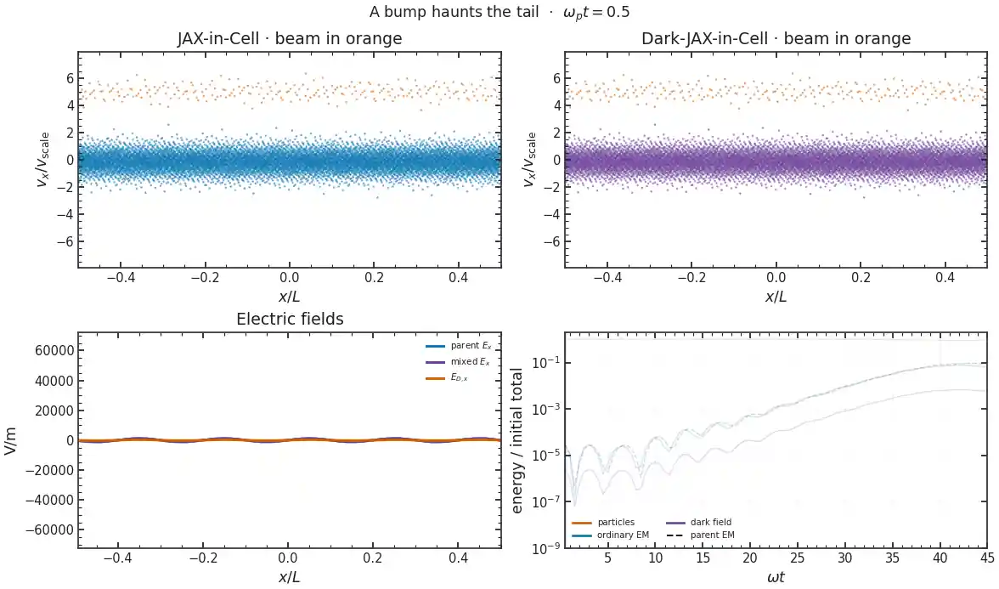

[Movie script](docs/scripts/make_movies.py) · `full=True`, `movies=("bump_on_tail",)`.


[Companion script](examples/dark_bump.py) · `full=True`.

## Transverse anisotropy

The [Weibel example](examples/dark_instabilities.py) seeds a transverse magnetic mode in a current-neutral bi-Maxwellian with $T_z/T_x=4$. Its independent Vlasov–Proca root gives $\gamma/\omega_p=0.05113$; the 30,000- and 60,000-particle PIC fits give $0.05123$ and $0.05117$. The analytic transverse cutoff is $kc/\omega_p=1.79847$ at the PIC mass and mixing: the seeded $k_1$ grows, while a matched $k_2$ control stays oscillatory. The smaller predicted dark-minus-parent growth shift is comparable to fit uncertainty, so this run validates the mixed rate but does not resolve that shift. [Equation, fits and uncertainty](docs/kinetic.md#transverse-anisotropy); [arrays](docs/_static/figures/mixed_weibel/run.json).


[Companion script](examples/dark_instabilities.py) · `mode="weibel"`, `full=True`.

## Prescribed drive: a control with external work

The [drive example](examples/dark_drive.py) applies a homogeneous sinusoidal force at the cold plasma resonance. It follows the independently solved forced oscillator to **$7.49\times10^{-5}$** of the force scale; ordinary energy gained and accumulated external work differ by **$2.77\times10^{-4}$** of the transfer. This control has no evolving Proca reservoir. [Settings and data](docs/_static/figures/prescribed_drive/run.json).

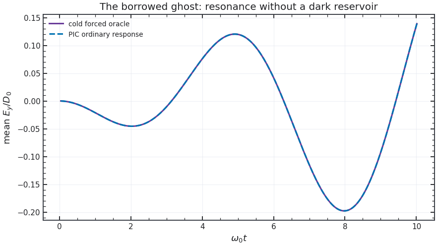

[Companion script](examples/dark_drive.py) · `full=True`.

## Homogeneous-drive null check

For a nonrelativistic electron plasma with a fixed neutralizer, a uniform force can be removed from the nonzero spatial modes by moving to an accelerating frame. The [matched null example](examples/dark_null.py) measures the seeded mode with and without that force: its largest relative difference falls from **$2.78\times10^{-4}$** to **$3.94\times10^{-5}$** when the grid, loading and timestep are refined together. This restricted null is distinct from a mobile-ion heating test. [Record](docs/_static/figures/homogeneous_null/run.json).

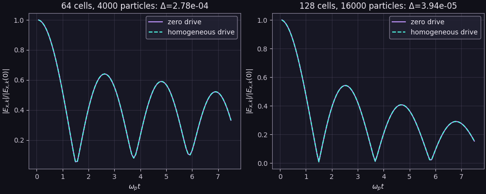

[Companion script](examples/dark_null.py) · `full=True`.

## Oblique magnetized 3V response

The [cold oblique example](examples/dark_plasma.py) sets a magnetic field with three nonzero components, exciting all particle velocity and field polarizations. A 12-state cold-fluid matrix exponential gives an independent answer for the six mean electric fields; the largest full-run error is **$4.92\times10^{-4}$** of the initial dark amplitude. [Record](docs/_static/figures/oblique_3v/run.json).

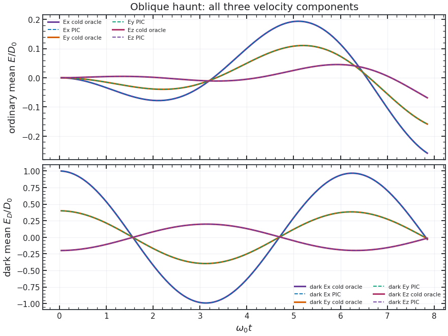

[Companion script](examples/dark_plasma.py) · `full=True`.

## Mobile ions: finite versus imposed reservoirs

The [mobile-ion example](examples/dark_reservoir.py) compares a zero-drive control, an imposed resonant force, and two finite Proca reservoirs with the same initial force. A two-fluid electron–ion solution checks the early mean response. By $\omega_pt=40$, the small dark reservoir loses about **52.8%** of its initial field energy; the large one loses about **14.8%**. [Controls, the earlier seeded pilot and limits](docs/kinetic.md#mobile-ions-and-a-finite-reservoir).


[Companion script](examples/dark_reservoir.py) · `study="mobile_ions"`, `full=True`.

## Resonant drive and nonlinear plasma response

The [strong-drive Figure 2 case of Hook, Huang and Shalaby](https://arxiv.org/pdf/2510.13956v1) has mobile ions, $m_i/m_e=1836$, $T_e=T_i=10^{-3}m_ec^2$ and $L=40c/\omega_p$. The applied field is

$$
E_{\rm applied}=E_{\star}a_0\cos(\omega_pt),\qquad E_{\star}=m_ec\omega_p/e,\qquad a_0=0.03\sqrt{10^{-3}}.
$$

The [parameter replay](examples/dark_reservoir.py) advances **206,000 particles** on 1,000 cells through $\omega_pt=5000$, with $\Delta t\omega_p=0.02$ and quadratic shapes; the paper uses fifth-order shapes.


Final RMS speeds are **0.1926c (electrons)** and **0.000834c (ions)**, about **4.6%/5.4% below** the visible PDF curves; their variance-energy increments differ by **9.2%/35.2%**. Late electron variance grows **36.09×**, versus **1.0025×** without driving. The energy/work defect is at most **0.0241% of peak injected work**. Halving the timestep changes late electron spread by **1.1%**, but total/nonzero-mode field energy by **52.7%/65.0%**. A third step verifies early second-order behavior; same-step replays diverge during nonlinear broadening. Spatial broadening follows the published trend; quantitative late agreement remains open. [Data, refinement, normalization and mechanism limits](docs/kinetic.md#long-strong-drive-replay-and-controls).

[Simulation script](examples/dark_reservoir.py) · `study="paper"`, `full=True`; [comparison and plot](docs/scripts/make_paper_replay.py) ([drive, control and refinement inputs](docs/scripts/make_all.py)).

### Late resolution controls

Two [exact archived-state replays](docs/kinetic.md#exact-archived-state-equal-horizon-replays) at the same timestep and horizon agree early, then differ by **9.3%** in nonzero-mode energy's relative $L^2$ norm through $\omega_pt=1000$. On $800\le\omega_pt\le1000$, its mean changes by **31.3%**, versus less than **0.6%** for particle spread at a fixed physical smoothing length. Gauss residuals stay near roundoff; an endpoint projection would change $E/E_{\star}$ by less than **$4\times10^{-15}$**. The late field needs execution, seed and isolated resolution checks before a physical suppression factor can be assigned.

At $\Delta t\omega_p=0.005$, an [isolated 1,000→2,000-cell check](docs/kinetic.md#isolated-mesh-particles-and-seed-controls) holds all 206,000 particles fixed. The energy/work defect falls **3.1×**, while late nonzero-field mean energy changes **+22.9%** and local electron spread **+3.6%**. At 2,000 cells, doubling the loading to **412,000 particles** changes those late means by **+129.4% / +8.9%**; an independent velocity seed on the original grid gives **−37.6% / +6.3%**. These controls quantify sensitivity alongside conservation; the published late conversion curve still requires convergence.


[Simulation script](examples/dark_reservoir.py) · `study="paper"`; [comparison and plot](docs/scripts/compare_replays.py) ([matched mesh/loading inputs](docs/scripts/make_all.py)).

### Late timestep and execution at higher loading


[Simulation script](examples/dark_reservoir.py) · `study="paper"`, `cells=2000`, `particles=206000`; [comparison and plot](docs/scripts/compare_replays.py) ([timestep and restart inputs](docs/scripts/make_all.py)).

These controls use **206,000 particles per species** on 2,000 cells through $\omega_pt=1000$: an exact-state repeat at $\Delta t\omega_p=0.005$ and a halved step. On $800\leq\omega_pt\leq1000$, mean electric energy changes by **−17.12% / −17.60%** relative to the first run; injected work changes by **−29.87% / −35.60%**. Local electron-spread increments change by **−0.25% / −1.64%** at $2\lambda_{D0}$. The residual injection-rate differences exceed the accuracy target, so neither a late conversion rate nor timestep convergence is established. One repeated execution does not supply ensemble uncertainty. [Raw measurements, normalization and limits](docs/kinetic.md#higher-count-late-timestep-and-execution-controls).

### Higher-order particle weighting

Matched **412,000-particle** runs compare quadratic and six-cell quintic weighting through $\omega_pt=1000$. The largest energy/work defect falls from **$2.26\times10^{-6}$ to $2.11\times10^{-6}nm_ec^2L$**, with unchanged particle charge and Gauss residuals below $4.6\times10^{-13}en/\epsilon_0$. On $800$–$1000$, mean electric energy changes **+10.0%**, injected work **+24.4%**, and local electron/ion spread increments **−0.82% / +3.04%**. The conversion-rate gate still fails. The weights follow SHARP's integrated quintic family; the gather is a face-centred approximation. [Methods, independent checks and measured cost](docs/kinetic.md#particle-weighting-under-nonlinear-drive).


[Simulation script](examples/dark_reservoir.py) · `study='paper'`, `shape_order=2` or `5`; [comparison and plot](docs/scripts/compare_replays.py) · `variant='shape'` ([full inputs](docs/scripts/make_all.py)); [cost benchmark](docs/scripts/benchmark_field_cost.py).

## Oscillating pair plasma: a kinetic bridge

The [pair example](examples/dark_reservoir.py) starts an **ordinary**, charge-neutral electron–positron waterbag with a finite homogeneous electric pump. It follows the parameter case of [Cruz, Grismayer and Silva](https://arxiv.org/abs/2104.04490): $\omega_0=\sqrt2\omega_p$ in the nonrelativistic limit, a $0.1c$ full velocity width, and a $0.14c$ initial quiver scale. The full replay uses the parent’s relativistic Boris pusher. A separate relativistic Vlasov orbit calculation predicts the seeded mode’s early growth at about **$0.0963\,\omega_0$**; the 4,096-cell PIC fit gives about **$0.0960\,\omega_0$** over five pump cycles. By $\omega_0t=170$, the coherent pump has transferred most of its energy into finite-wavelength fields and particle kinetic excess while the complete particle-plus-field energy changes by less than **$3.0\times10^{-4}$** of its initial value. No-pump and seed-amplitude controls, grid/loading refinements, equations and limitations are in the [kinetic study](docs/kinetic.md#an-oscillating-pair-plasma).


[Companion script](examples/dark_reservoir.py) · `study="pair"`, `full=True`.

## Pair plasma with a finite dark reservoir

The [dark pair option](examples/dark_reservoir.py) puts the same neutral waterbag and spatial seed under a **self-consistent** massive field. Its initial effective force has a $0.05c$ quiver scale, with $\eta=0.5$ and $\Omega_D=\omega_0$; the bare reservoir initially holds four times the electric energy of an ordinary run with the same force. A separate relativistic Vlasov–Proca calculation follows the two-frequency background and seeded response. The early ordinary and dark mode traces agree with it to about **3.1%** in relative $L^2$. In the 4,096-cell run at $\omega_0t=170$, combined coherent energy is about **52.5%** of the initial dark energy and particle kinetic excess above a cold-flow estimate is **45.2%**; the complete energy changes by at most **$3.3\times10^{-4}$**. Combined coherence includes ordinary fields and bulk motion, so it does not measure the energy remaining in the dark sector. Both Gauss laws, separate resolution changes and ordinary controls matched by initial force and by initial energy are in the [pair study](docs/kinetic.md#a-finite-dark-reservoir-in-the-pair-plasma). The late fraction is **not yet converged**; this high-coupling case tests the model, not a dark-matter signal.


[Companion script](examples/dark_reservoir.py) · `study="pair_dark"`, `full=True`.

### Velocity resolution and pump controls

The archived pair runs repeat 32 waterbag velocities per cell. Their independent free-streaming recurrence estimate is **$\omega_0t_{\rm rec}=167.2$**, close to the $170$ horizon; spatial refinement alone does not move it. Relativistic acceleration changes that estimate, so this identifies a resolution risk rather than the cause of the stored depletion. New controls distribute velocity quantiles across the full loading and compare the coupled run with its realized mean-force replay and an independent warm homogeneous envelope. They retain total dark energy separately from ordinary fields and bulk motion, refine forcing tables, and compare the early spatial response with Vlasov–Proca theory. [Equations, recurrence checks and interpretation](docs/kinetic.md#velocity-sampling-and-numerical-recurrence).

[Companion script](examples/dark_reservoir.py) · `study='pair_waveform'`, `full=True`; [independent loading and reference checks](tests/test_pair_reference.py). Late depletion remains under validation.

### Seed, mesh and particle controls

Global waterbag quantiles resolve distinct velocities across the full loading. Five matched branches separate the evolved reservoir from its realized mean force and an independent homogeneous envelope. Additional dark depletion removes the initial preparation offset:

$$
G_D(t)=\frac{\Delta U_{D,\mathrm{hom}}(t)-\Delta U_{D,\mathrm{PIC}}(t)}{U_{D,\mathrm{PIC}}(0)},\qquad
\Delta U(t)=U(t)-U(0).
$$


[Simulation script](examples/dark_reservoir.py) · `study='pair_waveform', pair_loading='global', horizon=40, local_moments=True`; [comparison and plot](docs/scripts/compare_replays.py) · `pair_controls` ([six input sets](docs/scripts/make_all.py)).

The seeded early response is checked against independent relativistic Vlasov–Proca theory. On $20\leq\omega_0t\leq40$, halving the timestep changes mean $G_D$ by **0.345%**; doubling the mesh at the same particle count changes it by **2.18%**, and doubling particles changes it by **5.68%**. The finest loading uses **2,097,152 particles**, with full field-and-potential energy, both Gauss laws and sector work retained. Its conservation error is **5.29% of the additional-depletion gain**: the [separate conservation and refinement budgets](docs/kinetic.md#global-loading-controls-through-40) remain unmet.

## Conservation and long-time clocks

The [source-free Proca comparison](docs/scripts/benchmark_time_integrators.py) evolves longitudinal and transverse fields to $\Omega_Dt=200$ against a matrix exponential. The explicit split bounds field-energy error at **2.37%** for $\Delta t\Omega_D=0.2$ and **0.577%** at half that step. Implicit midpoint preserves this vacuum field energy to roundoff but has **1.53** final relative state error at the larger step; DOP853 reaches **$3.0\times10^{-8}$** state error with tight tolerances. Phase accuracy and total PIC energy require separate checks: exact field-only conservation does not close the particle–field work ledger. [Methods and timings](docs/performance.md#which-clock-to-trust) and the [full record](docs/_static/figures/time_integrators/run.json) give the comparison.

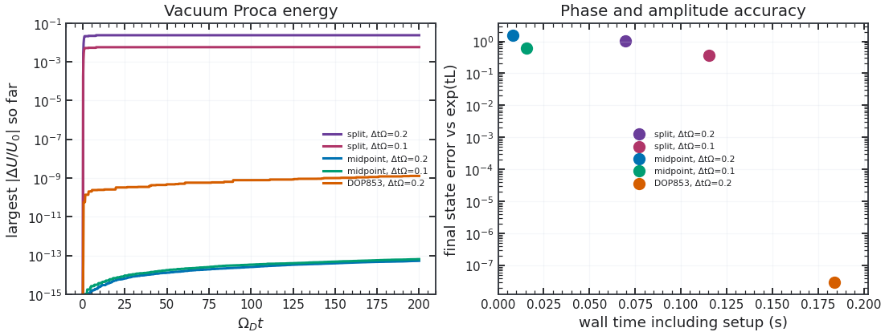

[Benchmark script](docs/scripts/benchmark_time_integrators.py) · `quick=False`.

## Differentiate and optimize a physical objective

JAX derivatives pass through particle loading and weights, fields, the PIC run and the measured objective. The [density calibration](examples/optimize_dark_photon.py) maximizes coherent electric plus cold bulk energy on one fixed physical interval, with $p=n/n_{\rm ref}$:

$$
\mathcal C(p)=\frac1{30}\int_{45}^{75}\left[\left(\frac{E_y}{D_0}\right)^2+\frac1p\left(\frac{J_y}{\epsilon_0\omega_0D_0}\right)^2\right]d(\omega_0t).
$$

The full PIC optimum is **$p=1.0016225$**; an independent cold matrix exponential and Fréchet derivative give **$1.0016317$**. Finite differences and time refinement check the PIC gradient. This is a known-answer optimization, not a fitted target. [Methods and limits](docs/optimization.md) and the [full run](docs/_static/figures/density_calibration/run.json) give the error measures. To evaluate the same differentiable objective:

```python
from examples.optimize_dark_photon import build_objective

objective, value_and_gradient, steps = build_objective(16, 64, 45, 75)
value, density_gradient = value_and_gradient(0.97)
```

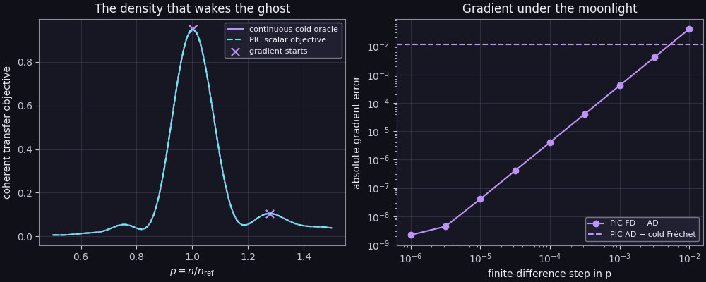

[Companion script](examples/optimize_dark_photon.py) · `full=True`.

## A finite dark packet crosses a designed slab

The [profile example](examples/dark_profile.py) keeps the slab's total electron column fixed while changing four smooth density weights. It measures **outgoing ordinary-photon flux at a detector**, rather than a homogeneous field amplitude. A JAX gradient design raises the held-out photon-energy fraction from **0.0020826** to **0.0021179**; a finer particle/grid replay gives a **1.81–1.82%** relative gain. An independent cold scattering solve predicts the same ordering. Finite-amplitude kinetic replay changes the yield but finds **no reliable additional gain** from re-optimization. This extends the tested setting from cold wave conversion and prescribed drives to a finite, self-consistent reservoir and a kinetic objective; it makes no detector or priority claim. See [constraints, reference and replay](docs/profile.md).

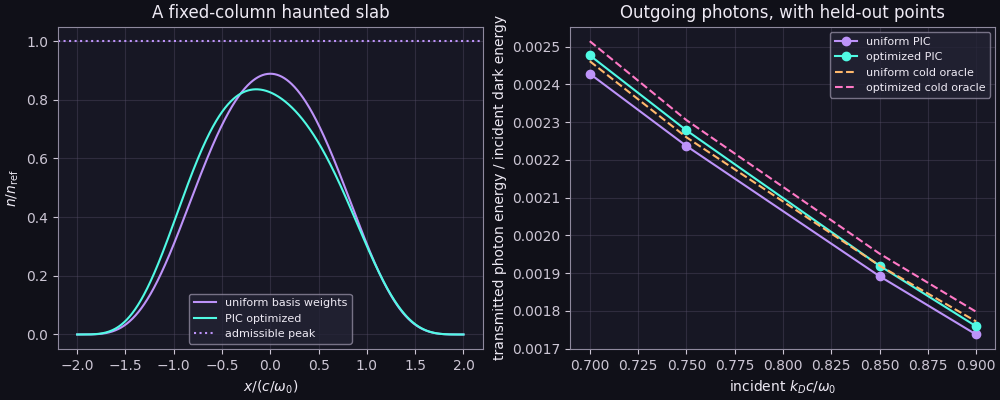

[Companion script](examples/dark_profile.py) · `full=True`.

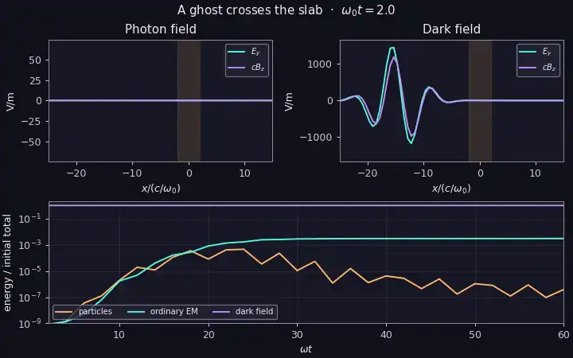

*The [packet movie](docs/_static/movies/slab_packet/run.json) uses 512 cells, about 26 cells across the slab, 256 particles per basis per species and 80 stored frames. It shows propagation; the full optimization record carries the flux and convergence claims.*

[Movie script](docs/scripts/make_movies.py) · `full=True`, `movies=("slab_packet",)`.

## Vacuum polarizations and complete restart

The [field tests](tests/test_proca.py) compare longitudinal and both transverse vacuum polarizations with discrete-symbol waves, check the ordinary and dark Gauss laws, and resume the complete particle/field state across a run boundary. The source-free [energy/phase experiment](docs/_static/figures/time_integrators/run.json) above includes all three polarizations. Native NPZ restart saves $\mathbf E_D,\mathbf B_D,\mathbf A_D,\phi_D$, the neutralizing background and accumulated work alongside the parent particle and Maxwell state. [Validation details](docs/validation.md).

[Polarization benchmark](docs/scripts/benchmark_time_integrators.py) · `quick=False`; [restart input](examples/input.toml) with `load_state` and `simulation.run(state=...)` ([usage](docs/index.md)).

## Runtime and differentiation cost

The [isolated field-step benchmark](docs/_static/figures/field_cost.json) uses 8,192 particles on 128 cells for 256 steps: median warm CPU times are **176 ms** for the parent and **219 ms** for active Proca. A [131,072-particle replay](docs/_static/figures/field_cost_large.json) gives **5.30 s** and **5.71 s**, with host load varying too much to infer a reliable overhead ratio. These are *timing workloads*; the two-stream movie advances 262,144 particles, and the refined kinetic bump run advances 240,000. A separate [955-step gradient recurrence](docs/_static/figures/recurrence_benchmark.json) compares native JAX checkpointing with SOLVAX. SOLVAX agrees on value and derivative but offers no clear benefit over native segmented JAX, so it remains optional. [Compile, memory and device details](docs/performance.md) are reported with the measurements.

[Field and storage benchmark](docs/scripts/benchmark_field_cost.py); [gradient recurrence benchmark](docs/scripts/benchmark_recurrence.py). Their input blocks select the recorded workloads.

### GPU execution repeatability

On an RTX A4000 with JAX/CUDA packages 0.6.2, three calls to one compiled deposition kernel and one compiled **100-step, 412,000-particle PIC run** produce different bits under default settings. With `--xla_gpu_exclude_nondeterministic_ops`, all three outputs match bitwise in each kernel. Median PIC time changes from **0.422 s to 2.296 s (5.44×)**. Both controls restore identical archived inputs; this short test does not establish late-time convergence or explain earlier trajectory differences. [Timings, correctness and version-specific limits](docs/performance.md#bounded-gpu-repeatability-test).

[Benchmark script](docs/scripts/benchmark_field_cost.py) · `replay=True`, `cells=2000`, `particles=206000`, `steps=100`, `stride=100`, `dt=0.005`. Set `XLA_FLAGS=--xla_gpu_exclude_nondeterministic_ops` before starting Python for the flagged control; [complete input protocol](docs/performance.md#bounded-gpu-repeatability-test).

## Related codes and scope

[JAX-in-Cell](https://github.com/uwplasma/JAX-in-Cell) supplies the PIC engine. The table compares documented models, including [Hook–Huang–Shalaby's imposed-drive PIC](https://arxiv.org/pdf/2510.13956v1), cold-fluid conversion, cosmological probability calculations, and ordinary plasma solvers. **Proca** means an evolved massive field with plasma backreaction; **AD** means documented gradients through the simulated dynamics.

| Code or model | Public source | PIC | Dark conversion | Proca | AD | CPU + GPU | 2D/3D |
|---|:---:|:---:|:---:|:---:|:---:|:---:|:---:|
| Dark-JAX-in-Cell | ✅ | ✅ | ✅ | ✅ | ✅ | ✅ | ❌ |
| [JAX-in-Cell](https://github.com/uwplasma/JAX-in-Cell/tree/83d327118163833f93e2588edcb5029241f6ba2a) | ✅ | ✅ | ❌ | ❌ | ✅ | ✅ | ❌ |
| [SHARP + Hook drive](https://arxiv.org/pdf/2510.13956v1) | — | ✅ | ✅ | ❌ | — | — | ❌ |
| [Corelli *et al.* cold fluid](https://arxiv.org/abs/2410.16357) | — | ❌ | ✅ | ✅ | — | — | ❌ |
| [Caputo *et al.* notebooks](https://github.com/smsharma/dark-photons-perturbations) | ✅ | ❌ | ✅ | ❌ | — | — | ❌ |
| [OSIRIS public](https://github.com/osiris-code/osiris) | ✅ | ✅ | ❌ | ❌ | — | — | ✅ |
| [Smilei](https://github.com/SmileiPIC/Smilei) | ✅ | ✅ | ❌ | ❌ | — | ✅ | ✅ |
| [WarpX](https://github.com/BLAST-WarpX/warpx) | ✅ | ✅ | ❌ | ❌ | — | ✅ | ✅ |
| [PIConGPU](https://github.com/ComputationalRadiationPhysics/picongpu) | ✅ | ✅ | ❌ | ❌ | — | ✅ | ✅ |
| [VPIC 2.0](https://github.com/lanl/vpic-kokkos) | ✅ | ✅ | ❌ | ❌ | — | ✅ | ✅ |
| [ECSIM test code](https://github.com/petschge/ECSIM) | ✅ | ✅ | ❌ | ❌ | — | — | ❌ |
| [Unstaggered_PIC, Project3](https://github.com/sgong11/Unstaggered_PIC/tree/c9e20107624781af147d5497c5de10d004a35cd1/Project3) | ✅ | ✅ | ❌ | ❌ | — | — | ✅ |
| [π-PIC](https://github.com/hi-chi/pipic/tree/68757ea57283c93623c4d0c8b64351a55d47a6ce) | ✅ | ✅ | ❌ | ❌ | — | — | ✅ |
| [GEMPICX](https://github.com/NMPPMaxPlanck/GEMPICX) | ✅ | ✅ | ❌ | ❌ | — | ✅ | ✅ |
| [ADEPT](https://github.com/ergodicio/adept) | ✅ | ✅¹ | ❌ | ❌ | ✅ | ✅ | ✅ |
| [SPECTRAX](https://github.com/uwplasma/SPECTRAX) | ✅ | ❌ | ❌ | ❌ | — | ✅ | ✅ |

✅ documents the feature; ❌ excludes it from the reviewed model; — leaves it unverified. Review: **30 September 2026** (Project3 and π-PIC: **1 October**), pinned parent above, Smilei 5.1, WarpX 26.09, PIConGPU 0.9.0-dev and GEMPICX 0.5.648; [source snapshots and conservation methods](docs/validation.md#other-numerical-approaches) give the qualifications. ¹ ADEPT's PIC module is electrostatic; its multidimensional kinetic solvers evolve distributions. SPECTRAX uses Hermite–Fourier moments. Unstaggered_PIC Project3 provides relativistic 3D potential PIC on CPU, with optional OpenMP; GPU support is unverified. π-PIC supplies CPU/OpenMP spectral solvers; its GPU and AD support are unverified. OSIRIS's general CUDA documentation does not establish GPU support in its public snapshot. Particle/field restart is supported here and by several large PIC codes; it does not imply the same dark-field archive format.

The pair benchmark confirms a known kinetic instability; the current finite-reservoir runs extend the model but have unresolved late loading dependence. They neither contradict Hook *et al.* nor confirm that paper's nonlinear conversion curve. Differentiable kinetic optimization already exists in ADEPT and the parent. The tested contribution here is the coupled Maxwell–Proca trajectory and its complete energy/work and gradient diagnostics; a new physical mechanism still requires converged controls.

[Full evidence driver](docs/scripts/make_all.py): `records_only=True` refreshes measured documentation from saved records; set it to `False` to rerun the full studies sequentially. [Movie driver](docs/scripts/make_movies.py): install `.[media]`, set `full=True`, and choose the desired `movies` tuple. Both write directories are explicit inputs. Quick presets are smoke tests, not the evidence quoted above.

MIT licensed. JAX-in-Cell and its human contributors retain upstream authorship and licenses. The parent [draft PR #42](https://github.com/uwplasma/JAX-in-Cell/pull/42) remains separate.
