# Kinetic response of the coupled fields

The full longitudinal benchmark starts a small, fixed physical $k$ density perturbation in a current-neutral Maxwellian electron population with a uniform fixed neutralizing background. It uses 150,000 quiet particles, 64 cells, 1,200 steps, $k\lambda_D=0.5$, $\mu/\omega_p=1$, and $\eta=0.3$. The coupling is deliberately large enough for numerical validation; it is not an observational dark-matter parameter. The deposited **mean current remains physical** rather than being removed each step.

For $\sigma=\sqrt{T/m}$, $\zeta=\omega/(\sqrt2 k\sigma)$, and the Landau-continued plasma dispersion function $Z$, the independent reference solves

$$
\chi_L=\frac{\omega_p^2}{k^2\sigma^2}[1+\zeta Z(\zeta)],\qquad
D_L=(s-\mu^2)(1+\chi_L)+\eta^2s\chi_L=0,\qquad s=\omega^2-c^2k^2.
$$

The independent root has real and imaginary parts **{{ kinetic_root_real }}** and **{{ kinetic_root_imag }}** in $\omega_p$ units; the PIC fit gives **{{ kinetic_pic_real }}** and **{{ kinetic_pic_imag }}**. The real-frequency difference is **{{ kinetic_frequency_error }}%** and the damping-rate difference **{{ kinetic_damping_error }}%**. Five maxima between $\omega_pt=2.45$ and $11.225$ stand above the late mode floor; the fitted damping slope has a regression standard error of **{{ kinetic_damping_stderr }}** in $\omega_p$ units. The reference determinant residual and the exact window are stored in the [run record](_static/figures/mixed_kinetic/run.json).

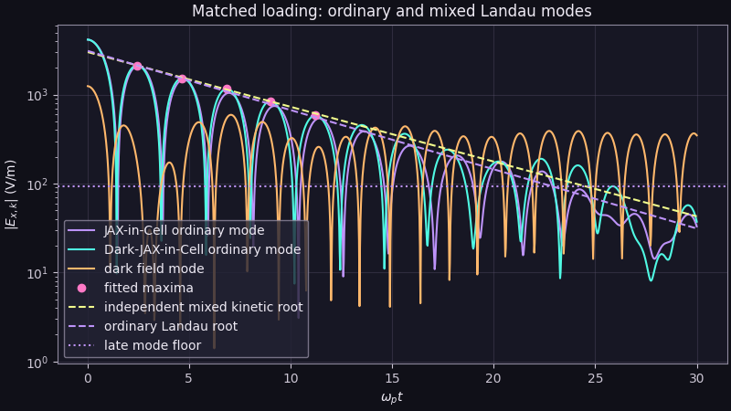

The late floor contains a coherent dark branch as well as particle noise, so an unqualified single-mode fit to the entire record would be wrong. The quick preset is explicitly noise-limited and makes no fit. This is **one resolved mixed Landau case**, not a convergence study of all kinetic roots. The full density/cell/time/seed refinements required for a kinetic convergence claim have not yet been completed.

The same full run now advances **JAX-in-Cell itself** from the identical electron positions, velocities, weights, ordinary field, grid and timestep. Setting $\eta=0$ in the independent determinant gives the ordinary [Landau dispersion](https://arxiv.org/abs/2303.12620) limit $\omega/\omega_p=1.41566-0.15336i$. The parent fit is $1.41195-0.15338i$; the dark run and mixed root above shift both frequency and damping. The [matched data](_static/figures/mixed_kinetic/data.npz) store all three field-mode histories. The displayed decay ends at the measured late floor; neither trace supports a single exponential fit through late times.

## A physical-speed Landau replay

`python examples/dark_kinetic.py --physical --full` holds $k\lambda_D=0.5$, $\sigma/c=0.05$, $\eta=0.3$, $\Omega_D/(kc)=1$, the box length and the physical $\omega_p$ fixed. Here $kc/\omega_p=10$, so the plasma-like phase speed is about $0.14c$. The largest initial sampled speed is below $0.224c$ in all three runs. The independent ordinary, full and quasistatic roots are **{{ physical_reference_parent }}**, **{{ physical_reference_mixed }}** and **{{ physical_reference_screened }}** in $\omega_p$ units. The closeness of the last two is a screening prediction for this setting, not evidence of a resonant propagating dark wave.

The same quiet loading is used for matched parent/dark runs at each resolution. A fixed $2<\omega_pt<12$ window fits the early absolute-field maxima; it does not require the signal to reach a noise floor. The longer windows $2$–$14$ and $3$–$16$ are saved as sensitivity checks. The complex ordinary, dark and effective mode coefficients, particle-plus-field energy and exact settings are in the linked records.

| Cells / markers / steps | Parent $\omega_r/\omega_p$ | Parent $\gamma/\omega_p$ | Mixed $\omega_r/\omega_p$ | Mixed $\gamma/\omega_p$ | Max sampled $\lvert\Delta U\rvert/U_0$ |
|---|---:|---:|---:|---:|---:|
| 32 / 40,000 / 3,000 | {{ physical_32_parent_measured_real_over_wp }} | {{ physical_32_parent_measured_imag_over_wp }} | {{ physical_32_measured_real_over_wp }} | {{ physical_32_measured_imag_over_wp }} | {{ physical_32_maximum_sampled_closed_energy_drift }} |
| 64 / 80,000 / 6,000 | {{ physical_64_parent_measured_real_over_wp }} | {{ physical_64_parent_measured_imag_over_wp }} | {{ physical_64_measured_real_over_wp }} | {{ physical_64_measured_imag_over_wp }} | {{ physical_64_maximum_sampled_closed_energy_drift }} |
| 128 / 160,000 / 12,000 | {{ physical_128_parent_measured_real_over_wp }} | {{ physical_128_parent_measured_imag_over_wp }} | {{ physical_128_measured_real_over_wp }} | {{ physical_128_measured_imag_over_wp }} | {{ physical_128_maximum_sampled_closed_energy_drift }} |

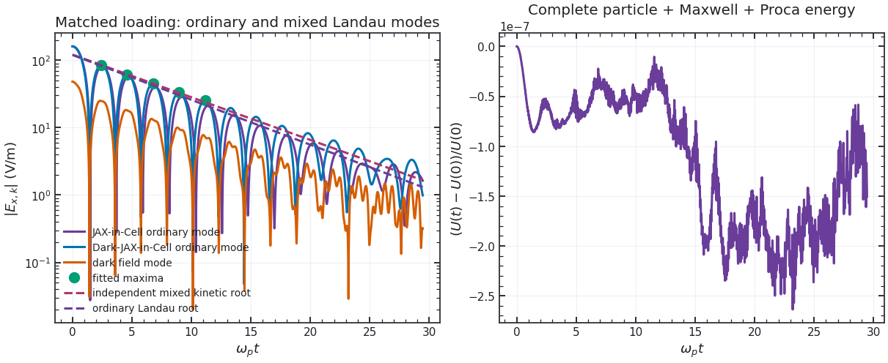

The coarse damping bias shrinks by 64 cells, but the mixed fit moves away from its root at 128 cells. The **difference** between the fitted damping rates changes from $0.00958$ to $0.01231\,\omega_p$ between 64 and 128 cells, while the predicted shift is $0.00756\,\omega_p$. On 128 cells, moving the declared upper/lower fit window changes the fitted difference to $0.01356$ or $0.01598\,\omega_p$. This paired run therefore does not resolve a precision dark correction to Landau damping. The late ordinary and dark oscillations contain ballistic/loading contributions and a coherent dark branch; the fixed-window fit is not continued through them. [32-cell record](_static/figures/physical_kinetic_32/run.json), [64-cell record](_static/figures/physical_kinetic_64/run.json), [128-cell record](_static/figures/physical_kinetic_128/run.json).

## Counterstreaming ordinary electrons

Two equal cold electron beams start at $\pm0.25c$ with equal physical weights, so their **deposited mean current is exactly zero**. A uniform fixed background neutralizes charge. We perturb one beam's position at a fixed $k$, leaving the mean current physical. For $a=(ku/\omega_p)^2$, $z=(\omega/\omega_p)^2$, $K=kc/\omega_p$ and $\widehat\mu=\mu/\omega_p$, the independent mixed cold determinant after removing beam poles is

$$
(z-K^2-\widehat\mu^2)[(z-a)^2-(z+a)]-\eta^2(z-K^2)(z+a)=0.
$$

The unstable root gives $\gamma/\omega_p=$ **{{ two_stream_root }}** at $\eta=0.3$; the full PIC fit over the **declared** $10<\omega_pt<20$ interval gives **{{ two_stream_pic }}** on 64 cells and **{{ two_stream_refined }}** on 128 cells with twice the particles and half the time step. The same loading at $\eta=0$ gives **{{ two_stream_zero_pic }}**. The observed mixing-induced growth-rate difference agrees in sign and scale with the determinant's $\eta=0$ to $0.3$ difference; the absolute growth error still includes cold-PIC discretization. The [full run record](_static/figures/mixed_two_stream/run.json) holds fit standard errors and both resolutions.

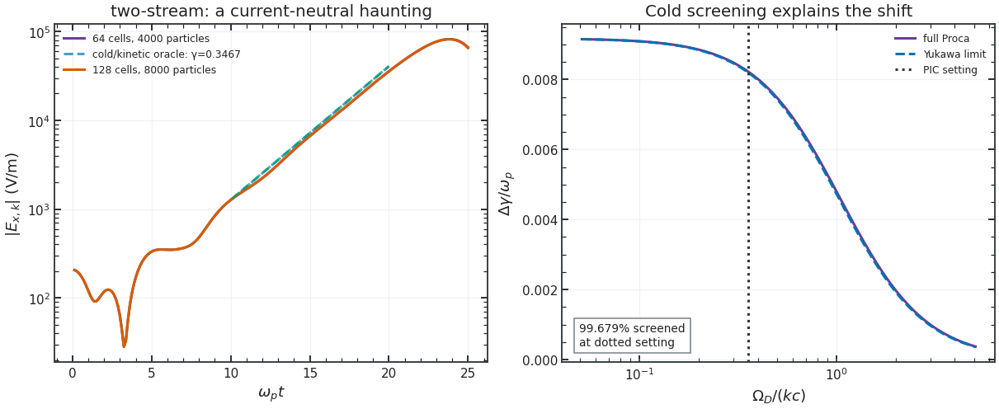

### Screening versus a propagating dark response

For a longitudinal plasma eigenmode away from the free dark pole, eliminating the dark field gives

$$
\frac{E_{D,k}}{E_k}=\eta\frac{s}{s-\Omega_D^2},\qquad
1+\left(1+\eta^2\frac{s}{s-\Omega_D^2}\right)\chi_L=0,\qquad s=\omega^2-c^2k^2.
$$

At $|\omega|\ll kc$, the factor multiplying $\chi_L$ becomes $\alpha(k)=1+\eta^2c^2k^2/(c^2k^2+\Omega_D^2)$: ordinary Coulomb response plus a Yukawa contribution. The constant-charge limit instead uses $\alpha=1+\eta^2$. The [two-stream example](../examples/dark_instabilities.py) saves the full, quasistatic and constant-charge cold roots over dark mass. At its PIC setting, $kc/\omega_p=1.963495$, $ku/\omega_p=0.490874$, $\Omega_D/\omega_p=0.7$ and $\eta=0.3$:

| Analytic cold reference | $\gamma/\omega_p$ |
|---|---:|
| Ordinary Maxwell | 0.33847119 |
| Coulomb + Yukawa limit | 0.34667091 |
| Full Maxwell–Proca | 0.34669731 |
| Constant effective charge | 0.34764468 |

The quasistatic reference accounts for **99.679% of the full cold growth-rate shift** from ordinary Maxwell. This is an analytic comparison, not a separate PIC measurement. The late nonlinear dark-minus-parent difference is therefore not evidence by itself for a propagating dark resonance. In-medium shielding is established in [Dubovsky and Hernández-Chifflet](https://arxiv.org/abs/1509.00039), and a cold-fluid time-domain conversion model was studied by [Corelli *et al.*](https://arxiv.org/abs/2410.16357); the present calculation identifies which control explains this particular legacy benchmark.

The time-dependent part can be checked without a fitted pole. With $Y_k=E_{D,k}-\eta E_k$ and a prepared $Y_k(0)=\dot Y_k(0)=0$,

$$
\ddot Y_k+\omega_{D,k}^2Y_k=-\eta\Omega_D^2E_k,\qquad
Y_k(t)=-\eta\Omega_D^2\int_0^t\frac{\sin[\omega_{D,k}(t-t')]}{\omega_{D,k}}E_k(t')\,dt',
\quad \omega_{D,k}^2=c^2k^2+\Omega_D^2.
$$

The independent convolution of a seeded PIC ordinary-field history predicts its dark response to 0.518% at $\Delta t\omega_p=0.04$ and 0.130% at 0.02, relative to the peak $|Y_k|$. The test uses the compatible grid symbol $k\mapsto 2\sin(k\Delta x/2)/\Delta x$ and a trapezoidal time integral; its fourfold error reduction checks the retarded identity at second order. Other initial dark preparations add a free homogeneous solution and must be compared separately. The source histories are generated by the coupled PIC transition, while the integral is evaluated outside it.

### Through nonlinear saturation

`python examples/dark_saturation.py --full` follows the **same cold beam loading** in the parent and dark solvers through $\omega_pt=80$. It starts with 64 cells, 4,000 particles per beam and $\Delta t\omega_p=0.025$. The five runs halve the step, then independently double cells and particles at the smaller step. The fitted parent/dark rates over $10<\omega_pt<20$ are $0.33228/0.34069$ at the base setting, $0.33407/0.34276$ after timestep refinement and $0.33435/0.34302$ after joint grid/loading refinement. The independent cold roots are $0.33847/0.34670$. The growth-rate difference survives these numerical refinements; absolute PIC rates are lower by roughly 1–2%.

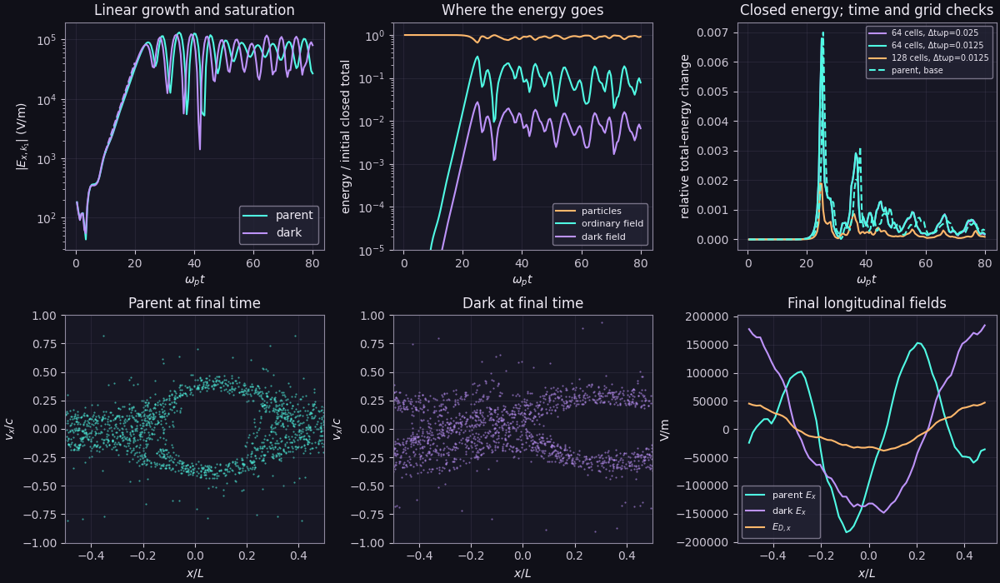

The first large mode peak lies near $\omega_pt\simeq29$. The single-wave trapping estimate uses the complex force mode $E_{\rm eff,k}=E_k+\eta E_{D,k}$ and $\omega_b=\sqrt{2e k|E_{\rm eff,k}|/m_e}$. It reaches about $1.54\gamma_{\rm parent}$ in the ordinary run and $1.52\gamma_{\rm mixed}$ in the dark run. The order-unity ratio and phase-space roll-up are **consistent with electron trapping**, the familiar nonlinear two-stream mechanism; this scale is not an exact saturation prediction. The dark run retains sparse kinetic and field-energy records without particle histories; its final phase space reconstructs integer-time coordinates from the complete half-step restart state. Longitudinal fields are plotted on electric faces. The [SHARP code paper](https://arxiv.org/abs/1702.04732) also emphasizes long-time energy control and joint particle/grid refinement for two-stream PIC.

The [matched two-stream movie](_static/movies/two_stream/figure.webp) repeats the 128-cell case with 131,072 particles **per beam** at the same $\Delta t\omega_p=0.0125$ through $\omega_pt=120$. Against the 8,000-per-beam extended run, parent and mixed growth fits on $10\leq\omega_pt\leq20$ differ by $0.00106\omega_p$ and $0.00086\omega_p$. Their first-mode RMS histories differ by 0.09% and 0.14% over $40\leq\omega_pt\leq55$, growing to 10.0% and 11.3% over $80\leq\omega_pt\leq120$. These comparisons interpolate the smaller run to the movie times. All 262,144 particles are advanced in restartable chunks; 8,192 are plotted in each panel. The largest stored-frame relative complete-energy change is 0.188%. The [movie record](_static/movies/two_stream/run.json) stores the comparisons, energy history and frame spacing. The late loading sensitivity and the spatial sensitivity below both matter when interpreting the phase-space difference.

The RMS of $|E_{k_1}|$ on $40\leq\omega_pt\leq80$ is $69.84/67.60$, $70.95/67.97$ and $68.62/64.56$ kV/m for parent/dark at the base, time-refined and jointly-refined settings. The mixed case is 3.2–5.9% lower in this window. The largest **stored-sample** relative total-energy changes are 0.70/0.68%, 0.70/0.68% and 0.23/0.19% for parent/dark. The **dark total includes the full Proca electric, magnetic and potential energy**; comparing ordinary-only energy in the mixed run would mislabel physical exchange as error. The maximum dark-field work residual, divided by the largest absolute dark source-work transfer, is $1.91\times10^{-5}$ at the base step and $4.65\times10^{-6}$ after halving it. The refined grid/loading case gives $6.91\times10^{-6}$. Dark work is therefore well tracked even where the full particle-plus-field energy drifts.

At fixed $\Delta t\omega_p=0.0125$, the $2\times2$ cell/particle comparison is revealing: doubling from 4,000 to 8,000 **quiet cold particles per beam** changes the maximum fractional dark total-energy error by less than $10^{-9}$ at either grid size. Doubling cells from 64 to 128 changes it from **{{ saturation_short_coarse_drift_percent }}%** to **{{ saturation_short_refined_drift_percent }}%**. The first-mode RMS changes by 0.1–0.7% under particle doubling at fixed grid. This isolates grid spacing as the main tested limitation for this quiet loading; it does not determine the best spline order or the particle count required by a warm/noisy plasma. The [$\omega_pt=80$ record](_static/figures/two_stream_saturation/run.json) and [arrays](_static/figures/two_stream_saturation/data.npz) keep all five cases. All energy maxima use the same $0.5/\omega_p$ output spacing.

`python examples/dark_saturation.py --extended` takes four matched cases through $\omega_pt=200$ at that **same output spacing**: the base run, the jointly-refined run, that same 128-cell run with half its timestep, and a 256-cell run at the same smaller timestep with twice as many particles. On $120\leq\omega_pt\leq200$, dark $k_1$ RMS is **{{ saturation_long_coarse_mode_drop_percent }}%** lower than the parent on 64 cells, but **{{ saturation_long_refined_mode_drop_percent }}%** lower on 128 cells. The time-averaged electric energy in *all nonzero spatial modes* is **{{ saturation_long_coarse_field_drop_percent }}%** and **{{ saturation_long_refined_field_drop_percent }}%** lower, respectively, normalized against the same initial parent total. These late amplitudes are visibly grid-sensitive; the run establishes neither a converged suppression factor nor a new long-time law. The largest stored-sample dark total-energy changes remain **{{ saturation_long_coarse_drift_percent }}%** and **{{ saturation_long_refined_drift_percent }}%**, with no secular increase beyond the early nonlinear peak in this diagnostic. The [$\omega_pt=200$ record](_static/figures/two_stream_extended/run.json) and [arrays](_static/figures/two_stream_extended/data.npz) preserve the matched traces.

At 128 cells, halving $\Delta t\omega_p$ from 0.0125 to 0.00625 leaves the late dark-minus-parent first-mode RMS at **{{ saturation_long_halfstep_mode_change_percent }}%**, versus **−{{ saturation_long_refined_mode_drop_percent }}%** before the step change. At the **same** $0.00625$ step, 256 cells and 16,000 particles per beam give **{{ saturation_long_fine_mode_change_percent }}%**. For all nonzero electric modes, those 128/256-cell differences are **{{ saturation_long_halfstep_field_change_percent }}%** and **{{ saturation_long_fine_field_change_percent }}%**. The finest run improves the largest sampled closed-energy change to **{{ saturation_long_fine_drift_percent }}%**, but reverses the direction of the late field difference. The measured late effect is therefore **not spatially converged**, even in sign.

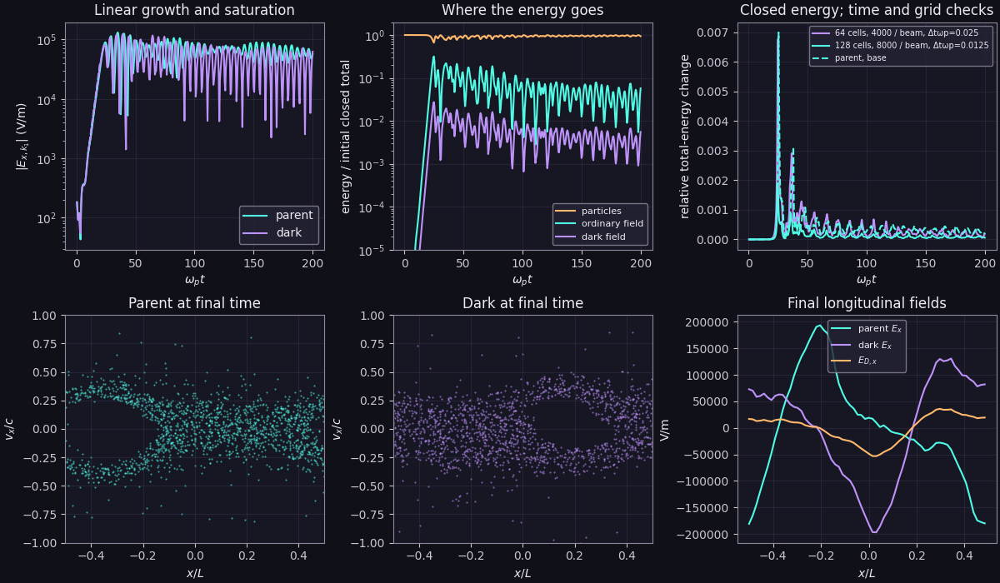

Late coherent phases and vortex shapes change with grid refinement. A warmer, seeded ensemble and further spatial refinement are needed before interpreting the late difference physically. This cold two-stream problem has no counterpart for separately dark-charged particles; both beams carry ordinary charge and couple through $\eta$. It also differs from the mobile-ion, homogeneous resonant drive in [Hook, Huang and Shalaby](https://journals.aps.org/prl/abstract/10.1103/98cx-7t43) and is not a reproduction of that paper's heating curve.

## Warm two streams and a stable control

The [warm two-stream example](../examples/dark_instabilities.py) uses two equal-density electron Maxwellians drifting at $\pm0.05c$. Their finite-loading means are adjusted to make the physical mean current zero, and the fixed background neutralizes charge. The selected mode has $ku/\omega_p=0.5$, $kc/\omega_p=10$ and $\Omega_D/(kc)=1$. The growing pair has $\sigma/c=0.01$; the single-humped control has $\sigma/c=0.06$. A manufactured $\eta=0.6$ makes the root separation visible at feasible resolution; it is not an astrophysical coupling constraint. The control uses a tenfold larger position seed to expose its initial decay above the marker floor.

The shared drifting-Maxwellian determinant predicts the following selected roots. The control's velocity distribution decreases monotonically away from $v=0$, and its selected roots lie below the real-frequency axis. This is a stable control at the chosen $k$, rather than a claim that a failed Newton solve found no unstable root.

| Reference | Growing $\gamma/\omega_p$ | Control $\gamma/\omega_p$ |
|---|---:|---:|
| Ordinary Maxwell | {{ warm_ordinary_root }} | $-0.78358$ |
| Coulomb + Yukawa | {{ warm_quasistatic_root }} | $-0.77564$ |
| Full Maxwell–Proca | {{ warm_full_root }} | $-0.77562$ |
| Constant effective charge | {{ warm_effective_charge_root }} | $-0.76954$ |

For the unstable loading, both solvers start from exactly the same particles. The fixed $6<\omega_pt<16$ log-amplitude slopes are {{ warm_64_parent_fit }}/{{ warm_64_mixed_fit }} on 64 cells with 60,000 markers, and {{ warm_128_parent_fit }}/{{ warm_128_mixed_fit }} on 128 cells with 120,000 markers. The predicted full-minus-ordinary difference is $0.01649\,\omega_p$; the two measured differences are $0.01980$ and $0.02001\,\omega_p$. These paired slopes are grid-stable at the tested resolutions, but shifting the fit window among $8$–$16$, $10$–$18$ and $12$–$19$ moves the inferred difference over approximately $0.008$–$0.022\,\omega_p$. The measured difference has therefore **not** met the window-uncertainty gate for a precise dark correction. The full Proca and Yukawa roots differ by only $8.2\times10^{-6}\,\omega_p$; this setup mainly tests screening, not a propagating dark resonance.

The hotter control first phase mixes, then fluctuates at its finite-marker floor. Its mixed-mode RMS on $12<\omega_pt<18$ is **{{ warm_stable_late_over_early }}** times the RMS on $0<\omega_pt<2$; it shows no comparable sustained exponential growth through the recorded $\omega_pt\approx20$. The largest sampled complete-energy change falls from **{{ warm_64_energy_drift }}** to **{{ warm_128_energy_drift }}** in the unstable joint refinement. These ratios normalize to the particles' large thermal/drift energy; they do not by themselves establish convergence of the small field-mode difference. [Settings, fits, complex histories and energy arrays](_static/figures/warm_two_stream/run.json).

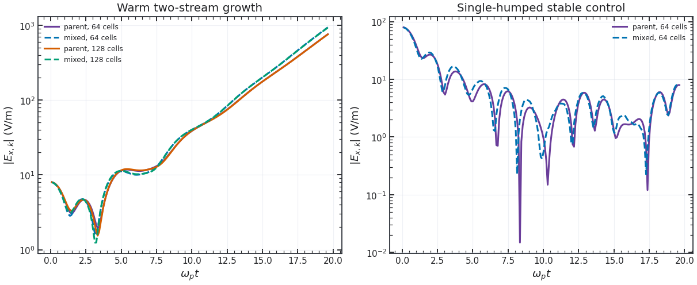

## Bump on tail with a finite dark field

The parent's [bump-on-tail example](https://github.com/uwplasma/JAX-in-Cell/blob/83d327118163833f93e2588edcb5029241f6ba2a/examples/2_intermediate/bump_on_tail.py) supplies the kinetic setup. We use two electron Maxwellians with a 3% beam at $5v_{th}$, beam width $0.7v_{th}$ and a compensating bulk drift $u_b=-0.03u_t/0.97$; a fixed background neutralizes their charge. The drift adjustment makes the **physical mean current zero**, and it distinguishes this loading from the parent's original example. The seeded $k_5$ displacement is $0.002/k_5$. In both solvers the positions, velocities, weights and ordinary initial field are identical. The same physical $\omega_p$, $v_{th}$, box and mode are held fixed across grid refinement. Although one-third of numerical markers represent the beam, their physical number weights integrate to 0.03 of the distribution. The plotted histogram divides weighted bin counts by total represented number and bin width; its saved arrays separate core and beam and report support and out-of-range number weight.

For each drifting Maxwellian $j$, use $\zeta_j=(\omega-ku_j)/(kv_{th,j})$ and the parent's independent [plasma dispersion function](https://github.com/uwplasma/JAX-in-Cell/blob/83d327118163833f93e2588edcb5029241f6ba2a/jaxincell/theory.py):

$$
\epsilon_L=1+\sum_j\frac{2\omega_{pj}^2}{k^2v_{th,j}^2}\left[1+\zeta_jZ(\zeta_j)\right],
\qquad
D_L=(s-\Omega_D^2)\epsilon_L+\eta^2s(\epsilon_L-1),
\qquad s=\omega^2-c^2k^2.
$$

At $\eta=0$, the growing root of $\epsilon_L=0$ is the parent limit; at $\eta=0.3$ the determinant includes the finite Proca reservoir. The independent roots give $\gamma/\omega_p=$ **{{ bump_base_parent_root }}** and **{{ bump_base_mixed_root }}**. On 128 cells with 80,000 bulk and 40,000 beam particles, the declared $18\leq\omega_pt\leq30$ fits give **{{ bump_base_parent_fit }}** and **{{ bump_base_mixed_fit }}**; on 256 cells with doubled loading and half the step they give **{{ bump_refined_parent_fit }}** and **{{ bump_refined_mixed_fit }}**. The [run record](_static/figures/bump_on_tail/run.json) includes regression errors and determinant residuals. The late distribution broadens and loses the narrow bump, consistent with wave–particle trapping and plateau formation described in the [parent example](https://github.com/uwplasma/JAX-in-Cell/blob/83d327118163833f93e2588edcb5029241f6ba2a/examples/2_intermediate/bump_on_tail.py) and the classic [Vedenov–Velikhov–Sagdeev](https://doi.org/10.1088/0029-5515/1/2/003) and [O'Neil](https://doi.org/10.1063/1.1761193) analyses. The PIC dark-minus-parent growth difference is smaller than the fit uncertainty; this replay checks the absolute growing branch but does **not** establish a resolved dark shift or a new nonlinear law.

The same example also saves a **selected-pole analytic scan** over physical beam fraction $0.001$–$0.05$, drift $4.5$–$5.5v_{th}$ and dark mass $0.1$–$2\omega_p$, with total density and both temperatures explicit. At fraction $0.001$, drift $5v_{th}$ and $\Omega_D=0.7\omega_p$, the ordinary selected beam pole has $\Im\omega/\omega_p=$ **{{ bump_threshold_ordinary_imag }}**, while full Proca gives **{{ bump_threshold_full_imag }}**; the Yukawa and constant-charge controls give **{{ bump_threshold_quasistatic_imag }}** and **{{ bump_threshold_effective_charge_imag }}**. The full and Yukawa branches nearly coincide, so screening predicts this change. A damped *selected pole* is not a proof that no other growing branch exists. This near-threshold point has no long-time PIC validation, and the 3% beam PIC result above must not be read as its validation. No independent incoming dark wave is prepared in either case.

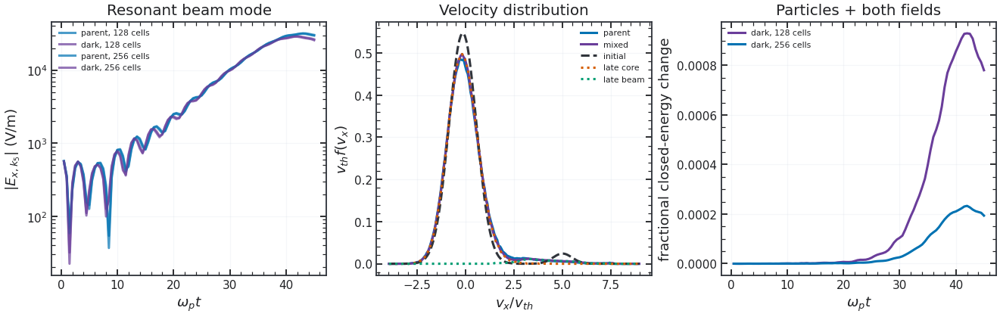

The largest sampled closed-energy change, counting kinetic, ordinary and *all Proca potential and field terms*, falls from **{{ bump_base_energy_percent }}%** to **{{ bump_refined_energy_percent }}%**. The dark Gauss residual stays at roundoff relative to the deposited-charge scale. Grid, particle and timestep all change together here; this is a joint refinement rather than an isolated error attribution. The [matched movie](_static/movies/bump_on_tail/figure.webp) uses the 128-cell, 120,000-electron loading. Its [record](_static/movies/bump_on_tail/run.json) gives the exact frame count and plotted subset; all particles still take part in the simulation. The movie is a visual comparison, while the two-level full record supports the numerical statements above.

## Transverse anisotropy

A current-neutral, unmagnetized bi-Maxwellian has $\sigma_x=0.08c$ and $A=T_z/T_x=4$. We seed a transverse $E_z,B_y$ mode, then fit **the magnetic-mode magnitude** on $20<\omega_pt<70$; the electric mode has a large oscillatory transient. The independent Vlasov–Proca reference uses

$$
\Pi_T=\omega_p^2[1-A(1+\zeta Z(\zeta))],\quad
\zeta=\frac{\omega}{\sqrt2k\sigma_x},\quad
(s-\mu^2)(s-\Pi_T)-\eta^2s\Pi_T=0.
$$

At zero frequency, put $Q=\sum_s\omega_{ps}^2(A_s-1)$ and $K=kc$. The marginal condition is $(K^2+\Omega_D^2)(K^2-Q)-\eta^2K^2Q=0$. `weibel_cutoff_squared` evaluates its positive root without cancellation at large mass. Its tested limits are $K_{\max}^2=Q$ for $\eta=0$ or a heavy dark field and $(1+\eta^2)Q$ for a light field. The right panel scans four mass ratios over $0\leq\eta\leq0.6$; at $\Omega_D/\omega_p=0.7$ and $\eta=0.3$, the marginal $kc/\omega_p$ is **{{ weibel_cutoff_kc_over_wp }}**. With fixed physical density, the seeded $k_1$ mode lies below this cutoff, while the $k_2$ control lies above it.

Its growing root is **{{ weibel_root }}** $\omega_p$; PIC gives **{{ weibel_pic }}** at 64 cells/30,000 particles and **{{ weibel_refined }}** at 128 cells/60,000 particles. The $\eta=0$ control is **{{ weibel_zero_pic }}**. The individual mixed-root fit agrees closely, but the predicted **difference** from zero coupling is comparable to fit uncertainty and is **not yet resolved as a mixing effect**. This is one anisotropy benchmark, not a survey of unstable branches. The [run record](_static/figures/mixed_weibel/run.json) includes the fit windows and uncertainty.

At the same 64-cell, 30,000-particle loading, the $k_2$ magnetic mode remains oscillatory through $\omega_pt\approx118$ instead of following the growing $k_1$ envelope. Its RMS on $40<\omega_pt<70$ is **{{ weibel_stable_late_over_early }}** times the RMS on $0<\omega_pt<10$; a stable transverse wave need not decay to zero. This is a two-mode marginal check. It does not address oblique modes, filament merging, or anisotropy loss in more than one spatial dimension.

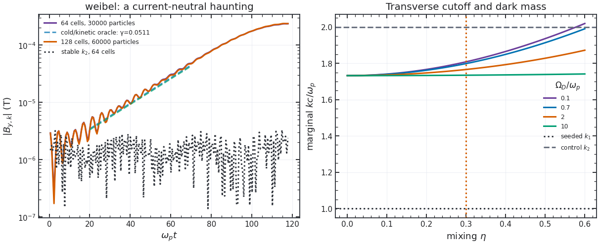

These two-stream and Weibel cases involve **ordinary charged species responding to both fields**. A theory in which particles carry a separate dark charge and interact through a massive mediator alone is a different model and is not implemented here. All $\eta=0.3$ cases use a deliberately large coupling to resolve numerical effects, with no observational interpretation. The quick presets are smoke tests without fitted growth rates.

## An oscillating pair plasma

The [pair option](../examples/dark_reservoir.py) first runs an **ordinary** electron–positron waterbag, following the nonrelativistic parameter case in [Cruz, Grismayer and Silva](https://arxiv.org/abs/2104.04490). Each species has $\omega_p^2=n_0e^2/(\epsilon_0m_e)$ and the nonrelativistic homogeneous frequency is $\omega_0=\sqrt2\omega_p$. The box is $70c/\omega_0$, the waterbag has full velocity width $0.1c$, and $E_0/(m_ec\omega_p/e)=0.2$, giving an initial quiver scale $0.2c/\sqrt2$. Equal electron and positron loadings start charge neutral. Opposite $2\times10^{-4}c$ velocity nudges seed one mode at $kv_T/\omega_0=0.6014$. The homogeneous field is a finite-energy initial condition, not an imposed drive. The full replay uses the parent's **relativistic Boris pusher**; the published OSIRIS run loads a momentum waterbag, whose difference from this velocity waterbag is small at the stated $v_T/c=0.05$ but is not zero.

The [independent reference](scripts/pair_reference.py) has two levels. Four waterbag edges give the nonrelativistic limit: the time-dependent drifts are $U_\pm(t)=\pm\delta v\sin(\omega_0t)$, and a one-period propagator gives a Floquet exponent. Its zero-pump eigenvalues recover $\omega^2=\omega_0^2+k^2v_T^2$ and the two ballistic edge frequencies $\pm kv_T$. For the relativistic PIC replay, 64 Gauss–Legendre nodes over the **initial velocity** propagate linearized orbit displacements and momenta, with self-consistent finite-$k$ fields from Gauss's law. Doubling the quadrature resolution changes the early complex trace by less than $10^{-4}$. This is an initial-value calculation with the same velocity nudge, not a fitted exponent or the paper's period-averaged Bessel dispersion. The analytic nonrelativistic Floquet value is a limit check; the relativistic trace is the quantitative PIC reference.

The full example reaches $\omega_0t=170$ with 4,096 cells, 32 markers per cell **per species**, and $\Delta t\omega_0=0.00625$. It is smaller in loading than the published OSIRIS run (5,000 cells, 500 markers per cell per species), though its step is comparable. The five pump-cycle peaks spanning cycles 2–6 fit $\gamma/\omega_0=$ **{{ pair_pic_growth }}** in PIC and **{{ pair_vlasov_growth }}** in the relativistic Vlasov initial-value calculation; the nonrelativistic Floquet limit is **{{ pair_floquet_growth }}**. The complex mode's relative $L^2$ difference over $0\leq\omega_0t\leq35$ falls from **{{ pair_coarse_error }}** at 1,024 cells to **{{ pair_fine_error }}** at 4,096 cells. The [run record](_static/figures/oscillating_pair/run.json) separates the grid, marker and timestep changes; the cycle-fit regression error is not a loading uncertainty.

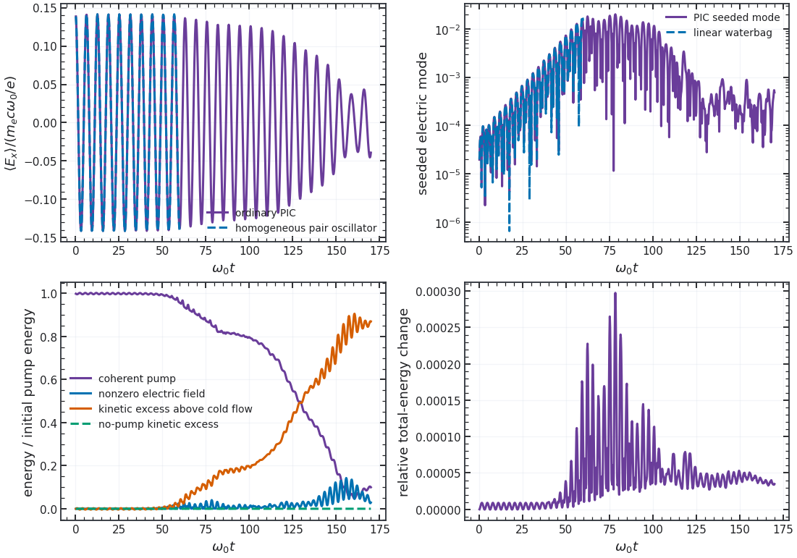

The coherent energy plotted below combines the mean electric field and a relativistic cold counterflow estimate from the mean current. It is normalized to the initial pump energy. The remaining kinetic increment is **excess above that cold-flow estimate**, not a rest-frame temperature. In the last 20 plasma times, the coherent fraction is **{{ pair_late_coherent }}** and the kinetic excess is **{{ pair_late_random }}** of the initial pump energy. The matched no-pump control changes that excess by **{{ pair_no_pump_random }}** on the same scale. A fivefold seed changes the first half-coherence time by **{{ pair_seed_shift }}** in $1/\omega_0$; the single-rate estimate $\ln 5/\gamma$ gives **{{ pair_seed_expected_shift }}**. The difference warns against using one linear growth rate to predict the nonlinear onset. The largest sampled total particle-plus-field energy change is **{{ pair_energy_drift }}** of the initial total. This supports the known oscillating-pair instability and its nonlinear transfer at the tested resolution. It does not yet test the massive-field modification or establish a new mechanism.

## A finite dark reservoir in the pair plasma

`python examples/dark_reservoir.py --pair-dark --full` starts the **same neutral pair loading and finite-$k$ velocity seed** with a bare homogeneous Proca field. Here $\eta=0.5$, $\Omega_D/\omega_0=1$, $E_0=0$, and $E_{D0}/(m_ec\omega_0/e)=0.1$. Thus the initial effective force has a $0.05c$ quiver scale. The dark reservoir initially contains four times the electric energy of an ordinary run with the **same force**; these are deliberately large numerical-validation parameters, not a dark-matter constraint. Both runs use the relativistic Boris pusher. The independently dynamical dark field differs from a prescribed sinusoidal force: its ordinary field, massive potential and pair current exchange energy from the first step.

In units $c=\omega_0=\epsilon_0=1$, the homogeneous reference advances $(E_0,D_0,A_0,P)$ with $\dot E_0=-U(P)$, $\dot D_0=\widehat\mu^2A_0-\eta U(P)$, $\dot A_0=-D_0$, and $\dot P=E_0+\eta D_0$. Here $U(P)$ averages the relativistic velocity of the shifted waterbag. The bare initial dark field excites **two coupled normal frequencies**; this background has no single prescribed pump period. For the seeded spatial mode, 64 velocity quadrature nodes evolve linearized displacement $\xi_s$ and momentum $\pi_s$ along each orbit:

$$
\dot\xi_s+ikv_s\xi_s=v'_s\pi_s,\qquad
\dot\pi_s+ikv_s\pi_s=q_s(E_k+\eta D_k),\qquad
\rho_k=-ik\sum_s q_s n_0\langle\xi_s\rangle.
$$

Ordinary and massive Gauss laws give $ikE_k=\rho_k$ and $ikD_k+\widehat\mu^2\phi_k=\eta\rho_k$, while $\dot A_k=-D_k-ik\phi_k$ and $\dot\phi_k=-ikA_k$. This is a finite-time initial-value reference independent of PIC deposition and pusher code. It is not assigned a Floquet exponent. The four-edge nonrelativistic limit and the zero-mixing reduction are separate analytic checks.

In the 4,096-cell, 32-marker-per-cell-per-species run, the early complex ordinary and dark electric coefficients differ from this reference by **{{ dark_pair_ordinary_error }}** and **{{ dark_pair_dark_error }}** in relative $L^2$ over $\omega_0t\leq35$. The homogeneous mean-field discrepancy is **{{ dark_pair_mean_error }}** of the initial dark field. Both all-step Gauss residuals are below **{{ dark_pair_gauss }}** on the fixed $E_\ast\omega_0/c$ scale. By the final 20 plasma times, the coherent mean reservoir fraction is **{{ dark_pair_coherent }}** and the kinetic excess above the cold counterflow estimate is **{{ dark_pair_kinetic }}** of the initial dark energy. The final fastest particle moves at **{{ dark_pair_final_speed }}$c$**; its speed stays bounded by the relativistic pusher. The largest sampled complete kinetic + Maxwell + Proca field-and-potential energy change is **{{ dark_pair_energy_drift }}** of the initial total, with the all-step ledger maximum in the [run record](_static/figures/oscillating_dark_pair/run.json).

The late coherent fraction changes to **{{ dark_pair_grid_control }}** at 2,048 cells and **{{ dark_pair_large_grid }}** at 8,192 cells with the same timestep and 32 markers per cell; at 4,096 cells it becomes **{{ dark_pair_marker_control }}** with 16 markers per cell and **{{ dark_pair_dense_markers }}** with 64, versus **{{ dark_pair_coherent }}** with 32. Doubling the timestep at 4,096 cells and 32 markers gives **{{ dark_pair_clock_control }}**. Thus the late fraction is sensitive to grid and loading even while the linear-response error falls below 1% at 8,192 cells. It is not a converged nonlinear result.

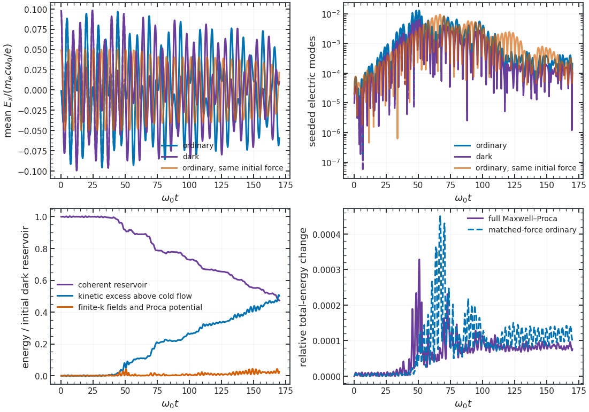

The orange ordinary control has the same particles, grid, timestep and **initial force**, but one quarter of the dark case's initial field energy. Its late coherent fraction, relative to its own initial field energy, is **{{ dark_pair_force_control }}**. A second ordinary control starts with the **same initial field energy** as the dark case, so its initial force is twice as large; its late coherent fraction is **{{ dark_pair_energy_control }}**. These comparisons expose the different force and energy budgets rather than isolating a new dark kinetic mechanism. The familiar ordinary pump instability was established by [Cruz, Grismayer and Silva](https://arxiv.org/abs/2104.04490). [Corelli *et al.*](https://arxiv.org/abs/2410.16357) evolve coupled photon–dark-photon fields with a cold plasma model; their calculation does not provide this waterbag kinetic trace. The selected case has no matched prescribed-drive control or independent nonlinear 1D1V replay. Its long-time transfer is a bounded numerical result at the tested resolutions, not a priority or universality claim.

## Mobile ions and a finite reservoir

The [mobile-ion example](../examples/dark_reservoir.py) uses co-located, exactly charge-neutral electron and proton loadings with $m_i/m_e$ at its physical value, $T_e=T_i=10^{-3}m_ec^2$, and a fixed seeded velocity mode. It compares zero drive, a prescribed longitudinal $F\cos\omega_pt$, and two dynamical Proca fields whose **initial** effective force $\eta E_D$ is the same $F=0.03m_e\omega_pv_{\rm th,e}/e$. Both Proca rest frequencies equal $\omega_p$. The small and large reservoirs set $\eta=0.2$ and $0.02$, giving initial dark energy **{{ mobile_small_energy_ratio }}** and **{{ mobile_large_energy_ratio }}** times the particles' initial longitudinal kinetic energy. Changing $\eta$ changes the reservoir size and backreaction while holding the initial force fixed.

An independent homogeneous two-fluid system evolves the mean ordinary field, dark field and both species velocities. It contains the finite ion mass and the same $\eta J$ source, but no PIC deposition. With 64 cells/4,000 particles per species and then 128 cells/8,000 particles per species at half the step, the refined maximum mean-field error over $F$ is **{{ mobile_external_oracle_error }}** for the external drive and **{{ mobile_large_oracle_error }}** for the large reservoir. The [run record](_static/figures/mobile_ions/run.json) gives both resolutions, all four cases and initial/final energy components. Over $\omega_pt\leq5$, the large reservoir's effective pump differs from the imposed cosine by at most **{{ mobile_large_early_pump_error }}$F$**. Through $\omega_pt=40$, the small reservoir gives up **{{ mobile_small_depletion }}%** of its initial dark energy and the large one **{{ mobile_large_depletion }}%**. The maximum absolute closed/work balance error over the declared initial-energy scale is **{{ mobile_max_balance }}**. The one-cell, species-specific random longitudinal kinetic measure changes by less than one percent in all cases; this run does not establish nonlinear heating or exponential growth.

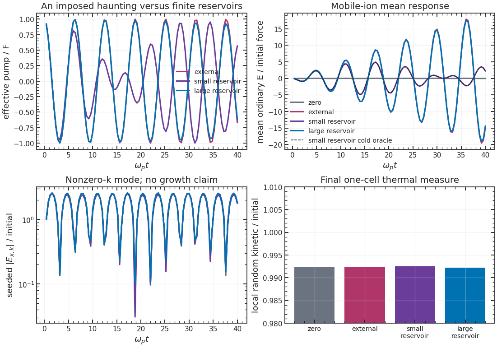

The [reported SHARP setup, Appendix B](https://arxiv.org/html/2510.13956v1) uses $L=40c/\omega_p$, 1,000 cells ($\Delta x=0.04c/\omega_p$), fifth-order particle shapes and a much longer horizon. Its Eq. (45), with $v_q^D/v_{\rm th,e}=0.03$, $v_{\rm th,e}/c=\sqrt{10^{-3}}$, and quoted noise-onset target $\omega_pt\simeq2.4$, implies roughly $2.06\times10^5$ total macroparticles **if those quantities are inserted literally**; the paper does not give that as an explicit per-species loading count. Our refined control uses 128 cells, $L=2\pi c/\omega_p$, 8,000 particles per species and $\omega_pt\leq40$. The box, shape order, loading and horizon differences preclude a claim that its later heating or saturation curves have been reproduced.

### Early paper-geometry pilot

`python examples/dark_reservoir.py --paper-pilot --output artifacts/paper_pilot` runs the stronger prescribed force and a matched zero-drive control on the reported 1,000-cell, $40c/\omega_p$ grid through $\omega_pt=80$. It repeats both with 20,000 and 40,000 quiet particles **per species**, seeded with the same $0.01v_{\rm th,e}$ velocity mode. The drive and mobile-ion mean field follow the independent two-fluid solution to within $0.031F$; the largest energy/work balance error is $0.0026$ of the initial particle energy. At 20,000 particles per species, the peak nonzero-$k$ electric energy is $0.0161$ of initial particle energy without the drive and $0.0166$ with it. At 40,000, those fractions fall to $0.00472$ and $0.00444$. The drive-minus-zero difference changes sign under loading refinement, so this pilot resolves **no pump-induced higher-mode growth** by $\omega_pt=80$. The cell-local random kinetic measure falls slightly in both controls; it gives no heating evidence here.

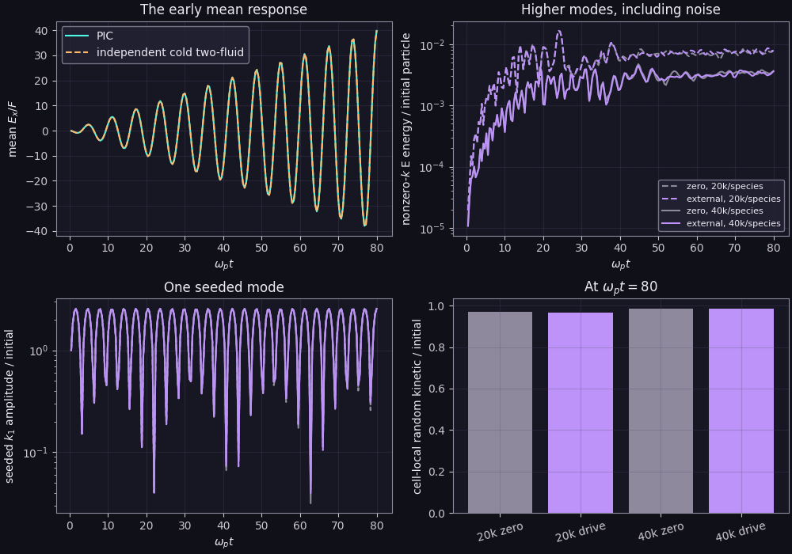

The [run record](_static/figures/paper_geometry_pilot/run.json) and [plotted arrays](_static/figures/paper_geometry_pilot/data.npz) retain both loadings. This is an early-time diagnostic with the parent's quadratic particle shape, $\leq80{,}000$ total particles and a horizon far short of the source's long runs. It neither reproduces nor rules out the reported nonlinear heating and saturation.

### Replay of the attached Hook–Huang–Shalaby Figure 2

`python examples/dark_reservoir.py --paper` uses the original [October 2025 preprint](https://arxiv.org/abs/2510.13956v1), Figure 2 and Appendix B. The target is a **prescribed spatially uniform electric force**, not an independently evolved dark reservoir. Electrons and mobile ions have $m_i/m_e=1836$, $T_e=T_i=10^{-3}m_ec^2$, $L=40c/\omega_p$, and 1,000 cells. Both species start at the same equally spaced positions, with independent Gaussian longitudinal velocities and no added spatial perturbation. Each draw is conditioned to zero mean and exactly the specified variance; the seed and this conditioning are recorded. The replay uses relativistic Boris, which gives the same electric-only momentum kick as Vay in this 1V setting. Its quadratic parent shapes differ from the paper's fifth-order shapes.

The paper defines $\sigma_s^2=\langle(v_x-\langle v_x\rangle)^2\rangle=T_s/m_s$ in Eq. B2. This is $v_{th,s}/\sqrt2$ in the parent API. With $r=v_q^D/\sigma_e$,

$$
E_{\rm applied}(t)=\frac{m_ec\omega_p}{e}a_0\cos(\omega_pt),\qquad
a_0=r\sqrt{10^{-3}},\qquad
\mathcal E_{s,\rm spread}=\frac{m_s}{2}\sum_p w_p(v_{x,p}-\overline v_{x,s})^2.
$$

The default $r=0.03$ matches the upper panel of Figure 2. `--drive-ratio 0.001` selects the lower-panel force, and `--drive-ratio 0` supplies the matched no-drive control. The earlier seeded pilot above used $0.03$ times the **parent** thermal-speed convention, making its force $\sqrt2$ larger than the upper-panel force. It remains a separate short control and is not Figure 2 evidence.

`--paper --full` selects 103,000 markers **per species** and $\omega_pt=5000$; `--particles`, `--cells`, `--dt`, `--horizon`, and `--seed` override the numerical controls. The total count follows the paper's Eq. B5 noise-onset estimate,

$$
\overline t_{\rm noise}=\frac{40}{a_0\sqrt{3N_pN_x/2}}.
$$

For $r=0.03$, $N_x=1000$ and $\overline t_{\rm noise}=2.4$, this gives $N_p\simeq2.06\times10^5$ **total** markers. It is an inference rather than a reported per-species count. The weak force requires about $1.85\times10^8$ total markers to retain the same estimate. A smaller weak-force replay therefore has a different noise budget and cannot be labeled a matched-loading reproduction.

The saved scalar histories include exact relativistic particle kinetic energy, the Eq. B3 velocity-spread measure, species mean and RMS velocities, mean and nonzero-$k$ electric energy, grid-scale density contrast, source work, and total momentum. The spread measure removes only the species-global mean; it includes spatial flows and does not measure a rest-frame thermodynamic temperature. Every-step maxima retain energy-minus-work, particle/grid charge, continuity, ordinary Gauss, and dark Gauss residuals without storing particle histories. `--coupling ETA` replaces the prescribed source by a finite Proca field with the same initial force, and includes its full potential energy and momentum.

Two independent controls accompany the PIC data. The finite-ion Newtonian solution generalizes Eq. A25: for $\tau=\omega_pt$, $b=1+1/1836$ and $E_{\star} = m_ec\omega_p/e$,

$$
\frac{\overline E}{E_{\star}}=\frac{ba_0}{b-1}\left[\cos(\sqrt b\,\tau)-\cos\tau\right].
$$

Its early, fixed-ion limit is $-a_0\tau\sin\tau/2$, with energy envelope $a_0^2\tau^2/8$. Independently integrated Gaussian momentum orbits retain relativistic thermal and amplitude detuning while suppressing spatial perturbations. This homogeneous reference can bound coherent field growth without exciting ion-density waves. A nonlinear spatial interpretation therefore requires a resolved increase in electron spread and density contrast relative to both this reference and the no-drive control, with separate grid, step, loading, and seed checks. The setup and linear-limit controls do not by themselves confirm the paper's late suppression curve, its proposed density mechanism, or its cosmological conclusion.

#### Long strong-drive replay and controls

The [record](_static/figures/paper_replay/run.json) combines clean-source driven and no-drive runs with 103,000 markers per species, 1,000 cells and $\Delta t\omega_p=0.02$, through $\tau=5000$. The displayed reference curves were digitized from the attached v1 PDF's visible vector paths, with logged axis calibration and PDF SHA-256. They are approximate plotted values, not the authors' simulation arrays. The [stored curves](_static/figures/paper_replay/data.npz) and [plot generator](scripts/make_paper_replay.py) retain the comparison independently of the illustration.

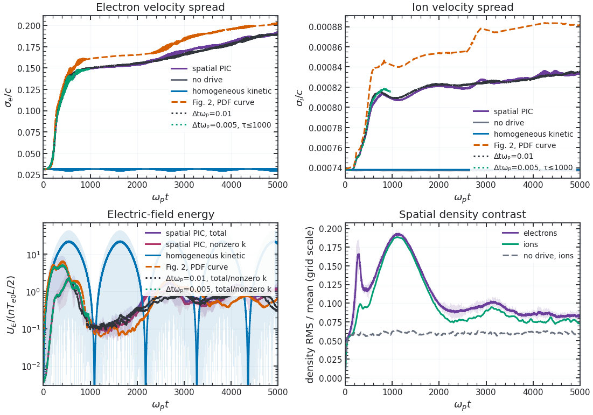

| Quantity at $\tau=5000$ | Spatial PIC | Visible Fig. 2 curve |
|---|---:|---:|
| Electron RMS spread $\sigma_e/c$ | {{ hook_electron_rms }} | {{ hook_target_electron_rms }} |
| Ion RMS spread $\sigma_i/c$ | {{ hook_ion_rms }} | {{ hook_target_ion_rms }} |
| Electron B3 spread-energy increment $\Delta W_e/(nm_ec^2L)$ | {{ hook_electron_B3_increment }} | {{ hook_target_electron_B3_increment }} |
| Ion B3 spread-energy increment $\Delta W_i/(nm_ec^2L)$ | {{ hook_ion_B3_increment }} | {{ hook_target_ion_B3_increment }} |

The RMS endpoint differences are **{{ hook_electron_difference_percent }}%** and **{{ hook_ion_difference_percent }}%**. Reconstructing B3's $W_s=nm_sL\sigma_s^2/2$ from those RMS curves and subtracting each species' initial $0.0005nm_ec^2L$ gives spread-energy increment differences of **{{ hook_electron_B3_difference_percent }}%** and **{{ hook_ion_B3_difference_percent }}%**. Small RMS differences therefore do not establish accurate ion energy gain. These reconstructed values are distinct from the PDF's ambiguously normalized solid energy curves and from exact relativistic kinetic energy. Over $4800\leq\tau\leq5000$, electron global spread energy is **{{ hook_spread_gain }}** times its initial value; the identical no-drive loading gives **{{ hook_no_drive_spread }}**. The homogeneous relativistic control has no growing spatial spread. Thus the spatial calculation reproduces the qualitative broadening trend, while a single particle realization and shape order cannot establish quantitative late convergence. Continued broadening at the end also precludes a steady-temperature claim.

Faint lines retain raw field-energy and density samples every $\Delta\tau=0.5$; thicker lines use a 13-sample moving average, spanning $6.5/\omega_p$, with trimmed endpoints. The source curve is shown as digitized. The density RMS uses the numerical grid scale and therefore requires separate interpretation under refinement. It supplies evidence of spatial response, without establishing the ion-density cross-phase or the proposed detuning mechanism. The field can also be bounded by homogeneous relativistic detuning, as the blue control demonstrates.

Every-step energy-minus-external-work error is at most **{{ hook_work_error_percent }}%** of peak injected work; momentum defect is **{{ hook_momentum }}** in $nm_ecL$ units. Continuity and ordinary Gauss maxima are **{{ hook_continuity }}** and **{{ hook_gauss }}**, scaled by $en\omega_p$ and $en/\epsilon_0$. These checks address numerical conservation, independently of curve agreement. The [PDF normalization review](validation.md#which-published-limits-are-tested) explains why the direct RMS comparison is used rather than rescaling the paper's solid thermal-energy curves.

#### Time refinement through the nonlinear transition

The same loading recipe, weights, physical parameters and seed were replayed at $\Delta\tau=0.01$ through $5000$, then at $0.005$ through $1000$. Initial particle moments match exactly. Refinement overlays use dotted curves for RMS speeds and total electric energy, and dash-dot curves for nonzero-$k$ electric energy; the green third-level curves end at $1000$. The late electron/ion spread-energy means change by $-1.09\%/+0.40\%$ on halving the full-run step, while total/nonzero-$k$ electric-energy means change by $-52.70\%/-65.00\%$. Energy-minus-work defects are $0.02412\%$ and $0.02371\%$ of peak injected work. Small conservation defects do not establish late field convergence.

For observable $X$, define the adjacent-level contraction on the indicated fixed window as

$$
R_X=\frac{\lVert X_{0.02}-X_{0.01}\rVert_2}{\lVert X_{0.01}-X_{0.005}\rVert_2}.
$$

Native samples are compared directly, with $10^{-5}$ tolerance on accumulated clocks and no interpolation or smoothing. These are paired trajectory differences from one particle realization, not an ensemble uncertainty.

| Window in $\tau$ | $R_{\overline E}$ | $R_{U_E}$ | $R_{U_{E,k\ne0}}$ |
|---|---:|---:|---:|
| 0–100 | {{ hook_contraction_100_mean_E }} | {{ hook_contraction_100_electric }} | {{ hook_contraction_100_nonzero_electric }} |
| 0–250 | {{ hook_contraction_250_mean_E }} | {{ hook_contraction_250_electric }} | {{ hook_contraction_250_nonzero_electric }} |
| 0–500 | {{ hook_contraction_500_mean_E }} | {{ hook_contraction_500_electric }} | {{ hook_contraction_500_nonzero_electric }} |
| 0–1000 | {{ hook_contraction_1000_mean_E }} | {{ hook_contraction_1000_electric }} | {{ hook_contraction_1000_nonzero_electric }} |

The ratio near four through $100$ verifies second-order behavior in the early smooth response. Contraction fails during nonlinear broadening. The fine-level relative $L^2$ differences through $1000$ are approximately $9.7\%$ for mean field and $27\%$ for nonzero-mode energy when normalized by the common $0.02$ trace. The [record](_static/figures/paper_replay/run.json) retains the norms, windows and raw computational provenance. The first $2\times$ and $5\times$ electron-spread crossings agree to the $0.5$ sample interval; the $20\times$ marker shifts from $553$ to $562.5$ to $626$. The finest trace already reaches $19.93\times$ before $625$, so a first threshold crossing is not a sharply defined instability onset. The $1000$-horizon conservation maxima also cannot be compared as equal-horizon improvements over the $5000$ runs.

#### Same-step prefix replay

A second $\Delta\tau=0.01$ run ends at $1000$, with the same clean computational source, loading recipe, seed, grid and output cadence. Its initial RMS speeds, means, kinetic/spread energies, weights and particle counts match the longer run exactly; initial field diagnostics differ at roundoff. Different horizons produce different compiled allocations. The table compares unsmoothed native samples with the longer run's prefix, using $\lVert X_{\rm repeat}-X_{0.01}\rVert_2/\lVert X_{0.01}\rVert_2$.

| Window in $\tau$ | Mean-field difference (%) | Total field-energy difference (%) | Nonzero-mode energy difference (%) |
|---|---:|---:|---:|
| 0–100 | {{ hook_repeat_100_mean_E_l2_percent }} | {{ hook_repeat_100_electric_l2_percent }} | {{ hook_repeat_100_nonzero_electric_l2_percent }} |
| 0–250 | {{ hook_repeat_250_mean_E_l2_percent }} | {{ hook_repeat_250_electric_l2_percent }} | {{ hook_repeat_250_nonzero_electric_l2_percent }} |
| 0–500 | {{ hook_repeat_500_mean_E_l2_percent }} | {{ hook_repeat_500_electric_l2_percent }} | {{ hook_repeat_500_nonzero_electric_l2_percent }} |
| 0–1000 | {{ hook_repeat_1000_mean_E_l2_percent }} | {{ hook_repeat_1000_electric_l2_percent }} | {{ hook_repeat_1000_nonzero_electric_l2_percent }} |

The repeat variation is negligible through $250$, where timestep contraction already fails, and becomes material during later broadening. Through $1000$, its mean-field and nonzero-energy differences are 34% and 19% of the fine adjacent-timestep differences. This one replay identifies execution sensitivity, not its cause or a statistical uncertainty. Exact initial particle arrays were not archived. The next nonlinear comparison needs repeated executions and independent loading seeds at fixed physical smoothing scales, alongside isolated mesh and timestep checks. A solver change should be judged on these observables as well as conservation.

#### Controlled replay preparation

The example now saves a compressed complete zero-time state before running. SHA-256 fingerprints identify the explicit loading positions/velocities and initialized particle weights, momenta and fields. `--initial-state` reuses that state after checking its particle arrays and physical metadata. `--block-horizon` compiles one fixed interval and carries the original conservation reference through every block; the total horizon changes the number of calls. These controls distinguish different compiled horizons from repeat variation within a fixed execution pattern.

`--local-moments` records Gaussian-smoothed species density contrast and lab-frame random-energy histories at $2\lambda_{D0}$ and $4\lambda_{D0}$, at the native scalar cadence. These physical scales stay fixed across grid changes. The variances subtract resolved local flow and remain distinct from thermodynamic temperature. Timings include synchronized execution and host scalar transfers, with compilation separate.

```sh
python examples/dark_reservoir.py --paper --full --dt 0.01 --horizon 1000 --block-horizon 100 --local-moments --output artifacts/paper_fixed_first
python examples/dark_reservoir.py --paper --full --dt 0.01 --horizon 1000 --block-horizon 100 --local-moments --initial-state artifacts/paper_fixed_first/initial_state.npz --output artifacts/paper_fixed_repeat
```

Run the following cases **sequentially**. The final complete restart is compressed and retained in each computational output; the public summary keeps compressed scalar curves and provenance.

```sh
python examples/dark_reservoir.py --paper --full --output artifacts/paper_full_drive
python examples/dark_reservoir.py --paper --full --drive-ratio 0 --output artifacts/paper_full_zero
python examples/dark_reservoir.py --paper --full --dt 0.01 --output artifacts/paper_dt_half
python examples/dark_reservoir.py --paper --full --dt 0.005 --horizon 1000 --output artifacts/paper_dt_quarter_transition
python examples/dark_reservoir.py --paper --full --dt 0.01 --horizon 1000 --output artifacts/paper_dt_half_prefix_replay
python docs/scripts/make_paper_replay.py --refined artifacts/paper_dt_half --refined artifacts/paper_dt_quarter_transition --repeat artifacts/paper_dt_half_prefix_replay --output docs/_static/figures/paper_replay
```

`--dt 0.01` repeats identical initial particles at half the timestep. A subsequent `--cells 2000 --dt 0.01` with unchanged particle count isolates spatial refinement against that run. Loading and independent-seed checks follow separately. The new output also retains initial/final local spread at fixed physical Gaussian smoothing lengths $2\lambda_{D0}$ and $4\lambda_{D0}$, with $\lambda_{D0}=\sqrt{10^{-3}}c/\omega_p$. These lab-frame moments remove resolved local flow; they remain distinct from a relativistic thermodynamic temperature. The original stored long runs precede those additional endpoint diagnostics. The weak-drive panel, Appendix C's much longer evolution and the cosmological conclusion remain open reproduction targets.
