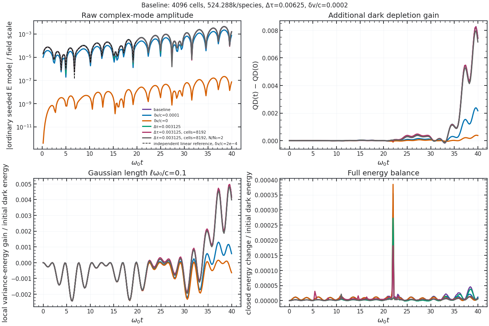
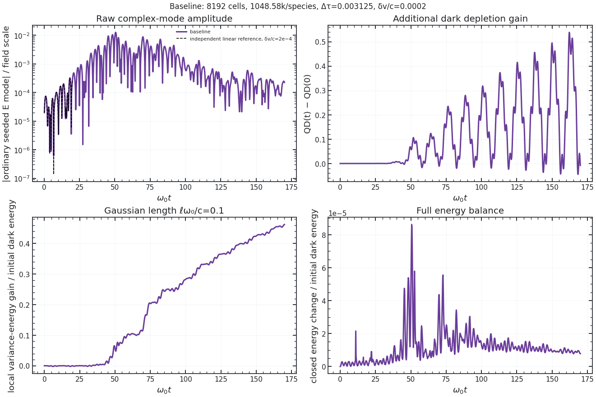
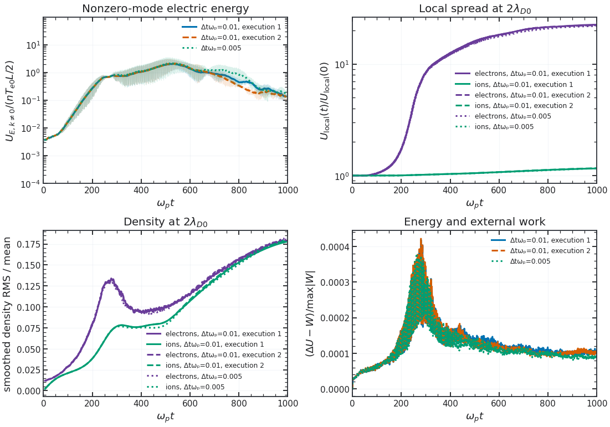
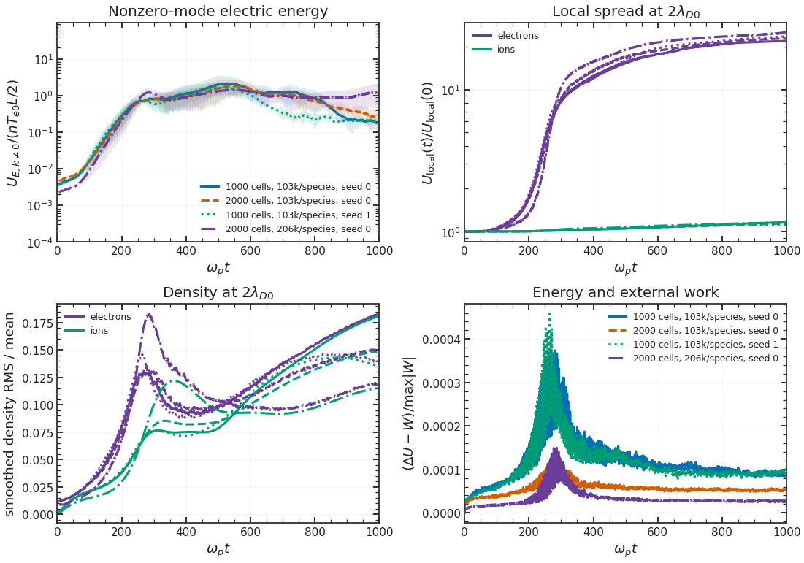
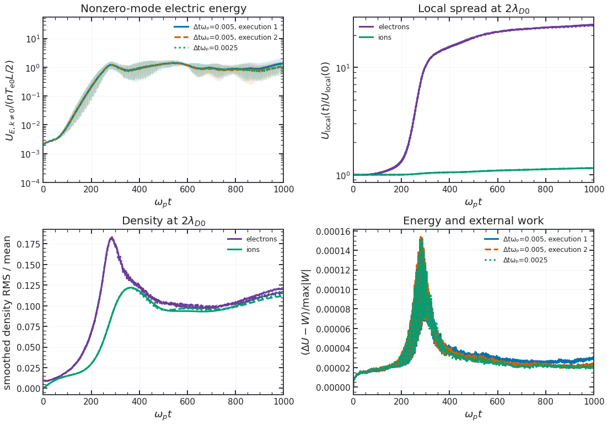
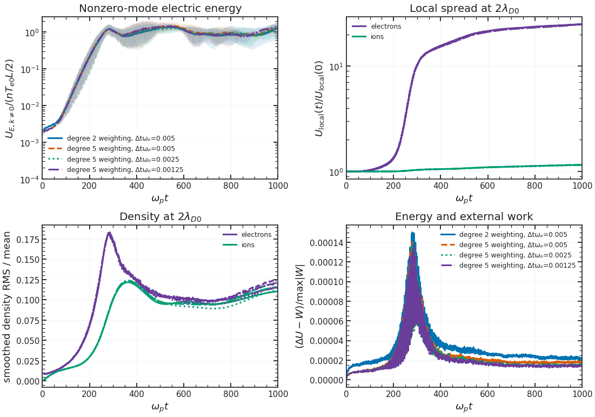

# Kinetic response of the coupled fields

The full longitudinal benchmark starts a small, fixed physical $k$ density perturbation in a current-neutral Maxwellian electron population with a uniform fixed neutralizing background. It uses 150,000 quiet particles, 64 cells, 1,200 steps, $k\lambda_D=0.5$, $\mu/\omega_p=1$, and $\eta=0.3$. The coupling is deliberately large enough for numerical validation; it is not an observational dark-matter parameter. The deposited **mean current remains physical** rather than being removed each step.

For $\sigma=\sqrt{T/m}$, $\zeta=\omega/(\sqrt2 k\sigma)$, and the Landau-continued plasma dispersion function $Z$, the independent reference solves

$$
\chi_L=\frac{\omega_p^2}{k^2\sigma^2}[1+\zeta Z(\zeta)],\qquad
D_L=(s-\mu^2)(1+\chi_L)+\eta^2s\chi_L=0,\qquad s=\omega^2-c^2k^2.
$$

The independent root has real and imaginary parts **{{ kinetic_root_real }}** and **{{ kinetic_root_imag }}** in $\omega_p$ units; the PIC fit gives **{{ kinetic_pic_real }}** and **{{ kinetic_pic_imag }}**. The real-frequency difference is **{{ kinetic_frequency_error }}%** and the damping-rate difference **{{ kinetic_damping_error }}%**. Five maxima between $\omega_pt=2.45$ and $11.225$ stand above the late mode floor; the fitted damping slope has a regression standard error of **{{ kinetic_damping_stderr }}** in $\omega_p$ units. The reference determinant residual and the exact window are stored in the [run record](_static/figures/mixed_kinetic/run.json).

The late floor contains a coherent dark branch as well as particle noise, so an unqualified single-mode fit to the entire record would be wrong. The quick preset is explicitly noise-limited and makes no fit. This is **one resolved mixed Landau case**, not a convergence study of all kinetic roots. The full density/cell/time/seed refinements required for a kinetic convergence claim have not yet been completed.

The same full run now advances **JAX-in-Cell itself** from the identical electron positions, velocities, weights, ordinary field, grid and timestep. Setting $\eta=0$ in the independent determinant gives the ordinary [Landau dispersion](https://arxiv.org/abs/2303.12620) limit $\omega/\omega_p=1.41566-0.15336i$. The parent fit is $1.41195-0.15338i$; the dark run and mixed root above shift both frequency and damping. The [matched data](_static/figures/mixed_kinetic/data.npz) store all three field-mode histories. The displayed decay ends at the measured late floor; neither trace supports a single exponential fit through late times.

## A physical-speed Landau replay

**Corrected producer (1 October 2026):** the example previously constructed $\Omega_D=\omega_p$ while its physical-preset theory and settings used $\Omega_D=kc=10\omega_p$. The earlier dirty producer source was not archived, so its simulated mass could not be certified. The table and figure now use three sequential GPU replays from clean revision `9e99dcbcb8ccbc1f55e661616123bc3934b79064`, with the same mass in simulation, theory and metadata. Independent neighboring-sample peak detection and NumPy least squares reproduce both fitted rates from the saved arrays.

[dark_kinetic.py](../examples/dark_kinetic.py) with `physical=True, full=True` holds $k\lambda_D=0.5$, $\sigma/c=0.05$, $\eta=0.3$, $\Omega_D/(kc)=1$, the box length and the physical $\omega_p$ fixed. Here $kc/\omega_p=10$, so the plasma-like phase speed is about $0.14c$. The largest initial sampled speed is below $0.224c$ in all three runs. The independent ordinary, full and quasistatic roots are **{{ physical_reference_parent }}**, **{{ physical_reference_mixed }}** and **{{ physical_reference_screened }}** in $\omega_p$ units. The closeness of the last two is a screening prediction for this setting, not evidence of a resonant propagating dark wave.

The same quiet loading is used for matched parent/dark runs at each resolution. A fixed $2<\omega_pt<12$ window fits the early absolute-field maxima; it does not require the signal to reach a noise floor. The longer windows $2$–$14$ and $3$–$16$ are saved as sensitivity checks. The complex ordinary, dark and effective mode coefficients, particle-plus-field energy and exact settings are in the linked records.

| Cells / markers / steps | Parent $\omega_r/\omega_p$ | Parent $\gamma/\omega_p$ | Mixed $\omega_r/\omega_p$ | Mixed $\gamma/\omega_p$ | Max sampled $\lvert\Delta U\rvert/U_0$ |
|---|---:|---:|---:|---:|---:|
| 32 / 40,000 / 3,000 | {{ physical_32_parent_measured_real_over_wp }} | {{ physical_32_parent_measured_imag_over_wp }} | {{ physical_32_measured_real_over_wp }} | {{ physical_32_measured_imag_over_wp }} | {{ physical_32_maximum_sampled_closed_energy_drift }} |
| 64 / 80,000 / 6,000 | {{ physical_64_parent_measured_real_over_wp }} | {{ physical_64_parent_measured_imag_over_wp }} | {{ physical_64_measured_real_over_wp }} | {{ physical_64_measured_imag_over_wp }} | {{ physical_64_maximum_sampled_closed_energy_drift }} |
| 128 / 160,000 / 12,000 | {{ physical_128_parent_measured_real_over_wp }} | {{ physical_128_parent_measured_imag_over_wp }} | {{ physical_128_measured_real_over_wp }} | {{ physical_128_measured_imag_over_wp }} | {{ physical_128_maximum_sampled_closed_energy_drift }} |

The mixed damping fit approaches its pole under this joint grid/loading/time refinement: $-0.17364$, $-0.15038$, $-0.14522\,\omega_p$, versus $-0.14580\,\omega_p$ analytically. This does not isolate those three numerical errors. The paired damping differences are $0.00410$, $0.00487$ and $0.00652\,\omega_p$, versus the predicted $0.00756\,\omega_p$. On 128 cells, the $2$–$14$ and $3$–$16$ windows give $0.00711$ and $0.00849\,\omega_p$. The absolute mixed rate is reproduced to about 0.4%, while the smaller difference remains unresolved at that precision. The late dark trace contains a coherent branch; a single damped exponential is not fitted through it. [32-cell record](_static/figures/physical_kinetic_32/run.json), [64-cell record](_static/figures/physical_kinetic_64/run.json), [128-cell record](_static/figures/physical_kinetic_128/run.json) include clean producer revision, data hashes and the independent fit audit.

## Counterstreaming ordinary electrons

Two equal cold electron beams start at $\pm0.25c$ with equal physical weights, so their **deposited mean current is exactly zero**. A uniform fixed background neutralizes charge. We perturb one beam's position at a fixed $k$, leaving the mean current physical. For $a=(ku/\omega_p)^2$, $z=(\omega/\omega_p)^2$, $K=kc/\omega_p$ and $\widehat\mu=\mu/\omega_p$, the independent mixed cold determinant after removing beam poles is

$$
(z-K^2-\widehat\mu^2)[(z-a)^2-(z+a)]-\eta^2(z-K^2)(z+a)=0.
$$

The unstable root gives $\gamma/\omega_p=$ **{{ two_stream_root }}** at $\eta=0.3$; the full PIC fit over the **declared** $10<\omega_pt<20$ interval gives **{{ two_stream_pic }}** on 64 cells and **{{ two_stream_refined }}** on 128 cells with twice the particles and half the time step. The same loading at $\eta=0$ gives **{{ two_stream_zero_pic }}**. The observed mixing-induced growth-rate difference agrees in sign and scale with the determinant's $\eta=0$ to $0.3$ difference; the absolute growth error still includes cold-PIC discretization. The [full run record](_static/figures/mixed_two_stream/run.json) holds fit standard errors and both resolutions.

### Screening versus a propagating dark response

For a longitudinal plasma eigenmode away from the free dark pole, eliminating the dark field gives

$$
\frac{E_{D,k}}{E_k}=\eta\frac{s}{s-\Omega_D^2},\qquad
1+\left(1+\eta^2\frac{s}{s-\Omega_D^2}\right)\chi_L=0,\qquad s=\omega^2-c^2k^2.
$$

At $|\omega|\ll kc$, the factor multiplying $\chi_L$ becomes $\alpha(k)=1+\eta^2c^2k^2/(c^2k^2+\Omega_D^2)$: ordinary Coulomb response plus a Yukawa contribution. The constant-charge limit instead uses $\alpha=1+\eta^2$. The [two-stream example](../examples/dark_instabilities.py) saves the full, quasistatic and constant-charge cold roots over dark mass. At its PIC setting, $kc/\omega_p=1.963495$, $ku/\omega_p=0.490874$, $\Omega_D/\omega_p=0.7$ and $\eta=0.3$:

| Analytic cold reference | $\gamma/\omega_p$ |
|---|---:|
| Ordinary Maxwell | 0.33847119 |
| Coulomb + Yukawa limit | 0.34667091 |
| Full Maxwell–Proca | 0.34669731 |
| Constant effective charge | 0.34764468 |

The quasistatic reference accounts for **99.679% of the full cold growth-rate shift** from ordinary Maxwell. This is an analytic comparison, not a separate PIC measurement. The late nonlinear dark-minus-parent difference is therefore not evidence by itself for a propagating dark resonance. In-medium shielding is established in [Dubovsky and Hernández-Chifflet](https://arxiv.org/abs/1509.00039), and a cold-fluid time-domain conversion model was studied by [Corelli *et al.*](https://arxiv.org/abs/2410.16357); the present calculation identifies which control explains this particular legacy benchmark.

The time-dependent part can be checked without a fitted pole. With $Y_k=E_{D,k}-\eta E_k$ and a prepared $Y_k(0)=\dot Y_k(0)=0$,

$$
\ddot Y_k+\omega_{D,k}^2Y_k=-\eta\Omega_D^2E_k,\qquad
Y_k(t)=-\eta\Omega_D^2\int_0^t\frac{\sin[\omega_{D,k}(t-t')]}{\omega_{D,k}}E_k(t')\,dt',
\quad \omega_{D,k}^2=c^2k^2+\Omega_D^2.
$$

The independent convolution of a seeded PIC ordinary-field history predicts its dark response to 0.518% at $\Delta t\omega_p=0.04$ and 0.130% at 0.02, relative to the peak $|Y_k|$. The test uses the compatible grid symbol $k\mapsto 2\sin(k\Delta x/2)/\Delta x$ and a trapezoidal time integral; its fourfold error reduction checks the retarded identity at second order. Other initial dark preparations add a free homogeneous solution and must be compared separately. The source histories are generated by the coupled PIC transition, while the integral is evaluated outside it.

### Through nonlinear saturation

[dark_saturation.py](../examples/dark_saturation.py) with `full=True` follows the **same cold beam loading** in the parent and dark solvers through $\omega_pt=80$. It starts with 64 cells, 4,000 particles per beam and $\Delta t\omega_p=0.025$. The five runs halve the step, then independently double cells and particles at the smaller step. The fitted parent/dark rates over $10<\omega_pt<20$ are $0.33228/0.34069$ at the base setting, $0.33407/0.34276$ after timestep refinement and $0.33435/0.34302$ after joint grid/loading refinement. The independent cold roots are $0.33847/0.34670$. The growth-rate difference survives these numerical refinements; absolute PIC rates are lower by roughly 1–2%.

The first large mode peak lies near $\omega_pt\simeq29$. The single-wave trapping estimate uses the complex force mode $E_{\rm eff,k}=E_k+\eta E_{D,k}$ and $\omega_b=\sqrt{2e k|E_{\rm eff,k}|/m_e}$. It reaches about $1.54\gamma_{\rm parent}$ in the ordinary run and $1.52\gamma_{\rm mixed}$ in the dark run. The order-unity ratio and phase-space roll-up are **consistent with electron trapping**, the familiar nonlinear two-stream mechanism; this scale is not an exact saturation prediction. The dark run retains sparse kinetic and field-energy records without particle histories; its final phase space reconstructs integer-time coordinates from the complete half-step restart state. Longitudinal fields are plotted on electric faces. The [SHARP code paper](https://arxiv.org/abs/1702.04732) also emphasizes long-time energy control and joint particle/grid refinement for two-stream PIC.

The [matched two-stream movie](_static/movies/two_stream/figure.webp) repeats the 128-cell case with 131,072 particles **per beam** at the same $\Delta t\omega_p=0.0125$ through $\omega_pt=120$. Against the 8,000-per-beam extended run, parent and mixed growth fits on $10\leq\omega_pt\leq20$ differ by $0.00106\omega_p$ and $0.00086\omega_p$. Their first-mode RMS histories differ by 0.09% and 0.14% over $40\leq\omega_pt\leq55$, growing to 10.0% and 11.3% over $80\leq\omega_pt\leq120$. These comparisons interpolate the smaller run to the movie times. All 262,144 particles are advanced in restartable chunks; 8,192 are plotted in each panel. The largest stored-frame relative complete-energy change is 0.188%. The [movie record](_static/movies/two_stream/run.json) stores the comparisons, energy history and frame spacing. The late loading sensitivity and the spatial sensitivity below both matter when interpreting the phase-space difference.

The RMS of $|E_{k_1}|$ on $40\leq\omega_pt\leq80$ is $69.84/67.60$, $70.95/67.97$ and $68.62/64.56$ kV/m for parent/dark at the base, time-refined and jointly-refined settings. The mixed case is 3.2–5.9% lower in this window. The largest **stored-sample** relative total-energy changes are 0.70/0.68%, 0.70/0.68% and 0.23/0.19% for parent/dark. The **dark total includes the full Proca electric, magnetic and potential energy**; comparing ordinary-only energy in the mixed run would mislabel physical exchange as error. The maximum dark-field work residual, divided by the largest absolute dark source-work transfer, is $1.91\times10^{-5}$ at the base step and $4.65\times10^{-6}$ after halving it. The refined grid/loading case gives $6.91\times10^{-6}$. Dark work is therefore well tracked even where the full particle-plus-field energy drifts.

At fixed $\Delta t\omega_p=0.0125$, the $2\times2$ cell/particle comparison is revealing: doubling from 4,000 to 8,000 **quiet cold particles per beam** changes the maximum fractional dark total-energy error by less than $10^{-9}$ at either grid size. Doubling cells from 64 to 128 changes it from **{{ saturation_short_coarse_drift_percent }}%** to **{{ saturation_short_refined_drift_percent }}%**. The first-mode RMS changes by 0.1–0.7% under particle doubling at fixed grid. This isolates grid spacing as the main tested limitation for this quiet loading; it does not determine the best spline order or the particle count required by a warm/noisy plasma. The [$\omega_pt=80$ record](_static/figures/two_stream_saturation/run.json) and [arrays](_static/figures/two_stream_saturation/data.npz) keep all five cases. All energy maxima use the same $0.5/\omega_p$ output spacing.

[dark_saturation.py](../examples/dark_saturation.py) with `extended=True` takes four matched cases through $\omega_pt=200$ at that **same output spacing**: the base run, the jointly-refined run, that same 128-cell run with half its timestep, and a 256-cell run at the same smaller timestep with twice as many particles. On $120\leq\omega_pt\leq200$, dark $k_1$ RMS is **{{ saturation_long_coarse_mode_drop_percent }}%** lower than the parent on 64 cells, but **{{ saturation_long_refined_mode_drop_percent }}%** lower on 128 cells. The time-averaged electric energy in *all nonzero spatial modes* is **{{ saturation_long_coarse_field_drop_percent }}%** and **{{ saturation_long_refined_field_drop_percent }}%** lower, respectively, normalized against the same initial parent total. These late amplitudes are visibly grid-sensitive; the run establishes neither a converged suppression factor nor a new long-time law. The largest stored-sample dark total-energy changes remain **{{ saturation_long_coarse_drift_percent }}%** and **{{ saturation_long_refined_drift_percent }}%**, with no secular increase beyond the early nonlinear peak in this diagnostic. The [$\omega_pt=200$ record](_static/figures/two_stream_extended/run.json) and [arrays](_static/figures/two_stream_extended/data.npz) preserve the matched traces.

At 128 cells, halving $\Delta t\omega_p$ from 0.0125 to 0.00625 leaves the late dark-minus-parent first-mode RMS at **{{ saturation_long_halfstep_mode_change_percent }}%**, versus **−{{ saturation_long_refined_mode_drop_percent }}%** before the step change. At the **same** $0.00625$ step, 256 cells and 16,000 particles per beam give **{{ saturation_long_fine_mode_change_percent }}%**. For all nonzero electric modes, those 128/256-cell differences are **{{ saturation_long_halfstep_field_change_percent }}%** and **{{ saturation_long_fine_field_change_percent }}%**. The finest run improves the largest sampled closed-energy change to **{{ saturation_long_fine_drift_percent }}%**, but reverses the direction of the late field difference. The measured late effect is therefore **not spatially converged**, even in sign.

Late coherent phases and vortex shapes change with grid refinement. A warmer, seeded ensemble and further spatial refinement are needed before interpreting the late difference physically. This cold two-stream problem has no counterpart for separately dark-charged particles; both beams carry ordinary charge and couple through $\eta$. It also differs from the mobile-ion, homogeneous resonant drive in [Hook, Huang and Shalaby, arXiv v1](https://arxiv.org/pdf/2510.13956v1) and is not a reproduction of that paper's heating curve.

## Warm two streams and a stable control

The [warm two-stream example](../examples/dark_instabilities.py) uses two equal-density electron Maxwellians drifting at $\pm0.05c$. Their finite-loading means are adjusted to make the physical mean current zero, and the fixed background neutralizes charge. The selected mode has $ku/\omega_p=0.5$, $kc/\omega_p=10$ and $\Omega_D/(kc)=1$. The growing pair has $\sigma/c=0.01$; the single-humped control has $\sigma/c=0.06$. A manufactured $\eta=0.6$ makes the root separation visible at feasible resolution; it is not an astrophysical coupling constraint. The control uses a tenfold larger position seed to expose its initial decay above the marker floor.

The shared drifting-Maxwellian determinant predicts the following selected roots. The control's velocity distribution decreases monotonically away from $v=0$, and its selected roots lie below the real-frequency axis. This is a stable control at the chosen $k$, rather than a claim that a failed Newton solve found no unstable root.

| Reference | Growing $\gamma/\omega_p$ | Control $\gamma/\omega_p$ |
|---|---:|---:|
| Ordinary Maxwell | {{ warm_ordinary_root }} | $-0.78358$ |
| Coulomb + Yukawa | {{ warm_quasistatic_root }} | $-0.77564$ |
| Full Maxwell–Proca | {{ warm_full_root }} | $-0.77562$ |
| Constant effective charge | {{ warm_effective_charge_root }} | $-0.76954$ |

For the unstable loading, both solvers start from exactly the same particles. The fixed $6<\omega_pt<16$ log-amplitude slopes are {{ warm_64_parent_fit }}/{{ warm_64_mixed_fit }} on 64 cells with 60,000 markers, and {{ warm_128_parent_fit }}/{{ warm_128_mixed_fit }} on 128 cells with 120,000 markers. The predicted full-minus-ordinary difference is $0.01649\,\omega_p$; the two measured differences are $0.01980$ and $0.02001\,\omega_p$. These paired slopes are grid-stable at the tested resolutions, but shifting the fit window among $8$–$16$, $10$–$18$ and $12$–$19$ moves the inferred difference over approximately $0.008$–$0.022\,\omega_p$. The measured difference has therefore **not** met the window-uncertainty gate for a precise dark correction. The full Proca and Yukawa roots differ by only $8.2\times10^{-6}\,\omega_p$; this setup mainly tests screening, not a propagating dark resonance.

The hotter control first phase mixes, then fluctuates at its finite-marker floor. Its mixed-mode RMS on $12<\omega_pt<18$ is **{{ warm_stable_late_over_early }}** times the RMS on $0<\omega_pt<2$; it shows no comparable sustained exponential growth through the recorded $\omega_pt\approx20$. The largest sampled complete-energy change falls from **{{ warm_64_energy_drift }}** to **{{ warm_128_energy_drift }}** in the unstable joint refinement. These ratios normalize to the particles' large thermal/drift energy; they do not by themselves establish convergence of the small field-mode difference. [Settings, fits, complex histories and energy arrays](_static/figures/warm_two_stream/run.json).

## Bump on tail with a finite dark field

The parent's [bump-on-tail example](https://github.com/uwplasma/JAX-in-Cell/blob/83d327118163833f93e2588edcb5029241f6ba2a/examples/2_intermediate/bump_on_tail.py) supplies the kinetic setup. We use two electron Maxwellians with a 3% beam at $5v_{th}$, beam width $0.7v_{th}$ and a compensating bulk drift $u_b=-0.03u_t/0.97$; a fixed background neutralizes their charge. The drift adjustment makes the **physical mean current zero**, and it distinguishes this loading from the parent's original example. The seeded $k_5$ displacement is $0.002/k_5$. In both solvers the positions, velocities, weights and ordinary initial field are identical. The same physical $\omega_p$, $v_{th}$, box and mode are held fixed across grid refinement. Although one-third of numerical markers represent the beam, their physical number weights integrate to 0.03 of the distribution. The plotted histogram divides weighted bin counts by total represented number and bin width; its saved arrays separate core and beam and report support and out-of-range number weight.

For each drifting Maxwellian $j$, use $\zeta_j=(\omega-ku_j)/(kv_{th,j})$ and the parent's independent [plasma dispersion function](https://github.com/uwplasma/JAX-in-Cell/blob/83d327118163833f93e2588edcb5029241f6ba2a/jaxincell/theory.py):

$$
\epsilon_L=1+\sum_j\frac{2\omega_{pj}^2}{k^2v_{th,j}^2}\left[1+\zeta_jZ(\zeta_j)\right],
\qquad
D_L=(s-\Omega_D^2)\epsilon_L+\eta^2s(\epsilon_L-1),
\qquad s=\omega^2-c^2k^2.
$$

At $\eta=0$, the growing root of $\epsilon_L=0$ is the parent limit; at $\eta=0.3$ the determinant includes the finite Proca reservoir. The independent roots give $\gamma/\omega_p=$ **{{ bump_base_parent_root }}** and **{{ bump_base_mixed_root }}**. On 128 cells with 80,000 bulk and 40,000 beam particles, the declared $18\leq\omega_pt\leq30$ fits give **{{ bump_base_parent_fit }}** and **{{ bump_base_mixed_fit }}**; on 256 cells with doubled loading and half the step they give **{{ bump_refined_parent_fit }}** and **{{ bump_refined_mixed_fit }}**. The [run record](_static/figures/bump_on_tail/run.json) includes regression errors and determinant residuals. The late distribution broadens and loses the narrow bump, consistent with wave–particle trapping and plateau formation described in the [parent example](https://github.com/uwplasma/JAX-in-Cell/blob/83d327118163833f93e2588edcb5029241f6ba2a/examples/2_intermediate/bump_on_tail.py) and the classic [Vedenov–Velikhov–Sagdeev](https://doi.org/10.1088/0029-5515/1/2/003) and [O'Neil](https://doi.org/10.1063/1.1761193) analyses. The PIC dark-minus-parent growth difference is smaller than the fit uncertainty; this replay checks the absolute growing branch but does **not** establish a resolved dark shift or a new nonlinear law.

The same example also saves a **selected-pole analytic scan** over physical beam fraction $0.001$–$0.05$, drift $4.5$–$5.5v_{th}$ and dark mass $0.1$–$2\omega_p$, with total density and both temperatures explicit. At fraction $0.001$, drift $5v_{th}$ and $\Omega_D=0.7\omega_p$, the ordinary selected beam pole has $\Im\omega/\omega_p=$ **{{ bump_threshold_ordinary_imag }}**, while full Proca gives **{{ bump_threshold_full_imag }}**; the Yukawa and constant-charge controls give **{{ bump_threshold_quasistatic_imag }}** and **{{ bump_threshold_effective_charge_imag }}**. The full and Yukawa branches nearly coincide, so screening predicts this change. A damped *selected pole* is not a proof that no other growing branch exists. This near-threshold point has no long-time PIC validation, and the 3% beam PIC result above must not be read as its validation. No independent incoming dark wave is prepared in either case.

The largest sampled closed-energy change, counting kinetic, ordinary and *all Proca potential and field terms*, falls from **{{ bump_base_energy_percent }}%** to **{{ bump_refined_energy_percent }}%**. The dark Gauss residual stays at roundoff relative to the deposited-charge scale. Grid, particle and timestep all change together here; this is a joint refinement rather than an isolated error attribution. The [matched movie](_static/movies/bump_on_tail/figure.webp) uses the 128-cell, 120,000-electron loading. Its [record](_static/movies/bump_on_tail/run.json) gives the exact frame count and plotted subset; all particles still take part in the simulation. The movie is a visual comparison, while the two-level full record supports the numerical statements above.

## Transverse anisotropy

A current-neutral, unmagnetized bi-Maxwellian has $\sigma_x=0.08c$ and $A=T_z/T_x=4$. We seed a transverse $E_z,B_y$ mode, then fit **the magnetic-mode magnitude** on $20<\omega_pt<70$; the electric mode has a large oscillatory transient. The independent Vlasov–Proca reference uses

$$
\Pi_T=\omega_p^2[1-A(1+\zeta Z(\zeta))],\quad
\zeta=\frac{\omega}{\sqrt2k\sigma_x},\quad
(s-\mu^2)(s-\Pi_T)-\eta^2s\Pi_T=0.
$$

At zero frequency, put $Q=\sum_s\omega_{ps}^2(A_s-1)$ and $K=kc$. The marginal condition is $(K^2+\Omega_D^2)(K^2-Q)-\eta^2K^2Q=0$. `weibel_cutoff_squared` evaluates its positive root without cancellation at large mass. Its tested limits are $K_{\max}^2=Q$ for $\eta=0$ or a heavy dark field and $(1+\eta^2)Q$ for a light field. The right panel scans four mass ratios over $0\leq\eta\leq0.6$; at $\Omega_D/\omega_p=0.7$ and $\eta=0.3$, the marginal $kc/\omega_p$ is **{{ weibel_cutoff_kc_over_wp }}**. With fixed physical density, the seeded $k_1$ mode lies below this cutoff, while the $k_2$ control lies above it.

Its growing root is **{{ weibel_root }}** $\omega_p$; PIC gives **{{ weibel_pic }}** at 64 cells/30,000 particles and **{{ weibel_refined }}** at 128 cells/60,000 particles. The $\eta=0$ control is **{{ weibel_zero_pic }}**. The individual mixed-root fit agrees closely, but the predicted **difference** from zero coupling is comparable to fit uncertainty and is **not yet resolved as a mixing effect**. This is one anisotropy benchmark, not a survey of unstable branches. The [run record](_static/figures/mixed_weibel/run.json) includes the fit windows and uncertainty.

At the same 64-cell, 30,000-particle loading, the $k_2$ magnetic mode remains oscillatory through $\omega_pt\approx118$ instead of following the growing $k_1$ envelope. Its RMS on $40<\omega_pt<70$ is **{{ weibel_stable_late_over_early }}** times the RMS on $0<\omega_pt<10$; a stable transverse wave need not decay to zero. This is a two-mode marginal check. It does not address oblique modes, filament merging, or anisotropy loss in more than one spatial dimension.

These two-stream and Weibel cases involve **ordinary charged species responding to both fields**. A theory in which particles carry a separate dark charge and interact through a massive mediator alone is a different model and is not implemented here. All $\eta=0.3$ cases use a deliberately large coupling to resolve numerical effects, with no observational interpretation. The quick presets are smoke tests without fitted growth rates.

## An oscillating pair plasma

The [pair option](../examples/dark_reservoir.py) first runs an **ordinary** electron–positron waterbag, following the nonrelativistic parameter case in [Cruz, Grismayer and Silva](https://arxiv.org/abs/2104.04490). Each species has $\omega_p^2=n_0e^2/(\epsilon_0m_e)$ and the nonrelativistic homogeneous frequency is $\omega_0=\sqrt2\omega_p$. The box is $70c/\omega_0$, the waterbag has full velocity width $0.1c$, and $E_0/(m_ec\omega_p/e)=0.2$, giving an initial quiver scale $0.2c/\sqrt2$. Equal electron and positron loadings start charge neutral. Opposite $2\times10^{-4}c$ velocity nudges seed one mode at $kv_T/\omega_0=0.6014$. The homogeneous field is a finite-energy initial condition, not an imposed drive. The full replay uses the parent's **relativistic Boris pusher**; the published OSIRIS run loads a momentum waterbag, whose difference from this velocity waterbag is small at the stated $v_T/c=0.05$ but is not zero.

The [independent reference](scripts/pair_reference.py) has two levels. Four waterbag edges give the nonrelativistic limit: the time-dependent drifts are $U_\pm(t)=\pm\delta v\sin(\omega_0t)$, and a one-period propagator gives a Floquet exponent. Its zero-pump eigenvalues recover $\omega^2=\omega_0^2+k^2v_T^2$ and the two ballistic edge frequencies $\pm kv_T$. For the relativistic PIC replay, 64 Gauss–Legendre nodes over the **initial velocity** propagate linearized orbit displacements and momenta, with self-consistent finite-$k$ fields from Gauss's law. Doubling the quadrature resolution changes the early complex trace by less than $10^{-4}$. This is an initial-value calculation with the same velocity nudge, not a fitted exponent or the paper's period-averaged Bessel dispersion. The analytic nonrelativistic Floquet value is a limit check; the relativistic trace is the quantitative PIC reference.

The full example reaches $\omega_0t=170$ with 4,096 cells, 32 markers per cell **per species**, and $\Delta t\omega_0=0.00625$. It is smaller in loading than the published OSIRIS run (5,000 cells, 500 markers per cell per species), though its step is comparable. The five pump-cycle peaks spanning cycles 2–6 fit $\gamma/\omega_0=$ **{{ pair_pic_growth }}** in PIC and **{{ pair_vlasov_growth }}** in the relativistic Vlasov initial-value calculation; the nonrelativistic Floquet limit is **{{ pair_floquet_growth }}**. The complex mode's relative $L^2$ difference over $0\leq\omega_0t\leq35$ falls from **{{ pair_coarse_error }}** at 1,024 cells to **{{ pair_fine_error }}** at 4,096 cells. The [run record](_static/figures/oscillating_pair/run.json) separates the grid, marker and timestep changes; the cycle-fit regression error is not a loading uncertainty.

The coherent energy plotted below combines the mean electric field and a relativistic cold counterflow estimate from the mean current. It is normalized to the initial pump energy. The remaining kinetic increment is **excess above that cold-flow estimate**, not a rest-frame temperature. In the last 20 plasma times, the coherent fraction is **{{ pair_late_coherent }}** and the kinetic excess is **{{ pair_late_random }}** of the initial pump energy. The matched no-pump control changes that excess by **{{ pair_no_pump_random }}** on the same scale. A fivefold seed changes the first half-coherence time by **{{ pair_seed_shift }}** in $1/\omega_0$; the single-rate estimate $\ln 5/\gamma$ gives **{{ pair_seed_expected_shift }}**. The difference warns against using one linear growth rate to predict the nonlinear onset. The largest sampled total particle-plus-field energy change is **{{ pair_energy_drift }}** of the initial total. This supports the known oscillating-pair instability and its nonlinear transfer at the tested resolution. It does not yet test the massive-field modification or establish a new mechanism.

## A finite dark reservoir in the pair plasma

[dark_reservoir.py](../examples/dark_reservoir.py) with `study='pair_dark', full=True` starts the **same neutral pair loading and finite-$k$ velocity seed** with a bare homogeneous Proca field. Here $\eta=0.5$, $\Omega_D/\omega_0=1$, $E_0=0$, and $E_{D0}/(m_ec\omega_0/e)=0.1$. Thus the initial effective force has a $0.05c$ quiver scale. The dark reservoir initially contains four times the electric energy of an ordinary run with the **same force**; these are deliberately large numerical-validation parameters, not a dark-matter constraint. Both runs use the relativistic Boris pusher. The independently dynamical dark field differs from a prescribed sinusoidal force: its ordinary field, massive potential and pair current exchange energy from the first step.

In units $c=\omega_0=\epsilon_0=1$, the homogeneous reference advances $(E_0,D_0,A_0,P)$ with $\dot E_0=-U(P)$, $\dot D_0=\widehat\mu^2A_0-\eta U(P)$, $\dot A_0=-D_0$, and $\dot P=E_0+\eta D_0$. Here $U(P)$ averages the relativistic velocity of the shifted waterbag. The bare initial dark field excites **two coupled normal frequencies**; this background has no single prescribed pump period. For the seeded spatial mode, 64 velocity quadrature nodes evolve linearized displacement $\xi_s$ and momentum $\pi_s$ along each orbit:

$$
\dot\xi_s+ikv_s\xi_s=v'_s\pi_s,\qquad
\dot\pi_s+ikv_s\pi_s=q_s(E_k+\eta D_k),\qquad
\rho_k=-ik\sum_s q_s n_0\langle\xi_s\rangle.
$$

Ordinary and massive Gauss laws give $ikE_k=\rho_k$ and $ikD_k+\widehat\mu^2\phi_k=\eta\rho_k$, while $\dot A_k=-D_k-ik\phi_k$ and $\dot\phi_k=-ikA_k$. This is a finite-time initial-value reference independent of PIC deposition and pusher code. It is not assigned a Floquet exponent. The four-edge nonrelativistic limit and the zero-mixing reduction are separate analytic checks.

In the 4,096-cell, 32-marker-per-cell-per-species run, the early complex ordinary and dark electric coefficients differ from this reference by **{{ dark_pair_ordinary_error }}** and **{{ dark_pair_dark_error }}** in relative $L^2$ over $\omega_0t\leq35$. The homogeneous mean-field discrepancy is **{{ dark_pair_mean_error }}** of the initial dark field. Both all-step Gauss residuals are below **{{ dark_pair_gauss }}** on the fixed $E_\ast\omega_0/c$ scale. By the final 20 plasma times, the coherent mean reservoir fraction is **{{ dark_pair_coherent }}** and the kinetic excess above the cold counterflow estimate is **{{ dark_pair_kinetic }}** of the initial dark energy. The final fastest particle moves at **{{ dark_pair_final_speed }}$c$**; its speed stays bounded by the relativistic pusher. The largest sampled complete kinetic + Maxwell + Proca field-and-potential energy change is **{{ dark_pair_energy_drift }}** of the initial total, with the all-step ledger maximum in the [run record](_static/figures/oscillating_dark_pair/run.json).

The late coherent fraction changes to **{{ dark_pair_grid_control }}** at 2,048 cells and **{{ dark_pair_large_grid }}** at 8,192 cells with the same timestep and 32 markers per cell; at 4,096 cells it becomes **{{ dark_pair_marker_control }}** with 16 markers per cell and **{{ dark_pair_dense_markers }}** with 64, versus **{{ dark_pair_coherent }}** with 32. Doubling the timestep at 4,096 cells and 32 markers gives **{{ dark_pair_clock_control }}**. Thus the late fraction is sensitive to grid and loading even while the linear-response error falls below 1% at 8,192 cells. It is not a converged nonlinear result.

The orange ordinary control has the same particles, grid, timestep and **initial force**, but one quarter of the dark case's initial field energy. Its late coherent fraction, relative to its own initial field energy, is **{{ dark_pair_force_control }}**. A second ordinary control starts with the **same initial field energy** as the dark case, so its initial force is twice as large; its late coherent fraction is **{{ dark_pair_energy_control }}**. These comparisons expose the different force and energy budgets rather than isolating a new dark kinetic mechanism. The familiar ordinary pump instability was established by [Cruz, Grismayer and Silva](https://arxiv.org/abs/2104.04490). [Corelli *et al.*](https://arxiv.org/abs/2410.16357) evolve coupled photon–dark-photon fields with a cold plasma model; their calculation does not provide this waterbag kinetic trace. The selected case has no matched prescribed-drive control or independent nonlinear 1D1V replay. Its long-time transfer is a bounded numerical result at the tested resolutions, not a priority or universality claim.

### Velocity sampling and numerical recurrence

The archived pair replays above repeat the same midpoint waterbag velocities in every cell. Increasing the number of spatial cells therefore increases total particles without increasing the number of distinct unperturbed velocities. This is a separate resolution limit from particle weighting and mesh spacing. For $N$ equally weighted velocities on $[-V,V]$, free streaming gives the exact discrete characteristic function

$$
F_N(k,t)=\frac{\sin(kVt)}{N\sin(kVt/N)},\qquad
F(k,t)=\frac{\sin(kVt)}{kVt},\qquad
t_{\rm rec}=\frac{\pi N}{kV}.
$$

Here $V=0.05c$, $L=70c/\omega_0$ and the seeded Fourier mode is 134. With 32 velocities, $\omega_0t_{\rm rec}=167.16$, close to the archived $170$ horizon. At $170$, $F_{32}=-0.5813$, versus $F=0.009693$. These are **independent free-streaming limits**, not a diagnosis of the nonlinear PIC result: relativistic acceleration and trapping change the trajectories. Even before recurrence, the relative discrete envelope differs by $z/\sin z-1$, with $z=kVt/N$. Keeping that bound below 2% through $170$ requires at least 298 velocities; 512 gives 0.67%. Through $500$, 1,024 velocities give 1.45%. Generated higher spatial harmonics impose stricter requirements.

[Loading and reference companion](../examples/dark_reservoir.py) · `pair_plasma(..., pair_loading='cell')`; [independent characteristic-function and seeded-charge checks](../tests/test_pair_reference.py).

The recurrence relation follows the phase aliasing described by [Einkemmer and Ostermann, §2](https://arxiv.org/html/1401.4809v1#S2). Their grid-based analysis is applied here to the deliberately discrete velocity beams, rather than to randomly sampled PIC generally. [Pezzi, Camporeale and Valentini, §§III–IV](https://arxiv.org/html/1601.05240v1) show that early linear growth and nonlinear saturation can respond differently to recurrence. Agreement of the early pair mode therefore does not validate the stored late depletion fraction.

The optional `pair_loading='global'` distributes midpoint quantiles across the complete particle population using the parent's bit-reversed sequence. Neighboring particles have opposite velocities, both species share the same positions and velocities before seeding, and every cell has zero unperturbed mean current. This makes the number of distinct velocities equal to the particle count per species. Spatial and velocity coordinates remain correlated, so the checks also evaluate the **actual seeded ballistic charge functional**, including its $2k$ counterterm, against the continuum integral. Refining that functional and independently refining the PIC mesh and loading are required; a long recurrence estimate alone is insufficient. The historical cell loading remains available for matched comparisons.

### Separating the pump envelope from spatial dark feedback

[dark_reservoir.py](../examples/dark_reservoir.py) with `study='pair_waveform'` runs a coupled pair plasma and two prescribed-force interventions from exactly the same ordinary particle and field state. The first uses the **realized coupled mean dark field** at each Boris push; the second uses an independently integrated warm homogeneous Vlasov–Proca background. Both remove finite-wavelength dark forces. The latter also changes the pump envelope, so its difference from the coupled run includes both changes. Each external-force intervention repeats with a finer interpolation table at fixed PIC timestep. Completed branches save native scalar histories, full restarts, sector work and every-step conservation maxima before the next branch starts.

The realized table reconstructs the actual first-half-kick mean,

$$
\overline D_{n+1/2}^{\rm push}
=\overline D_n+\frac{\Delta t}{2}
\left(\Omega_D^2\overline A_n-\frac{\eta\overline J_n}{\epsilon_0}\right).
$$

The homogeneous oracle uses velocity quadrature and DOP853 with independently refined tolerances and node count. A separate finite-$k$ linear initial-value calculation compares full spatial coupling with zero spatial dark coupling on the same background. Thus a difference already present in linear response is distinguished from a candidate nonlinear effect. DOP853 integrates the smooth independent reference; it does not replace the charge-conserving PIC step.

For the closed run, the retained dark fraction and additional depletion are

$$
R_D=\frac{\langle U_D\rangle}{U_D(0)},\qquad
Q_D=\frac{\langle U_{D,\rm hom}-U_{D,\rm PIC}\rangle}{U_D(0)}.
$$

Total, mean-mode and finite-wavelength dark energies are recorded separately, including electric, magnetic and massive-potential terms. $Q_D$ uses the independently evolved warm homogeneous plasma at identical physical clocks and the **actual initialized** dark energy. The record retains $Q_D(0)$ as the initial preparation offset and reports additional depletion gain as $Q_D(t)-Q_D(0)$. Kinetic excess subtracts that background's kinetic gain, rather than a cold-flow estimate. Prescribed branches balance ordinary energy against external work and have no evolved dark-energy budget. These are finite-time interventions; late physical claims require the time, mesh, velocity-loading, table, window and held-out controls specified below.

[Companion script](../examples/dark_reservoir.py) · `study='pair_waveform', full=True`; named inputs select `cells`, `particles_per_cell`, `pair_loading`, `dt`, `horizon`, `table_dt`, `quadrature` and `output`. The quick preset checks execution and does not establish depletion or late convergence.

### Global-loading controls through 40

The six controls use $L\omega_0/c=70$, velocity half-width $0.05c$, mode 134, $\eta=0.5$, $\Omega_D/\omega_0=1$ and initial effective quiver $0.05c$. Each executes all five branches above through $\omega_0t=40$, with complete native SI scalar histories and restart archives. The halved-step control keeps the physical particle loading fixed. The finer mesh holds the total particle count fixed; the final control doubles particles on that same mesh. Initial half-step positions differ when the timestep changes, while the supplied integer-time positions, velocities and physical weights agree.

[Simulation script](../examples/dark_reservoir.py) · `study='pair_waveform', pair_loading='global', horizon=40, block_horizon=10, local_moments=True, output_dt=.2`; [comparison and plot](scripts/compare_replays.py) · `pair_controls` ([all numerical inputs](scripts/make_all.py)).

| Control | Cells | Particles per species | $\Delta t\omega_0$ | $\delta v/c$ | Mean $G_D$, 20–40 | Max $|\Delta U|/U_D(0)$ |
|---|---:|---:|---:|---:|---:|---:|
| Baseline | 4,096 | 524,288 | 0.00625 | $2\times10^{-4}$ | {{ pair_control_0_depletion_gain }} | {{ pair_control_0_balance_over_UD0 }} |
| Half seed | 4,096 | 524,288 | 0.00625 | $10^{-4}$ | {{ pair_control_1_depletion_gain }} | {{ pair_control_1_balance_over_UD0 }} |
| No seed | 4,096 | 524,288 | 0.00625 | 0 | {{ pair_control_2_depletion_gain }} | {{ pair_control_2_balance_over_UD0 }} |
| Half step | 4,096 | 524,288 | 0.003125 | $2\times10^{-4}$ | {{ pair_control_3_depletion_gain }} | {{ pair_control_3_balance_over_UD0 }} |
| Twice cells, fixed particles | 8,192 | 524,288 | 0.003125 | $2\times10^{-4}$ | {{ pair_control_4_depletion_gain }} | {{ pair_control_4_balance_over_UD0 }} |
| Twice particles, fixed fine mesh | 8,192 | 1,048,576 | 0.003125 | $2\times10^{-4}$ | {{ pair_control_5_depletion_gain }} | {{ pair_control_5_balance_over_UD0 }} |

Here $G_D(t)=Q_D(t)-Q_D(0)$, and the window mean uses every native scalar clock, with no interpolation or phase alignment. The step control's scalar averaging cadence changes along with its timestep; its raw-mean difference includes that quadrature change, with shared-clock norms recorded separately. $U_D(0)$ is the actual initialized reservoir energy, $0.005$ of the declared $2nm_ec^2L$ scale. The spatial dark-mode energy and the homogeneous mean reservoir are counted separately. A decline in mean-mode energy alone includes reversible homogeneous exchange with ordinary fields and bulk motion.

The independent warm homogeneous reference refines 64/128 quadrature nodes and DOP853 tolerances. Its maximum energy defect is below $6\times10^{-13}$ of its initial dark energy. Forcing-table refinement compares the field actually used at each Boris midpoint, including the old mean current and Proca mass kick. The seeded early complex ordinary mode has about 3.47% relative $L^2$ error against the full spatial reference and 2.03% against the prescribed homogeneous reference. The full and spatially suppressed linear systems already differ: their subsequent PIC difference cannot alone identify a new nonlinear mechanism.

On the raw 20–40 window, the mean additional-depletion gain changes **{{ pair_control_dt_additional_dark_depletion_gain_mean_percent }}%** on step halving, **{{ pair_control_mesh_additional_dark_depletion_gain_mean_percent }}%** on mesh doubling and **{{ pair_control_loading_additional_dark_depletion_gain_mean_percent }}%** on particle doubling. The unchanged primary refinement target is 1%. Conservation is measured against the transferred energy and the claimed additional depletion, rather than against the larger initial kinetic energy. The baseline's largest complete/sector defect is **{{ pair_control_0_defect_over_gain }}** of its mean gain; the finest loading gives **{{ pair_control_5_defect_over_gain }}**, versus the declared $10^{-3}$ budget. These controls refine a candidate signal but do not establish late depletion or a result beyond the ordinary pair instability of [Cruz, Grismayer and Silva](https://arxiv.org/abs/2104.04490).

The [comparison record](_static/figures/pair_waveform_controls/run.json) retains each branch's native maxima, raw window reductions, source/data fingerprints, early reference checks and failed refinement/conservation gates; [compressed scalar arrays](_static/figures/pair_waveform_controls/data.npz) retain the plotted samples. Grid-scale density changes with the particle filter and remains distinct from density smoothed at the fixed $0.1c/\omega_0$ and $0.2c/\omega_0$ lengths. Local lab-frame velocity-variance energy is also distinct from relativistic temperature and irreversible heating.

### Long global loading through 170

The long baseline uses 8,192 cells and 1,048,576 particles per species through $\omega_0t=170$, with $\Delta t\omega_0=0.003125$, $10/\omega_0$ compiled blocks and $0.2/\omega_0$ scalar cadence. It retains the physical box, velocity distribution, seed, coupling and mass defined above. The global quantile loading avoids repeating a small velocity ring in every cell.

[Simulation script](../examples/dark_reservoir.py) · `study='pair_waveform', cells=8192, particles_per_cell=128, dt=.003125, horizon=170, block_horizon=10, local_moments=True, pair_loading='global', scalar_dt=.2, output_dt=.2, table_dt=.00625`; repeat with `dt=.0015625`; [comparison and plot](scripts/compare_replays.py) · `pair_controls=(baseline, halfstep)` ([complete inputs](scripts/make_all.py)).

The early complex ordinary mode agrees with independent Vlasov–Proca theory within **{{ pair_long_coupled_linear_percent }}%** in relative $L^2$ on $0\leq\omega_0t\leq20$. The homogeneous-force companion agrees with its separate spatial theory within **{{ pair_long_homogeneous_fine_linear_percent }}%**. These compare seeded linear responses, rather than reproducing a published nonlinear dark-reservoir curve; [Cruz *et al.*](https://arxiv.org/pdf/2104.04490v1) establish the underlying ordinary pair instability.

The inclusive $150\leq\omega_0t\leq170$ window has 101 native samples. Total dark retention is **{{ pair_long_total_dark_fraction_mean_percent }}%** of actual $U_D(0)$; its homogeneous component is **{{ pair_long_coherent_dark_fraction_mean_percent }}%** and finite-wavelength component **{{ pair_long_nonzero_dark_fraction_mean_percent }}%**. Mean additional depletion $G_D$ relative to the independent warm envelope is **{{ pair_long_additional_dark_depletion_gain_mean_percent }}%**. The preparation offset is retained before subtraction. Independent 64/128-node quadrature, tolerance refinement and native-window reductions reproduce these quantities. Local lab-frame variance excludes resolved flow; it is not a relativistic temperature or proof of irreversible heating.

| Branch | Work into ordinary plasma, 150–170 / $U_\star$ | Mean nonzero ordinary electric energy / $U_\star$ |
|---|---:|---:|
| Closed coupled reservoir | {{ pair_long_coupled_work_increment }} | {{ pair_long_coupled_nonzero_electric_mean }} |
| Realized mean, coarse table | {{ pair_long_realized_coarse_work_increment }} | {{ pair_long_realized_coarse_nonzero_electric_mean }} |
| Realized mean, every-step table | {{ pair_long_realized_fine_work_increment }} | {{ pair_long_realized_fine_nonzero_electric_mean }} |
| Warm envelope, coarse table | {{ pair_long_homogeneous_coarse_work_increment }} | {{ pair_long_homogeneous_coarse_nonzero_electric_mean }} |
| Warm envelope, every-step table | {{ pair_long_homogeneous_fine_work_increment }} | {{ pair_long_homogeneous_fine_nonzero_electric_mean }} |

Here $U_\star=n_{\rm tot}m_ec^2L$, with $n_{\rm tot}$ the sum of both species' number densities, and $U_D(0)=0.005U_\star$. Prescribed companions have external-work budgets; their injected work can exceed the initial finite reservoir. A coupled-versus-prescribed difference includes the changed spatial force and reservoir response, and is not by itself a new nonlinear mechanism.

| Coupled all-step maximum | $\Delta t\omega_0=.003125$ | $.0015625$ |
|---|---:|---:|
| Total energy/work defect / $U_\star$ | {{ pair_long_energy_work_over_energy_scale }} | {{ pair_half_energy_work_over_energy_scale }} |
| Dark-sector work defect / $U_\star$ | {{ pair_long_dark_sector_work_over_energy_scale }} | {{ pair_half_dark_sector_work_over_energy_scale }} |
| Ordinary-sector work defect / $U_\star$ | {{ pair_long_ordinary_sector_work_over_energy_scale }} | {{ pair_half_ordinary_sector_work_over_energy_scale }} |
| Momentum change / $(U_\star/c)$ | {{ pair_long_momentum_over_energy_scale_over_c }} | {{ pair_half_momentum_over_energy_scale_over_c }} |
| Particle charge change / $(en_{\rm tot}L)$ | {{ pair_long_charge_over_enL }} | {{ pair_half_charge_over_enL }} |
| Grid charge change / $(en_{\rm tot}L)$ | {{ pair_long_grid_charge_over_enL }} | {{ pair_half_grid_charge_over_enL }} |
| Continuity residual / $(en_{\rm tot}\omega_0)$ | {{ pair_long_continuity_over_enomega0 }} | {{ pair_half_continuity_over_enomega0 }} |
| Ordinary Gauss residual / $(en_{\rm tot}/\epsilon_0)$ | {{ pair_long_ordinary_gauss_over_en_eps0 }} | {{ pair_half_ordinary_gauss_over_en_eps0 }} |
| Dark Gauss residual / $(en_{\rm tot}/\epsilon_0)$ | {{ pair_long_dark_gauss_over_en_eps0 }} | {{ pair_half_dark_gauss_over_en_eps0 }} |

The largest energy/sector-work defect is **{{ pair_long_defect_over_gain_percent }}%** of the measured mean depletion gain, within its 0.1% budget. Independent serial endpoint charge, particle/field energy, full momentum and force-table reconstruction agree with native outputs. Complete current histories are not archived, so these independent checks do not reconstruct every particle-work or continuity sample. The separate short-audit $2\times10^{-13}$ endpoint-Gauss bound is retained as a failure in every long branch; residuals accumulate near floating-point roundoff.

Late force-table response remains unresolved. Coarse→every-step complex selected-mode $L^2$ differences are **{{ pair_long_realized_mode_E_table_l2_percent }}%** for realized forcing and **{{ pair_long_homogeneous_mode_E_table_l2_percent }}%** for the warm envelope, above the 5% gate. Corresponding nonzero-energy trajectory differences are **{{ pair_long_realized_nonzero_electric_table_l2_percent }}% / {{ pair_long_homogeneous_nonzero_electric_table_l2_percent }}%**. Small bulk means do not certify the phase-sensitive mode or resolve the smaller plasma-energy differences against the ledger budget. Every-step tables reproduce the exact native accepted force; the archived execution checks below measure their repeatability separately.

The [record](_static/figures/pair_waveform_long/run.json) retains both complete five-branch sources, raw reductions and nine conservation maxima; [compressed scalar arrays](_static/figures/pair_waveform_long/data.npz) retain plotted histories. The strongly oscillating gain requires longer horizons and separate timestep, mesh, loading and execution controls before a persistent-depletion claim.

#### Half-step nonlinear conversion

Both five-branch runs use [472ebfe](https://github.com/uwplasma/Dark-JAX-in-Cell/tree/472ebfeb7c104d05d5a90bc8a451ebbdbddc15ad), parent `2d693cb`, JAX/CUDA 0.6.2 and float64. Only the PIC timestep changes from $.003125/\omega_0$ to $.0015625/\omega_0$; mesh, counts, physical inputs, execution-block duration and scalar cadence remain fixed. Particle momenta and weights match exactly. Undoing the initial half drift recovers integer-time positions within $2.3\times10^{-16}L$; native half-step positions, deposited charge and initialized longitudinal fields differ. This is a matched physical preparation, not an exact-state execution repeat. Every-step force tables follow their respective accepted clocks, so this comparison also changes the fine prescribed waveform.

| Branch, 150–170 | Work-increment change | Raw complex-mode $L^2$ difference | $(\delta_a+\delta_b)/|\Delta W_b-\Delta W_a|$ |
|---|---:|---:|---:|
| Coupled reservoir | {{ pair_half_coupled_work_change_percent }}% | {{ pair_half_coupled_mode_percent }}% | {{ pair_half_coupled_ledger_over_work_difference }} |
| Realized mean, coarse table | {{ pair_half_realized_coarse_work_change_percent }}% | {{ pair_half_realized_coarse_mode_percent }}% | {{ pair_half_realized_coarse_ledger_over_work_difference }} |
| Realized mean, every-step table | {{ pair_half_realized_fine_work_change_percent }}% | {{ pair_half_realized_fine_mode_percent }}% | {{ pair_half_realized_fine_ledger_over_work_difference }} |
| Warm envelope, coarse table | {{ pair_half_homogeneous_coarse_work_change_percent }}% | {{ pair_half_homogeneous_coarse_mode_percent }}% | {{ pair_half_homogeneous_coarse_ledger_over_work_difference }} |
| Warm envelope, every-step table | {{ pair_half_homogeneous_fine_work_change_percent }}% | {{ pair_half_homogeneous_fine_mode_percent }}% | {{ pair_half_homogeneous_fine_ledger_over_work_difference }} |

[Simulation script](../examples/dark_reservoir.py) · `study='pair_waveform', dt=.0015625`; [comparison and plot above](scripts/compare_replays.py) · `pair_controls=(baseline, halfstep)` ([complete inputs](scripts/make_all.py)).

The norms retain all 101 shared native samples, without smoothing, phase alignment or amplitude rescaling. Each timestep has one execution; these differences include execution variation and are not an isolated truncation-error estimate. Every complex-mode comparison fails the original 5% gate even though the matched bulk observables pass their individual trajectory gates. At half step the coupled mean gain is **{{ pair_half_additional_dark_depletion_gain_mean_percent }}%**, changing **{{ pair_half_gain_change_percent }}% relative** to baseline; total dark retention is **{{ pair_half_total_dark_fraction_mean_percent }}%**. Small changes in these means do not certify a converged trajectory.

Here $\delta_i=\max(\delta H_i,\delta W_{O,i},\delta W_{D,i})$ is the original global all-step ledger maximum in units of $U_\star$. All five work-difference ratios exceed the fixed $10^{-3}$ conservation budget. Bounding an interval by its two endpoint errors doubles these ratios. Thus the small inter-run work changes cannot yet be attributed to physics. The coupled error is **{{ pair_half_defect_over_gain_percent }}%** of its much larger depletion gain and meets that separate budget. The dark-sector work error contracts approximately fourfold; the ordinary-sector maximum barely decreases. This suggests a separate spatial/work-consistency check, but does not identify the cause of the late error.

Independent archive CRC, endpoint charge/energy/momentum, accepted-force reconstruction and 64/128-node homogeneous quadrature checks pass. All original $2\times10^{-13}$ Gauss failures remain in both five-branch histories; nominal-clock $10^{-9}$ bounds pass. These finite-reservoir controls establish neither a nonlinear reproduction nor a contradiction of [Hook, Huang and Shalaby](https://arxiv.org/pdf/2510.13956v1), whose target uses a prescribed source. No late asymptotic order, continuum limit or new depletion mechanism is inferred.

#### Driving-waveform resolution

Three prescribed replays share every ordinary initial restart leaf and the complete native PIC protocol: 8,192 cells, 1,048,576 particles per species, $\Delta t\omega_0=.0015625$, $10/\omega_0$ blocks and $0.2/\omega_0$ output cadence through 170. Only the archived force table changes. The original coarse and fine branches use [472ebfe](https://github.com/uwplasma/Dark-JAX-in-Cell/tree/472ebfeb7c104d05d5a90bc8a451ebbdbddc15ad); the intermediate replay uses [d05c11a](https://github.com/uwplasma/Dark-JAX-in-Cell/tree/d05c11a5f0d40899b65572d65f35dd5dd33e75e2). Parent `2d693cb`, JAX/CUDA 0.6.2 and float64 match. No initial particles, weights, fields, clocks or ledgers are regenerated.

The fine table records the coupled donor's actual accepted midpoint force and both endpoints. The intermediate table retains the initial endpoint, first midpoint, every second midpoint and terminal endpoint. The actual coarse table is also an exact decimation of the fine archive; nesting is checked on bytes rather than inferred from nominal spacings.

| Table | Nominal spacing $\omega_0\Delta t_{\rm table}$ | Knots | Maximum accepted-force error / initial force |
|---|---:|---:|---:|
| Coarse | 0.00625 | {{ pair_table_coarse_knots }} | {{ pair_table_coarse_force_error }} |
| Intermediate | 0.003125 | {{ pair_table_intermediate_knots }} | {{ pair_table_intermediate_force_error }} |
| Every-step | 0.0015625 | {{ pair_table_fine_knots }} | {{ pair_table_fine_force_error }} |

All three meet the original $10^{-4}$ force-error target. The coarse/intermediate error ratio is approximately four, but this interpolation check does not establish a nonlinear convergence order.

| Comparison, 150–170 | Raw complex-mode $L^2$ difference | Weighted phase RMS (rad) | Nonzero-electric-energy $L^2$ difference | Work-increment change |
|---|---:|---:|---:|---:|
| Coarse → intermediate | {{ pair_table_coarse_intermediate_mode_percent }}% | {{ pair_table_coarse_intermediate_phase_rad }} | {{ pair_table_coarse_intermediate_nonzero_percent }}% | {{ pair_table_coarse_intermediate_work_percent }}% |
| Intermediate → every-step | {{ pair_table_intermediate_fine_mode_percent }}% | {{ pair_table_intermediate_fine_phase_rad }} | {{ pair_table_intermediate_fine_nonzero_percent }}% | {{ pair_table_intermediate_fine_work_percent }}% |
| Coarse → every-step | {{ pair_table_coarse_fine_mode_percent }}% | {{ pair_table_coarse_fine_phase_rad }} | {{ pair_table_coarse_fine_nonzero_percent }}% | {{ pair_table_coarse_fine_work_percent }}% |

[Companion simulation](../examples/dark_reservoir.py) · `study='pair_table', table_every=2, initial_state=donor/'initial_state.npz'`; [JSON reduction](scripts/compare_replays.py) · `pair_tables=(coarse, intermediate, fine)`; [complete regeneration recipe](scripts/make_all.py).

The published historical archives require `pair_table_transition=('472ebfeb7c104d05d5a90bc8a451ebbdbddc15ad', 'd05c11a5f0d40899b65572d65f35dd5dd33e75e2')`. This records the reviewed producer transition. Fresh full regeneration uses one producer revision and omits that transition.

All 101 late samples retain their native complex coefficients and shared accepted clocks, without phase alignment, smoothing or rescaling. The phase RMS uses the reference mode's amplitude squared as its weight. Each table has one execution; differences include execution variation. All three raw complex-mode comparisons exceed 5%; the other original trajectory gates pass. Correlated frames are not independent realizations, and decreasing adjacent differences do not certify an asymptotic order or continuum limit.

The global ledger maximum is at most **{{ pair_table_max_global_defect }} $U_\star$**. Its largest ratio to absolute late transferred work is **{{ pair_table_max_transfer_percent }}%**, or **{{ pair_table_max_two_endpoint_transfer_percent }}%** when bounding both endpoints; both pass the fixed 0.1% transfer budget. The corresponding ratios to the work differences are **{{ pair_table_coarse_intermediate_difference_budget }}**, **{{ pair_table_intermediate_fine_difference_budget }}** and **{{ pair_table_coarse_fine_difference_budget }}**, all above $10^{-3}$; two-endpoint bounds double them. Thus these small work changes are not resolved against the accounting budget.

The [measurement record](_static/figures/pair_waveform_long/table_resolution.json) preserves all nine original maxima, native source and archive hashes, endpoint checks, full and late reductions, and the 14 scalar histories needed to reproduce them. CRC and independent charge/energy/momentum/redeposition checks pass. Original ordinary-Gauss $2\times10^{-13}$ failures remain in every source; dark-Gauss and nominal-clock $10^{-9}$ bounds pass. This finite-reservoir forcing study is distinct from the prescribed-source late target in [Hook, Huang and Shalaby](https://arxiv.org/pdf/2510.13956v1) and establishes no new irreversible-depletion mechanism.

#### Exact forcing and execution repeats

Two executions restore one complete prescribed `realized_fine` restart, including every particle weight, integer-time clock, potential/work metadata and native SI force table. Both use 8,192 cells, 1,048,576 particles per species, $\Delta t\omega_0=.003125$, $10/\omega_0$ blocks and $0.2/\omega_0$ scalar cadence through 170. The actual producer is [527f2dc](https://github.com/uwplasma/Dark-JAX-in-Cell/tree/527f2dcdc1b7d2f60f7a2c4ec8b78dc62e245265), parent `2d693cb`, JAX/CUDA 0.6.2 and float64. No forcing, positions or velocities are reconstructed. Complete archive CRC, actual native leaves, species charges/masses, endpoint relativistic moments and all nine native SI maxima are checked by the JSON reducer.

| Raw relative $L^2$ difference | 0–170 (851 frames) | 150–170 (101 frames) |
|---|---:|---:|
| Nonzero ordinary electric energy | {{ pair_repeat_full_nonzero_electric }} | {{ pair_repeat_late_nonzero_electric }} |
| Complex selected electric mode | {{ pair_repeat_full_mode_E }} | {{ pair_repeat_late_mode_E }} |
| Mode-amplitude-squared-weighted phase RMS (rad) | {{ pair_repeat_full_phase_rad }} | {{ pair_repeat_late_phase_rad }} |
| Global energy/sector bound / absolute window work (%) | {{ pair_repeat_full_global_defect_over_abs_window_work_percent }} | {{ pair_repeat_late_global_defect_over_abs_window_work_percent }} |
| Two-endpoint bound / absolute window work (%) | {{ pair_repeat_full_two_endpoint_bound_over_abs_window_work_percent }} | {{ pair_repeat_late_two_endpoint_bound_over_abs_window_work_percent }} |

[Companion simulation](../examples/dark_reservoir.py) · `study='pair_repeat', samples=2, observe_executable=True, initial_state=folder/'realized_fine'/'initial_state.npz'`; [JSON reduction](scripts/compare_replays.py) · `pair_repeats=(first, second), pair_repeat_observer=observer`; [complete regeneration recipe](scripts/make_all.py).

These are native clocks and complex Fourier coefficients, with neither phase alignment nor interpolation. The late reference-amplitude weight has defined phase at all samples. Both global and two-endpoint bounds pass the frozen 0.1% **window-transfer** budget. The tiny difference between repeat work values fails its separate effect budget by more than seven orders of magnitude, so it supports no physical effect. Original $2\times10^{-13}en_{\rm tot}/\epsilon_0$ Gauss audit failures are retained, while exact repeated-addition clocks agree with the archives.

A host-only observer retains references to the returned runtime executable and observes the same object in the second call. StableHLO and optimized-HLO text hashes match. This local observation cannot be serialized into an executable-identity proof, and equal text does not imply bitwise trajectories. The historical observer's text hashing is included in its compilation timings; the public companion records hashing separately, outside compilation/execution timings. The [measurement record](_static/figures/pair_waveform_long/execution_repeat.json) preserves the actual observer and producer hashes rather than assigning the public companion to these older computations.

The archived donor was produced by [472ebfe](https://github.com/uwplasma/Dark-JAX-in-Cell/tree/472ebfeb7c104d05d5a90bc8a451ebbdbddc15ad). Its reviewed particle initialization and run-loop algorithms match 527f2dc, and complete initial files, exact force and clocks agree; no shared donor executable is asserted. The donor comparisons are retained separately. Repeat variation in this setting is much smaller than the 30.520% coarse-table mode difference. That measured separation does not certify temporal or continuum convergence, identify an irreversible conversion mechanism, or reproduce a published late dark-reservoir curve.

## Mobile ions and a finite reservoir

The [mobile-ion example](../examples/dark_reservoir.py) uses co-located, exactly charge-neutral electron and proton loadings with $m_i/m_e$ at its physical value, $T_e=T_i=10^{-3}m_ec^2$, and a fixed seeded velocity mode. It compares zero drive, a prescribed longitudinal $F\cos\omega_pt$, and two dynamical Proca fields whose **initial** effective force $\eta E_D$ is the same $F=0.03m_e\omega_pv_{\rm th,e}/e$. Both Proca rest frequencies equal $\omega_p$. The small and large reservoirs set $\eta=0.2$ and $0.02$, giving initial dark energy **{{ mobile_small_energy_ratio }}** and **{{ mobile_large_energy_ratio }}** times the particles' initial longitudinal kinetic energy. Changing $\eta$ changes the reservoir size and backreaction while holding the initial force fixed.

An independent homogeneous two-fluid system evolves the mean ordinary field, dark field and both species velocities. It contains the finite ion mass and the same $\eta J$ source, but no PIC deposition. With 64 cells/4,000 particles per species and then 128 cells/8,000 particles per species at half the step, the refined maximum mean-field error over $F$ is **{{ mobile_external_oracle_error }}** for the external drive and **{{ mobile_large_oracle_error }}** for the large reservoir. The [run record](_static/figures/mobile_ions/run.json) gives both resolutions, all four cases and initial/final energy components. Over $\omega_pt\leq5$, the large reservoir's effective pump differs from the imposed cosine by at most **{{ mobile_large_early_pump_error }}$F$**. Through $\omega_pt=40$, the small reservoir gives up **{{ mobile_small_depletion }}%** of its initial dark energy and the large one **{{ mobile_large_depletion }}%**. The maximum absolute closed/work balance error over the declared initial-energy scale is **{{ mobile_max_balance }}**. The one-cell, species-specific random longitudinal kinetic measure changes by less than one percent in all cases; this run does not establish nonlinear heating or exponential growth.

The [reported SHARP setup, Appendix B](https://arxiv.org/pdf/2510.13956v1) uses $L=40c/\omega_p$, 1,000 cells ($\Delta x=0.04c/\omega_p$), fifth-order particle shapes and a much longer horizon. Its Eq. B5, with $v_q^D/v_{\rm th,e}=0.03$, $v_{\rm th,e}/c=\sqrt{10^{-3}}$, and quoted noise-onset target $\omega_pt\simeq2.4$, implies roughly $2.06\times10^5$ total macroparticles **if those quantities are inserted literally**; the paper does not give that as an explicit per-species loading count. Our refined control uses 128 cells, $L=2\pi c/\omega_p$, 8,000 particles per species and $\omega_pt\leq40$. The box, shape order, loading and horizon differences preclude a claim that its later heating or saturation curves have been reproduced.

### Early paper-geometry pilot

[dark_reservoir.py](../examples/dark_reservoir.py) with `study='paper_pilot', output='artifacts/paper_pilot'` runs the stronger prescribed force and a matched zero-drive control on the reported 1,000-cell, $40c/\omega_p$ grid through $\omega_pt=80$. It repeats both with 20,000 and 40,000 quiet particles **per species**, seeded with the same $0.01v_{\rm th,e}$ velocity mode. The drive and mobile-ion mean field follow the independent two-fluid solution to within $0.031F$; the largest energy/work balance error is $0.0026$ of the initial particle energy. At 20,000 particles per species, the peak nonzero-$k$ electric energy is $0.0161$ of initial particle energy without the drive and $0.0166$ with it. At 40,000, those fractions fall to $0.00472$ and $0.00444$. The drive-minus-zero difference changes sign under loading refinement, so this pilot resolves **no pump-induced higher-mode growth** by $\omega_pt=80$. The cell-local random kinetic measure falls slightly in both controls; it gives no heating evidence here.

The [run record](_static/figures/paper_geometry_pilot/run.json) and [plotted arrays](_static/figures/paper_geometry_pilot/data.npz) retain both loadings. This is an early-time diagnostic with the parent's quadratic particle shape, $\leq80{,}000$ total particles and a horizon far short of the source's long runs. It neither reproduces nor rules out the reported nonlinear heating and saturation.

### Replay of the attached Hook–Huang–Shalaby Figure 2

[dark_reservoir.py](../examples/dark_reservoir.py) with `study='paper'` uses the original [October 2025 preprint](https://arxiv.org/abs/2510.13956v1), Figure 2 and Appendix B. The target is a **prescribed spatially uniform electric force**, not an independently evolved dark reservoir. Electrons and mobile ions have $m_i/m_e=1836$, $T_e=T_i=10^{-3}m_ec^2$, $L=40c/\omega_p$, and 1,000 cells. Both species start at the same equally spaced positions, with independent Gaussian longitudinal velocities and no added spatial perturbation. Each draw is conditioned to zero mean and exactly the specified variance; the seed and this conditioning are recorded. The replay uses relativistic Boris, which gives the same electric-only momentum kick as Vay in this 1V setting. Its quadratic parent shapes differ from the paper's fifth-order shapes.

The paper defines $\sigma_s^2=\langle(v_x-\langle v_x\rangle)^2\rangle=T_s/m_s$ in Eq. B2. This is $v_{th,s}/\sqrt2$ in the parent API. With $r=v_q^D/\sigma_e$,

$$
E_{\rm applied}(t)=\frac{m_ec\omega_p}{e}a_0\cos(\omega_pt),\qquad
a_0=r\sqrt{10^{-3}},\qquad
\mathcal E_{s,\rm spread}=\frac{m_s}{2}\sum_p w_p(v_{x,p}-\overline v_{x,s})^2.
$$

The default $r=0.03$ matches the upper panel of Figure 2. `drive_ratio=0.001` selects the lower-panel force, and `drive_ratio=0` supplies the matched no-drive control. The earlier seeded pilot above used $0.03$ times the **parent** thermal-speed convention, making its force $\sqrt2$ larger than the upper-panel force. It remains a separate short control and is not Figure 2 evidence.

`study="paper", full=True` selects 103,000 markers **per species** and $\omega_pt=5000$; `particles`, `cells`, `dt`, `horizon`, and `seed` set the numerical controls. The total count follows the paper's Eq. B5 noise-onset estimate,

$$
\overline t_{\rm noise}=\frac{40}{a_0\sqrt{3N_pN_x/2}}.
$$

For $r=0.03$, $N_x=1000$ and $\overline t_{\rm noise}=2.4$, this gives $N_p\simeq2.06\times10^5$ **total** markers. It is an inference rather than a reported per-species count. The weak force requires about $1.85\times10^8$ total markers to retain the same estimate. A smaller weak-force replay therefore has a different noise budget and cannot be labeled a matched-loading reproduction.

The saved scalar histories include exact relativistic particle kinetic energy, the Eq. B3 velocity-spread measure, species mean and RMS velocities, mean and nonzero-$k$ electric energy, grid-scale density contrast, source work, and total momentum. The spread measure removes only the species-global mean; it includes spatial flows and does not measure a rest-frame thermodynamic temperature. Every-step maxima retain energy-minus-work, particle/grid charge, continuity, ordinary Gauss, and dark Gauss residuals without storing particle histories. `coupling=ETA` replaces the prescribed source by a finite Proca field with the same initial force, and includes its full potential energy and momentum.

Two independent controls accompany the PIC data. The finite-ion Newtonian solution generalizes Eq. A25: for $\tau=\omega_pt$, $b=1+1/1836$ and $E_{\star} = m_ec\omega_p/e$,

$$
\frac{\overline E}{E_{\star}}=\frac{ba_0}{b-1}\left[\cos(\sqrt b\,\tau)-\cos\tau\right].
$$

Its early, fixed-ion limit is $-a_0\tau\sin\tau/2$, with energy envelope $a_0^2\tau^2/8$. Independently integrated Gaussian momentum orbits retain relativistic thermal and amplitude detuning while suppressing spatial perturbations. This homogeneous reference can bound coherent field growth without exciting ion-density waves. A nonlinear spatial interpretation therefore requires a resolved increase in electron spread and density contrast relative to both this reference and the no-drive control, with separate grid, step, loading, and seed checks. The setup and linear-limit controls do not by themselves confirm the paper's late suppression curve, its proposed density mechanism, or its cosmological conclusion.

#### Long strong-drive replay and controls

The [record](_static/figures/paper_replay/run.json) combines clean-source driven and no-drive runs with 103,000 markers per species, 1,000 cells and $\Delta t\omega_p=0.02$, through $\tau=5000$. The displayed reference curves were digitized from the attached v1 PDF's visible vector paths, with logged axis calibration and PDF SHA-256. They are approximate plotted values, not the authors' simulation arrays. The [stored curves](_static/figures/paper_replay/data.npz) and [plot generator](scripts/make_paper_replay.py) retain the comparison independently of the illustration.

| Quantity at $\tau=5000$ | Spatial PIC | Visible Fig. 2 curve |
|---|---:|---:|
| Electron RMS spread $\sigma_e/c$ | {{ hook_electron_rms }} | {{ hook_target_electron_rms }} |
| Ion RMS spread $\sigma_i/c$ | {{ hook_ion_rms }} | {{ hook_target_ion_rms }} |
| Electron B3 spread-energy increment $\Delta W_e/(nm_ec^2L)$ | {{ hook_electron_B3_increment }} | {{ hook_target_electron_B3_increment }} |
| Ion B3 spread-energy increment $\Delta W_i/(nm_ec^2L)$ | {{ hook_ion_B3_increment }} | {{ hook_target_ion_B3_increment }} |

The RMS endpoint differences are **{{ hook_electron_difference_percent }}%** and **{{ hook_ion_difference_percent }}%**. Reconstructing B3's $W_s=nm_sL\sigma_s^2/2$ from those RMS curves and subtracting each species' initial $0.0005nm_ec^2L$ gives spread-energy increment differences of **{{ hook_electron_B3_difference_percent }}%** and **{{ hook_ion_B3_difference_percent }}%**. Small RMS differences therefore do not establish accurate ion energy gain. These reconstructed values are distinct from the PDF's ambiguously normalized solid energy curves and from exact relativistic kinetic energy. Over $4800\leq\tau\leq5000$, electron global spread energy is **{{ hook_spread_gain }}** times its initial value; the identical no-drive loading gives **{{ hook_no_drive_spread }}**. The homogeneous relativistic control has no growing spatial spread. Thus the spatial calculation reproduces the qualitative broadening trend, while a single particle realization and shape order cannot establish quantitative late convergence. Continued broadening at the end also precludes a steady-temperature claim.

Faint lines retain raw field-energy and density samples every $\Delta\tau=0.5$; thicker lines use a 13-sample moving average, spanning $6.5/\omega_p$, with trimmed endpoints. The source curve is shown as digitized. The density RMS uses the numerical grid scale and therefore requires separate interpretation under refinement. It supplies evidence of spatial response, without establishing the ion-density cross-phase or the proposed detuning mechanism. The field can also be bounded by homogeneous relativistic detuning, as the blue control demonstrates.

Every-step energy-minus-external-work error is at most **{{ hook_work_error_percent }}%** of peak injected work; momentum defect is **{{ hook_momentum }}** in $nm_ecL$ units. Continuity and ordinary Gauss maxima are **{{ hook_continuity }}** and **{{ hook_gauss }}**, scaled by $en\omega_p$ and $en/\epsilon_0$. These checks address numerical conservation, independently of curve agreement. The [PDF normalization review](validation.md#which-published-limits-are-tested) explains why the direct RMS comparison is used rather than rescaling the paper's solid thermal-energy curves.

#### Time refinement through the nonlinear transition

The same loading recipe, weights, physical parameters and seed were replayed at $\Delta\tau=0.01$ through $5000$, then at $0.005$ through $1000$. Initial particle moments match exactly. Refinement overlays use dotted curves for RMS speeds and total electric energy, and dash-dot curves for nonzero-$k$ electric energy; the green third-level curves end at $1000$. The late electron/ion spread-energy means change by $-1.09\%/+0.40\%$ on halving the full-run step, while total/nonzero-$k$ electric-energy means change by $-52.70\%/-65.00\%$. Energy-minus-work defects are $0.02412\%$ and $0.02371\%$ of peak injected work. Small conservation defects do not establish late field convergence.

For observable $X$, define the adjacent-level contraction on the indicated fixed window as

$$
R_X=\frac{\lVert X_{0.02}-X_{0.01}\rVert_2}{\lVert X_{0.01}-X_{0.005}\rVert_2}.
$$

Native samples are compared directly, with $10^{-5}$ tolerance on accumulated clocks and no interpolation or smoothing. These are paired trajectory differences from one particle realization, not an ensemble uncertainty.

| Window in $\tau$ | $R_{\overline E}$ | $R_{U_E}$ | $R_{U_{E,k\ne0}}$ |
|---|---:|---:|---:|
| 0–100 | {{ hook_contraction_100_mean_E }} | {{ hook_contraction_100_electric }} | {{ hook_contraction_100_nonzero_electric }} |
| 0–250 | {{ hook_contraction_250_mean_E }} | {{ hook_contraction_250_electric }} | {{ hook_contraction_250_nonzero_electric }} |
| 0–500 | {{ hook_contraction_500_mean_E }} | {{ hook_contraction_500_electric }} | {{ hook_contraction_500_nonzero_electric }} |
| 0–1000 | {{ hook_contraction_1000_mean_E }} | {{ hook_contraction_1000_electric }} | {{ hook_contraction_1000_nonzero_electric }} |

The ratio near four through $100$ verifies second-order behavior in the early smooth response. Contraction fails during nonlinear broadening. The fine-level relative $L^2$ differences through $1000$ are approximately $9.7\%$ for mean field and $27\%$ for nonzero-mode energy when normalized by the common $0.02$ trace. The [record](_static/figures/paper_replay/run.json) retains the norms, windows and raw computational provenance. The first $2\times$ and $5\times$ electron-spread crossings agree to the $0.5$ sample interval; the $20\times$ marker shifts from $553$ to $562.5$ to $626$. The finest trace already reaches $19.93\times$ before $625$, so a first threshold crossing is not a sharply defined instability onset. The $1000$-horizon conservation maxima also cannot be compared as equal-horizon improvements over the $5000$ runs.

#### Same-step prefix replay

A second $\Delta\tau=0.01$ run ends at $1000$, with the same clean computational source, loading recipe, seed, grid and output cadence. Its initial RMS speeds, means, kinetic/spread energies, weights and particle counts match the longer run exactly; initial field diagnostics differ at roundoff. Different horizons produce different compiled allocations. The table compares unsmoothed native samples with the longer run's prefix, using $\lVert X_{\rm repeat}-X_{0.01}\rVert_2/\lVert X_{0.01}\rVert_2$.

| Window in $\tau$ | Mean-field difference (%) | Total field-energy difference (%) | Nonzero-mode energy difference (%) |
|---|---:|---:|---:|
| 0–100 | {{ hook_repeat_100_mean_E_l2_percent }} | {{ hook_repeat_100_electric_l2_percent }} | {{ hook_repeat_100_nonzero_electric_l2_percent }} |
| 0–250 | {{ hook_repeat_250_mean_E_l2_percent }} | {{ hook_repeat_250_electric_l2_percent }} | {{ hook_repeat_250_nonzero_electric_l2_percent }} |
| 0–500 | {{ hook_repeat_500_mean_E_l2_percent }} | {{ hook_repeat_500_electric_l2_percent }} | {{ hook_repeat_500_nonzero_electric_l2_percent }} |
| 0–1000 | {{ hook_repeat_1000_mean_E_l2_percent }} | {{ hook_repeat_1000_electric_l2_percent }} | {{ hook_repeat_1000_nonzero_electric_l2_percent }} |

The repeat variation is negligible through $250$, where timestep contraction already fails, and becomes material during later broadening. Through $1000$, its mean-field and nonzero-energy differences are 34% and 19% of the fine adjacent-timestep differences. This one replay identifies execution sensitivity, not its cause or a statistical uncertainty. Exact initial particle arrays were not archived. The next nonlinear comparison needs repeated executions and independent loading seeds at fixed physical smoothing scales, alongside isolated mesh and timestep checks. A solver change should be judged on these observables as well as conservation.

#### Exact archived-state, equal-horizon replays

The example saves a compressed complete zero-time state before running. SHA-256 fingerprints identify the explicit loading positions/velocities and initialized particle weights, momenta and fields. `initial_state` reuses that state after checking its particle arrays and physical metadata. Two GPU executions now use the exact same archived particles and Maxwell fields, source, runtime, $\Delta\tau=0.01$, $1000$ horizon and $0.5$ output cadence. Each compiles a $100/\omega_p$ interval and carries the original conservation reference through ten calls. The compiled configuration matches, but these are separately compiled processes; executable bytes were not compared.

`local_moments=True` records Gaussian-smoothed species density contrast and lab-frame random-energy histories at $2\lambda_{D0}$ and $4\lambda_{D0}$, at the native scalar cadence. These physical scales stay fixed across grid changes. The variances subtract resolved local flow and remain distinct from thermodynamic temperature. Timings include synchronized execution and host scalar transfers, with compilation separate.

| Window in $\tau$ | Mean-field difference (%) | Total electric-energy difference (%) | Nonzero-mode energy difference (%) |
|---|---:|---:|---:|
| 0–100 | {{ hook_fixed_0_100_mean_E_l2_percent }} | {{ hook_fixed_0_100_electric_l2_percent }} | {{ hook_fixed_0_100_nonzero_electric_l2_percent }} |
| 0–250 | {{ hook_fixed_0_250_mean_E_l2_percent }} | {{ hook_fixed_0_250_electric_l2_percent }} | {{ hook_fixed_0_250_nonzero_electric_l2_percent }} |
| 0–500 | {{ hook_fixed_0_500_mean_E_l2_percent }} | {{ hook_fixed_0_500_electric_l2_percent }} | {{ hook_fixed_0_500_nonzero_electric_l2_percent }} |
| 0–1000 | {{ hook_fixed_0_1000_mean_E_l2_percent }} | {{ hook_fixed_0_1000_electric_l2_percent }} | {{ hook_fixed_0_1000_nonzero_electric_l2_percent }} |

Differences are raw $L^2$ norms relative to execution 1, without shifting or interpolating time. On $800\le\tau\le1000$, nonzero-mode mean energy changes by **{{ hook_fixed_nonzero_mean_change_percent }}%**, while the local spread-energy means at $2\lambda_{D0}$ change by **{{ hook_fixed_local_spread_0_mean_change_percent }}% / {{ hook_fixed_local_spread_1_mean_change_percent }}%** for electrons/ions. Broadening is less sensitive than the late field in this pair. One repeat does not establish statistical uncertainty, a fixed-executable reproducibility floor or a cause. The JAX accumulation semantics and [method-selection review](performance.md#repeated-execution-and-compiled-horizons) explain why separate execution, timestep, mesh and seed controls are needed.

The third trace halves the timestep to $0.005$ at the same horizon, cadence, physical loading and block duration. Native initialized positions change with leapfrog staggering; the supplied positions/velocities and physical weights match exactly. Through $100$, mean-field difference is **{{ hook_fixed_dt_0_100_mean_E_l2_percent }}%**; through $1000$, nonzero-energy difference is **{{ hook_fixed_dt_0_1000_nonzero_electric_l2_percent }}%**. On $800\le\tau\le1000$, nonzero mean energy changes by **+{{ hook_fixed_dt_nonzero_mean_change_percent }}%**, versus **{{ hook_fixed_dt_local_spread_0_mean_change_percent }}% / {{ hook_fixed_dt_local_spread_1_mean_change_percent }}%** for the local electron/ion spread. The field's timestep and repeat sensitivities remain material. The isolated mesh, loading and seed controls below extend this test; late field convergence remains open.

All-step continuity and Gauss residuals remain at roundoff; particle charge is unchanged. A diagnostic periodic longitudinal projection of each final state would change $E/E_{\star}$ by at most **{{ hook_fixed_projection_field }}** and energy by at most **{{ hook_fixed_projection_energy }} $nm_ec^2L$**. The audit retains the incompatible mean residual and applies no correction. These endpoint sizes do not bound earlier dynamical amplification, but give no evidence of a large accumulated constraint defect requiring cleaning. The [native records, exact hashes, both smoothing lengths and projection audit](_static/figures/replay_controls/run.json) and [compressed scalar arrays](_static/figures/replay_controls/data.npz) retain the evidence. Faint electric-energy curves are raw; thick energy/density curves average 13 samples with trimmed endpoints. The local spread curves and all tabulated metrics use raw samples.

Edit the named inputs in each linked script, then run it with Python.

| Script | Inputs |
|---|---|
| [dark_reservoir.py](../examples/dark_reservoir.py) | `study='paper', full=True, dt=0.01, horizon=1000, block_horizon=100, local_moments=True, output='artifacts/paper_fixed_first'` |
| [dark_reservoir.py](../examples/dark_reservoir.py) | `study='paper', full=True, dt=0.01, horizon=1000, block_horizon=100, local_moments=True, initial_state='artifacts/paper_fixed_first/initial_state.npz', output='artifacts/paper_fixed_repeat'` |
| [dark_reservoir.py](../examples/dark_reservoir.py) | `study='paper', full=True, dt=0.005, horizon=1000, block_horizon=100, local_moments=True, output='artifacts/paper_fixed_fine'` |
| [compare_replays.py](../docs/scripts/compare_replays.py) | `first='artifacts/paper_fixed_first', second='artifacts/paper_fixed_repeat', constraints=True, refined='artifacts/paper_fixed_fine', destination='docs/_static/figures/replay_controls'` |

#### Isolated mesh, particles and seed controls

At fixed $\Delta t\omega_p=0.005$, horizon $1000$, compiled blocks of duration $100/\omega_p$ and native cadence $0.5$, doubling the grid from 1,000 to 2,000 cells holds the **same 103,000 particles per species**. The physical initial positions, velocities, weights and momenta match exactly. The initial $\Delta x/\lambda_{D0}$ falls from $1.265$ to $0.632$; markers per cell halve, so a separate doubled-particle run keeps 2,000 cells and uses 206,000 particles per species. A seed-1 run on the original grid changes only the conditioned velocity draw. Every run retains complete native endpoints privately and Gaussian local moments at the same $2\lambda_{D0}$ and $4\lambda_{D0}$ physical scales.

| Control | All-step max $\lvert\Delta U-W\rvert/(nm_ec^2L)$ | All-step max $\lvert\Delta P\rvert/(nm_ecL)$ |
|---|---:|---:|
| 1,000 cells, 103,000/species, seed 0 | {{ hook_resolution_fine_balance }} | {{ hook_resolution_fine_momentum }} |
| 2,000 cells, 103,000/species, seed 0 | {{ hook_resolution_mesh_balance }} | {{ hook_resolution_mesh_momentum }} |
| 1,000 cells, 103,000/species, seed 1 | {{ hook_resolution_seed_balance }} | {{ hook_resolution_seed_momentum }} |
| 2,000 cells, 206,000/species, seed 0 | {{ hook_resolution_loading_balance }} | {{ hook_resolution_loading_momentum }} |

Relative to the first row, full-history nonzero-energy $L^2$ differences are **{{ hook_mesh_0_1000_nonzero_electric_l2_percent }}%** on grid doubling and **{{ hook_seed_0_1000_nonzero_electric_l2_percent }}%** under the seed change. Raw mean nonzero energy on the inclusive $800\le\tau\le1000$ window changes by **{{ hook_mesh_nonzero_mean_change_percent }}% / {{ hook_seed_nonzero_mean_change_percent }}%**. Local electron-spread means at $2\lambda_{D0}$ change by **{{ hook_mesh_local_spread_0_mean_change_percent }}% / {{ hook_seed_local_spread_0_mean_change_percent }}%**; ion changes are **{{ hook_mesh_local_spread_1_mean_change_percent }}% / {{ hook_seed_local_spread_1_mean_change_percent }}%**. The second smoothing length gives similar shifts. The late $800\le\tau\le1000$ window uses 401 native samples without a time shift, curve fit or interpolation.

Doubling particles at the finer grid changes nonzero-energy $L^2$ by **{{ hook_loading_0_1000_nonzero_electric_l2_percent }}%** relative to the second row. Its late nonzero-energy mean changes by **{{ hook_loading_nonzero_mean_change_percent }}%**, with local electron/ion means changing by **{{ hook_loading_local_spread_0_mean_change_percent }}% / {{ hook_loading_local_spread_1_mean_change_percent }}%**. The larger count also changes the discrete conditioned velocity sample; this is a particle-loading sensitivity alongside the fixed-particle grid comparison. One additional velocity seed does not provide an ensemble uncertainty, and these finite changes require further refinement before assigning a conversion or heating suppression factor. The higher-count exact-state repeat has a full-history nonzero-energy difference of **{{ hook_loading_repeat_0_1000_nonzero_electric_l2_percent }}%** and a late mean shift of **{{ hook_loading_repeat_nonzero_mean_change_percent }}%**; local electron/ion mean shifts are **{{ hook_loading_repeat_local_spread_0_mean_change_percent }}% / {{ hook_loading_repeat_local_spread_1_mean_change_percent }}%**. The additional execution retains a complete scalar history and exact initial restart, with its final native archive unavailable and explicitly marked in the record.

The [record](_static/figures/replay_resolution/run.json) retains exact input hashes, each clean native computation record, raw norms, endpoints' Gauss/projection audits and both smoothing lengths. The [compressed scalar histories](_static/figures/replay_resolution/data.npz) support the plot and tables, including the unplotted higher-count repeat. Line styles identify controls; purple/green in species panels identify electrons/ions. The mesh and particle controls follow the separate error mechanisms identified by [SHARP, §§6.2–6.4](https://arxiv.org/html/1702.04732v2), and [Adams, Werner and Cary, §I/§VIII](https://arxiv.org/html/2503.13697v2). Their interpolation/noise analysis supplies numerical context, rather than a diagnosis of this run's nonlinear broadening. All four controls use quadratic shapes; matching the original paper's fifth-order discretization remains an independent comparison.

Edit the named inputs in each linked script, then run it with Python.

| Script | Inputs |
|---|---|
| [dark_reservoir.py](../examples/dark_reservoir.py) | `study='paper', cells=2000, particles=103000, dt=0.005, horizon=1000, block_horizon=100, local_moments=True, output='artifacts/paper_fixed_mesh'` |
| [dark_reservoir.py](../examples/dark_reservoir.py) | `study='paper', cells=1000, particles=103000, seed=1, dt=0.005, horizon=1000, block_horizon=100, local_moments=True, output='artifacts/paper_fixed_seed'` |
| [dark_reservoir.py](../examples/dark_reservoir.py) | `study='paper', cells=2000, particles=206000, dt=0.005, horizon=1000, block_horizon=100, local_moments=True, output='artifacts/paper_fixed_particles'` |
| [dark_reservoir.py](../examples/dark_reservoir.py) | `study='paper', cells=2000, particles=206000, dt=0.005, horizon=1000, block_horizon=100, local_moments=True, initial_state='artifacts/paper_fixed_particles/initial_state.npz', output='artifacts/paper_fixed_particles_repeat'` |
| [compare_replays.py](../docs/scripts/compare_replays.py) | `first='artifacts/paper_fixed_fine', second='artifacts/paper_fixed_mesh', variant='mesh', constraints=True, refined='artifacts/paper_fixed_seed', refined_variant='seed', loading_refined='artifacts/paper_fixed_particles', loading_repeat='artifacts/paper_fixed_particles_repeat', destination='docs/_static/figures/replay_resolution'` |

Run the following cases **sequentially**. The final complete restart is compressed and retained in each computational output; the public summary keeps compressed scalar curves and provenance.

Edit the named inputs in each linked script, then run it with Python.

| Script | Inputs |
|---|---|
| [dark_reservoir.py](../examples/dark_reservoir.py) | `study='paper', full=True, output='artifacts/paper_full_drive'` |
| [dark_reservoir.py](../examples/dark_reservoir.py) | `study='paper', full=True, drive_ratio=0, output='artifacts/paper_full_zero'` |
| [dark_reservoir.py](../examples/dark_reservoir.py) | `study='paper', full=True, dt=0.01, output='artifacts/paper_dt_half'` |
| [dark_reservoir.py](../examples/dark_reservoir.py) | `study='paper', full=True, dt=0.005, horizon=1000, output='artifacts/paper_dt_quarter_transition'` |
| [dark_reservoir.py](../examples/dark_reservoir.py) | `study='paper', full=True, dt=0.01, horizon=1000, output='artifacts/paper_dt_half_prefix_replay'` |
| [make_paper_replay.py](../docs/scripts/make_paper_replay.py) | `refined=('artifacts/paper_dt_half', 'artifacts/paper_dt_quarter_transition'), repeat='artifacts/paper_dt_half_prefix_replay', output='docs/_static/figures/paper_replay'` |

The fixed-block controls above now separate timestep, grid, particle count and independent-seed effects through $\tau=1000$. Extending the finer grid/loading to $5000$ needs another timestep level and several seeds, with the same physical diagnostic scales. The [matched four/eight-iteration and independent orbit checks](performance.md#independent-implicit-orbit-and-iteration-checks) verify the early implicit impulse. [Two/four substeps and three mesh levels](performance.md#mesh-and-particle-substep-controls) leave momentum sensitive to the mesh, with unresolved nonzero fields; the [fractional-cell force audit](performance.md#fractional-cell-force-audit) independently reproduces a phase-dependent net force despite roundoff energy balance. Its small one-step fixture does not settle late Gaussian accuracy; matched mesh-phase and particle-resolution tests remain necessary. The new output also retains initial/final local spread at fixed physical Gaussian smoothing lengths $2\lambda_{D0}$ and $4\lambda_{D0}$, with $\lambda_{D0}=\sqrt{10^{-3}}c/\omega_p$. These lab-frame moments remove resolved local flow; they remain distinct from a relativistic thermodynamic temperature. The original stored long runs precede those additional endpoint diagnostics. The weak-drive panel, Appendix C's much longer evolution and the cosmological conclusion remain open reproduction targets.

#### Higher-count late timestep and execution controls

Three controls retain 2,000 cells, **206,000 particles per species**, seed 0, quadratic shapes and the strong prescribed drive through $\tau=1000$. The $\Delta\tau=0.005$ repeat restores the exact initialized particle and field arrays; its executable identity was not verified. The $0.0025$ refinement retains the same physical loading, weights and momenta, while staggered positions and initialized fields change with the step. All runs use $100/\omega_p$ compiled intervals and $0.5/\omega_p$ scalar cadence.

[Simulation script](../examples/dark_reservoir.py) · `study='paper', cells=2000, particles=206000, horizon=1000, block_horizon=100, local_moments=True`; [comparison and plot](scripts/compare_replays.py) · `variant='repeat', refined_variant='dt'` ([complete inputs](scripts/make_all.py)).

| Change relative to the first $0.005$ execution, $800\leq\tau\leq1000$ | Exact-state repeat | Step $0.0025$ |
|---|---:|---:|
| Mean total electric energy (%) | {{ late_repeat_electric_mean_change_percent }} | {{ late_dt_electric_mean_change_percent }} |
| Mean nonzero-mode electric energy (%) | {{ late_repeat_nonzero_mean_change_percent }} | {{ late_dt_nonzero_mean_change_percent }} |
| Injected work over the window (%) | {{ late_repeat_work_change_percent }} | {{ late_dt_work_change_percent }} |
| Injection-rate difference ($\omega_p$) | {{ late_repeat_injection_rate_difference }} | {{ late_dt_injection_rate_difference }} |
| Mean local electron-spread increment, $2\lambda_{D0}$ (%) | {{ late_repeat_local_spread_increment_0_change_percent }} | {{ late_dt_local_spread_increment_0_change_percent }} |
| Mean local ion-spread increment, $2\lambda_{D0}$ (%) | {{ late_repeat_local_spread_increment_1_change_percent }} | {{ late_dt_local_spread_increment_1_change_percent }} |

These reductions use 401 aligned native samples, without shifting or interpolating trajectories. Work is $W(1000)-W(800)$; the local increment is $\langle U_{\rm local}(\tau)-U_{\rm local}(0)\rangle_{800\leq\tau\leq1000}$, subtracting each species' initial spread. At $4\lambda_{D0}$, electron/ion increment changes are −0.25%/+1.39% under repetition and −1.64%/+0.97% under timestep refinement. The faint field-energy curves are raw; bold field-energy and density curves average 13 samples over $6.5/\omega_p$, trimming endpoints. Local spread is unsmoothed in time. Metrics use the raw histories.

The work and field changes exceed the [prospective acceptance bounds](#prospective-late-conversion-acceptance), and both residual-rate differences exceed $10^{-5}\omega_p$. Similar repeat and refinement shifts prevent assigning the observed change to truncation error alone; no cause or confidence interval follows from one repeat. This bounded study does not establish the late conversion rate, convergence through $5000$, or a discrepancy with the paper. The [record](_static/figures/late_step_controls/run.json) retains `realization_summaries`, all-step conservation maxima and fingerprints; the [compressed histories](_static/figures/late_step_controls/data.npz) reproduce the reductions. All three native computations use source [c9b3503](https://github.com/uwplasma/Dark-JAX-in-Cell/tree/c9b35031fbb8bb9ed1d5a30a20c21a61e0ba943f).

#### Particle weighting under nonlinear drive

Two new prescribed-drive runs change the periodic cell weights and compatible gather from degree 2 to degree 5, holding the same physical initial positions, velocities, weights, timestep, 2,000 cells and 206,000 particles per species. Both reach $\tau=1000$ with seed 0, $\Delta\tau=0.005$, $100/\omega_p$ compiled blocks and $0.5/\omega_p$ scalar cadence. The six-cell quintic weights match the integrated $W^5$ family in [SHARP, Appendix B](https://arxiv.org/html/1702.04732v2#A2.T2); the field gather uses the face-centred approximation described in [the weighting method](physics.md#particle-weighting). This is not the complete SHARP algorithm used in the target paper.

[Simulation script](../examples/dark_reservoir.py) · `study='paper', cells=2000, particles=206000, dt=.005, horizon=1000, block_horizon=100, local_moments=True, shape_order=2` or `5`; the third and fourth runs use `shape_order=5, dt=.0025` and `.00125`. [Comparison and plot](scripts/compare_replays.py) · `variant='shape', refined_against='second', finer_step=folder` ([complete inputs](scripts/make_all.py)).

| All-step maximum | Degree 2, $\Delta\tau=.005$ | Degree 5, $\Delta\tau=.005$ | Degree 5, $\Delta\tau=.0025$ | Degree 5, $\Delta\tau=.00125$ |
|---|---:|---:|---:|---:|
| Energy/work defect, $nm_ec^2L$ | {{ shape_2_balance }} | {{ shape_5_balance }} | {{ shape_dt_balance }} | {{ shape_finer_balance }} |
| Momentum change, $nm_ecL$ | {{ shape_2_momentum }} | {{ shape_5_momentum }} | {{ shape_dt_momentum }} | {{ shape_finer_momentum }} |
| Ordinary Gauss, $en/\epsilon_0$ | {{ shape_2_gauss }} | {{ shape_5_gauss }} | {{ shape_dt_gauss }} | {{ shape_finer_gauss }} |

Particle charge is unchanged in all four runs. Independent serial endpoint redeposition agrees with each native charge array within $7.1\times10^{-14}en$; quartic-spline quadrature checks the integrated quintic weights without using the production polynomial. Independent endpoint energy, work and momentum agree with the native records. The [record](_static/figures/shape_controls/run.json) retains all four native sources, exact loading fingerprints, clock checks and endpoint Gauss/projection diagnostics. These prescribed controls have zero dark fields and no finite dark reservoir.

On the inclusive $800\leq\tau\leq1000$ window, changing degree 2 to 5 changes mean total electric energy by **{{ shape_electric_mean_change_percent }}%**, mean nonzero-mode energy by **{{ shape_nonzero_mean_change_percent }}%**, and injected work by **{{ shape_work_change_percent }}%**. Local electron/ion spread **increments** at $2\lambda_{D0}$ change by **{{ shape_local_spread_increment_0_change_percent }}% / {{ shape_local_spread_increment_1_change_percent }}%**. The residual-rate difference is **{{ shape_injection_rate_difference }}$\omega_p$**, above the $10^{-5}\omega_p$ target. Each window uses 401 raw native samples; displayed field and density averages use the same trimmed 13-sample window as the timestep comparison. One matched loading does not supply uncertainty, and default GPU accumulation remains non-bitwise in both shapes. Higher-order weighting improves the work ledger here, but does not establish late convergence or agreement with the paper's conversion rate.

The quintic timestep pair uses the same frozen simulation source, particle weights and integer-time positions/velocities. Its different native half-step fields and positions follow the staggered initialization. Independent serial charge redeposition agrees with the fine endpoint within $5.4\times10^{-14}en$; independent particle/field energy, work and momentum agree with the native ledger. Exact repeated-addition clocks agree. The separate audit's original narrow endpoint-Gauss and nominal-clock tolerances are retained as failures: $6.00\times10^{-13}>2\times10^{-13}$ and $6.58\times10^{-9}>10^{-9}$, respectively.

| Quintic timestep change, $800\leq\tau\leq1000$ | Halved-step difference | Prospective bound |
|---|---:|---:|
| Mean total electric energy (%) | {{ shape_dt_electric_mean_change_percent }} | 5% |
| Mean nonzero-mode electric energy (%) | {{ shape_dt_nonzero_mean_change_percent }} | 5% |
| Injected work over the window (%) | {{ shape_dt_work_change_percent }} | 2% |
| Mean local electron-spread increment, $2\lambda_{D0}$ (%) | {{ shape_dt_local_spread_increment_0_change_percent }} | 2% |
| Mean local ion-spread increment, $2\lambda_{D0}$ (%) | {{ shape_dt_local_spread_increment_1_change_percent }} | 2% |
| Injection-rate difference ($\omega_p$) | {{ shape_dt_injection_rate_difference }} | $10^{-5}$ |

Work, ion heating and residual rate exceed their bounds. The $0.0025$ energy/work defect is 0.145% of work transferred in this window, below the 1% transfer budget; a small conservation defect does not certify a small conversion-rate error. Mean nonzero-mode energy changes only {{ shape_dt_nonzero_mean_change_percent }}%, while its raw late trajectory differs by **{{ shape_dt_800_1000_nonzero_electric_l2_percent }}%** in relative $L^2$. At $4\lambda_{D0}$ the ion increment changes −6.37%. These small ion increments are more sensitive than total velocity spread. One timestep pair establishes neither ensemble equivalence nor temporal order. The [acceptance criteria](#prospective-late-conversion-acceptance) require additional realizations and refinements; the [record](_static/figures/shape_controls/run.json) and [native scalar arrays](_static/figures/shape_controls/data.npz) retain all four controls.

#### Three quintic timesteps

A third step, $\Delta\tau=.00125$, follows the same strong Figure 2 drive, seed 0 and physical loading through $\tau=1000$. The four-curve figure above retains the quadratic control and all three quintic histories. The new computation uses 800,000 steps and 2,001 native scalar samples; it shares the frozen source and parent with the earlier quintic runs.

[Simulation script](../examples/dark_reservoir.py) · `study='paper', shape_order=5, cells=2000, particles=206000, dt=.00125, horizon=1000, block_horizon=100, local_moments=True`; [comparison and plot](scripts/compare_replays.py) · `finer_step=folder` ([complete inputs](scripts/make_all.py)).

| Change from $.0025$ to $.00125$, $800\leq\tau\leq1000$ | Measured difference | Prospective bound |
|---|---:|---:|
| Mean total electric energy (%) | {{ shape_finer_electric_mean_change_percent }} | 5% |
| Mean nonzero-mode electric energy (%) | {{ shape_finer_nonzero_mean_change_percent }} | 5% |
| Injected work over the window (%) | {{ shape_finer_work_change_percent }} | 2% |
| Mean local electron-spread increment, $2\lambda_{D0}$ (%) | {{ shape_finer_local_spread_increment_0_change_percent }} | 2% |
| Mean local ion-spread increment, $2\lambda_{D0}$ (%) | {{ shape_finer_local_spread_increment_1_change_percent }} | 2% |
| Injection-rate difference ($\omega_p$) | {{ shape_finer_injection_rate_difference }} | $10^{-5}$ |

Work, total electric energy, ion heating and residual rate fail their bounds. The finest global work-ledger defect is **{{ shape_finer_work_budget_percent }}%** of transferred window work, below the 1% necessary budget. Its smaller conservation defect does not bound the change in conversion. The independent endpoint audit retains the original $2\times10^{-13}$ Gauss and $10^{-9}$ nominal-clock failures: the all-step Gauss maximum is {{ shape_finer_gauss }} and the nominal final-time error is $6.74\times10^{-9}$. Exact repeated-addition clocks agree. Reconstructing Gaussian velocities with a different NumPy version changes their byte hash, while the maximum physical difference is $2.49\times10^{-17}c$; the native initial momenta, weights and integer-time loading match the earlier runs.

For a native observable $f$, the record stores raw adjacent norms and their ratio on each fixed window $I$:

$$
C_f(I)=\frac{\|f_{.005}-f_{.0025}\|_{2,I}}{\|f_{.0025}-f_{.00125}\|_{2,I}}.
$$

| Raw norm contraction | $0\leq\tau\leq100$ | $800\leq\tau\leq1000$ |
|---|---:|---:|
| Mean electric field | {{ shape_contraction_0_100_mean_E }} | {{ shape_contraction_800_1000_mean_E }} |
| Total electric energy | {{ shape_contraction_0_100_electric }} | {{ shape_contraction_800_1000_electric }} |
| Nonzero-mode electric energy | {{ shape_contraction_0_100_nonzero_electric }} | {{ shape_contraction_800_1000_nonzero_electric }} |
| Combined species/local-spread components | {{ shape_contraction_0_100_local_spread }} | {{ shape_contraction_800_1000_local_spread }} |

Early contractions are consistent with second-order refinement. Late differences do not show that contraction, so extrapolating an early temporal order to late conversion is unsupported. The raw late mean-field and nonzero-energy relative differences are {{ shape_finer_800_1000_mean_E_l2_percent }}% and {{ shape_finer_800_1000_nonzero_electric_l2_percent }}%. Ratios from one matched loading are neither statistical uncertainty nor a Richardson error estimate. This result identifies an unresolved numerical limit; it does not contradict the late rate in [Hook, Huang and Shalaby's attached-v1 Figure 2](https://arxiv.org/pdf/2510.13956v1). The [record](_static/figures/shape_controls/run.json) preserves all four native records and adjacent comparisons; the [compressed arrays](_static/figures/shape_controls/data.npz) retain every plotted scalar history.

Separate 100-step GPU probes use the same loading, grid and timestep, three calls to each compiled executable, and independent NumPy charge references. They completed before unrelated compute contention affected the long campaign. The table reports seconds and compiler temporary memory; process peaks include Python/JAX allocations.

| Weighting | Deposit compile / warm (s) | 100 PIC steps compile / warm (s) | PIC temporary (MiB) | Process peak (MiB) |
|---|---:|---:|---:|---:|
| Degree 2 | {{ shape_2_deposition_compile_s }} / {{ shape_2_deposition_warm_median_s }} | {{ shape_2_short_run_compile_s }} / {{ shape_2_short_run_warm_median_s }} | {{ shape_2_short_run_compiler_temporary_MiB }} | {{ shape_2_rss_MiB }} |
| Degree 5 | {{ shape_5_deposition_compile_s }} / {{ shape_5_deposition_warm_median_s }} | {{ shape_5_short_run_compile_s }} / {{ shape_5_short_run_warm_median_s }} | {{ shape_5_short_run_compiler_temporary_MiB }} | {{ shape_5_rss_MiB }} |

[Cost companion](scripts/benchmark_field_cost.py) · `replay=True, cells=2000, particles=206000, dt=.005, steps=100, stride=100, shape_order=2` or `5`; [quadratic record](_static/figures/shape_controls/cost_quadratic.json), [quintic record](_static/figures/shape_controls/cost_quintic.json). JAX/CUDA packages are 0.6.2, x64, on an RTX A4000. The measured particle-step cost is about 1.69 times higher with quintic weighting. Both kernels pass the independent charge reference and vary at roundoff between calls under default settings. Long-run times are retained as shared-resource observations and are not used for throughput comparisons.

#### Three-seed late timestep pilot

Six quintic runs use seeds 0, 1 and 2, $206{,}000$ particles per species, 2,000 cells, $\Delta\tau=.005/.0025$, $100/\omega_p$ blocks and $0.5/\omega_p$ scalar cadence through $\tau=1000$. Force $0.03\sqrt{.001}$, equal species temperatures $.001m_ec^2$, mass ratio 1836 and length $40c/\omega_p$ match the strong attached-v1 Figure 2 experiment. The face-centred gather remains the companion method described above. The [reduction record](_static/figures/gaussian_pilot.json) preserves all six native computation records, data/run hashes, exact loading fingerprints and raw per-seed reductions.

[Simulation script](../examples/dark_reservoir.py) · `study='paper', cells=2000, particles=206000, shape_order=5, horizon=1000, block_horizon=100, local_moments=True`, with `seed=0/1/2` and `dt=.005/.0025`; [reduction](scripts/compare_replays.py) · `ensemble=((coarse0,fine0),(coarse1,fine1),(coarse2,fine2))`, `ensemble_window=(800,1000)` ([six recipes](scripts/make_all.py)).

Each $800$–$1000$ reduction uses 401 native frames, with three seed pairs as independent units. Approximately normal seed reductions are an unverified assumption; Gaussian input velocities do not establish normal nonlinear observables. Marginal intervals are retained, while the following table uses simultaneous 95% Bonferroni intervals for the eight fixed gates.

| Observable | Fine/coarse mean change | Simultaneous interval | Fixed bound |
|---|---:|---:|---:|
| Window work | {{ pilot_work_change }}% | Unbounded | 2% |
| Electron local increment, $2\lambda_{D0}$ | {{ pilot_electron_local_2D_change }}% | {{ pilot_electron_local_2D_interval }}% | 2% |
| Electron local increment, $4\lambda_{D0}$ | {{ pilot_electron_local_4D_change }}% | {{ pilot_electron_local_4D_interval }}% | 2% |
| Ion local increment, $2\lambda_{D0}$ | {{ pilot_ion_local_2D_change }}% | {{ pilot_ion_local_2D_interval }}% | 2% |
| Ion local increment, $4\lambda_{D0}$ | {{ pilot_ion_local_4D_change }}% | {{ pilot_ion_local_4D_interval }}% | 2% |
| Total electric energy | {{ pilot_electric_change }}% | Unbounded | 5% |
| Nonzero-mode electric energy | {{ pilot_nonzero_electric_change }}% | Unbounded | 5% |
| Injection-rate difference, $\omega_p$ | {{ pilot_rate_difference }} | {{ pilot_rate_interval }} | $10^{-5}$ |

All eight fail. The fine seed-1 global energy/work defect is $1.9693\times10^{-6}nm_ec^2L$, **{{ pilot_seed1_budget_percent }}%** of its $3.1493\times10^{-6}nm_ec^2L$ window work, exceeding the 1% budget. The other five global-defect/window-work ratios span $0.0746$–$0.6639\%$. A tiny ledger change within the selected window cannot replace the original global bound. All six original $2\times10^{-13}en/\epsilon_0$ Gauss and $10^{-9}$ nominal-clock audit gates also fail; exact native repeated-addition clocks agree. The accepted comparator clock tolerance remains $10^{-5}$, with the narrower audit failures retained separately. Loading and execution scatter remain combined, so these pairs establish neither pure timestep bias nor a contradiction of the source's late suppression.

The frozen three/five-seed design has a further precision limit. With the first two coarse work values $a,b$, set $\beta=(a+b)^2/(a^2+b^2)=1.36605635$. Optimizing over all possible values of the other $N-2$ samples gives the largest possible denominator statistic

$$
t_{\max}=\sqrt{\frac{(N-1)(N-2+\beta)}{2-\beta}}.
$$

For $N=3$ and 5 this is $2.73214$ and $5.24867$, below the frozen eight-gate critical values $12.58974$ and $5.26106$. The relative-work Fieller interval therefore cannot become bounded in this design. Seeds 3 and 4 remain unopened; adding them cannot repair that gate. A new independent precision design must be fixed prospectively after method, timestep, mesh and execution controls, preserving these failed pilot results and the physical accuracy targets. This is a sampling-design consequence of measured coarse work, not a plasma suppression result.

#### Prospective late-conversion acceptance

The attached paper starts from co-located neutral positions and independent finite-marker Gaussian velocities, without a prescribed spatial perturbation. An exactly homogeneous continuum stays homogeneous under its uniform driver. If a growing mode starts at noise amplitude proportional to $N_p^{-1/2}$, its onset approximately satisfies $\int_0^{\tau_{\rm nl}}\gamma(\tau)d\tau=\tfrac12\log N_p+C$. Particle refinement can therefore change the experiment's trigger as well as its numerical error. The unseeded finite-loading reproduction retains that sensitivity; a separate continuum extension fixes $m=16$, $k\lambda_{D0}=0.07948$ and $\delta u_e=0.05\sigma_e\cos(kx)$, with $\delta u_i=-\delta u_e/1836$. The seed preserves local neutral density and cancels its imposed particle momentum. Its cold quadratic energy scale is $6.25\times10^{-7}nm_ec^2L$, 0.125% of initial electron thermal energy. This extension requires a matched no-drive control and measured seed/noise dominance; it does not replace Figure 2 or establish a different mechanism by construction.

The frozen windows are $800\leq\tau\leq1000$ and $4800\leq\tau\leq5000$, with the same physical smoothing lengths, output cadence and block duration. Principal observables are injected work, electron/ion local spread **increments**, and total/nonzero electric energy. The residual injection rate is $[W(\tau_2)-W(\tau_1)]/[(\tau_2-\tau_1)\langle U_E+K_e+K_i\rangle]$, in units of $\omega_p$; cumulative work alone can hide its uncertainty. Raw trajectory differences remain recorded, but oscillatory samples are not independent statistical replicates. The original recipe planned a three-realization pilot followed by five preselected realizations, reducing each window within each run before comparing ensembles. The measured pilot now rules out its simultaneous relative-work precision gate; any further precision cohort requires a separate prospective design. Repeated execution of identical arrays measures a separate uncertainty.

These are acceptance targets, not achieved results: confidence bounds on successive refinement differences must lie inside 2% for work and local spread increments and 5% for window-mean field energies. The residual-rate difference must be below $10^{-5}\omega_p$, and below one third of any interpreted rate change. A third timestep and joint mesh/loading level test whether the finest difference continues to decrease. An interval merely containing zero does not establish equivalence. Conservation defects must be below 1% of transferred energy and below one tenth of any energy difference interpreted physically. Charge, both Gauss constraints and momentum are checked separately; a roundoff energy ledger cannot replace those tests. A smaller claimed effect requires proportionately tighter numerical and loading bounds.

The [comparison script](scripts/compare_replays.py) accepts `ensemble=((coarse0, fine0), (coarse1, fine1), (coarse2, fine2))`, `ensemble_window=(800, 1000)` and `output='artifacts/ensemble.json'`; five pairs include the additional preselected seeds 3 and 4. Each pair halves the timestep at fixed loading, mesh, physical cadence and compiled block duration. The script verifies native source/runtime identities, clocks and initial fingerprints, then reduces each run before computing seed statistics. Relative changes use paired Fieller intervals for the ratio of ensemble means; the residual rate uses a paired Student interval. It retains marginal 95% intervals and simultaneous 95% Bonferroni bounds for all eight observables. Equivalence requires the entire interval inside its fixed bound; an unresolved denominator fails the relative test.

Three seeds provide the exploratory pilot above. Its measured work scatter precludes a bounded simultaneous relative-work interval in the frozen five-seed design; seeds 3 and 4 remain unopened. A five-seed reduction incorporating the pilot would also not be independently held out. These small ensembles cannot verify the approximately normal seed-reduction assumption. Loading scatter includes execution variation, and a paired timestep difference includes execution variation; exact-state repeats are required to separate them. Scalar frames are correlated samples within a run, not additional realizations. The JSON preserves each raw reduction, native record and all-step conservation maximum alongside the intervals.

For a finite reservoir, report the retained dark-sector fraction $\langle U_{D,k=0}\rangle/U_D(0)$ separately from combined coherent energy. Additional depletion relative to an independently integrated, same-distribution homogeneous plasma is a candidate observable. Its refinement bounds must fit inside 0.01 of the initial reservoir and one third of the claimed effect, with the effect exceeding three times combined uncertainty. Longer windows and horizon extensions test return over several coupled beat cycles. Existing ordinary pump depletion and reversible two-oscillator exchange remain comparison controls, rather than new mechanisms.

[Companion simulation](../examples/dark_reservoir.py) · `study='paper', cells=2000, particles=206000, dt=0.0025, horizon=1000, block_horizon=100, local_moments=True`; [native comparisons](scripts/compare_replays.py) retain scalar histories and input fingerprints. These prospective runs extend the published sensitivity study; no late-convergence claim is made until the stated gates pass.

[Continuum-seed companion](../examples/dark_reservoir.py) · add `momentum_seed=0.05, seed_mode=16, seed_phase=0`; set `drive_ratio=0` for its matched no-drive control. The seed is a canonical momentum perturbation; conversion back to velocity remains relativistic and differentiable. The prescribed thermal Gaussian is defined before that coherent perturbation, and global spread includes it.

The run record measures the imposed current against the actual thermal draw at the selected mode, both at particle positions and in the continuity-derived face basis. It removes the known momentum kick at fixed integer-time positions to reconstruct the thermal loading; the coherent kick changes neither charge nor particle weights. Increasing particle count does not guarantee seed dominance in a particular draw. Initial-mode dominance also leaves the other thermal modes and their later growth to be tested. Coupled runs retain separate ordinary and dark work residuals: internal transfer cancels in total energy, while prescribed runs balance energy against external work.
