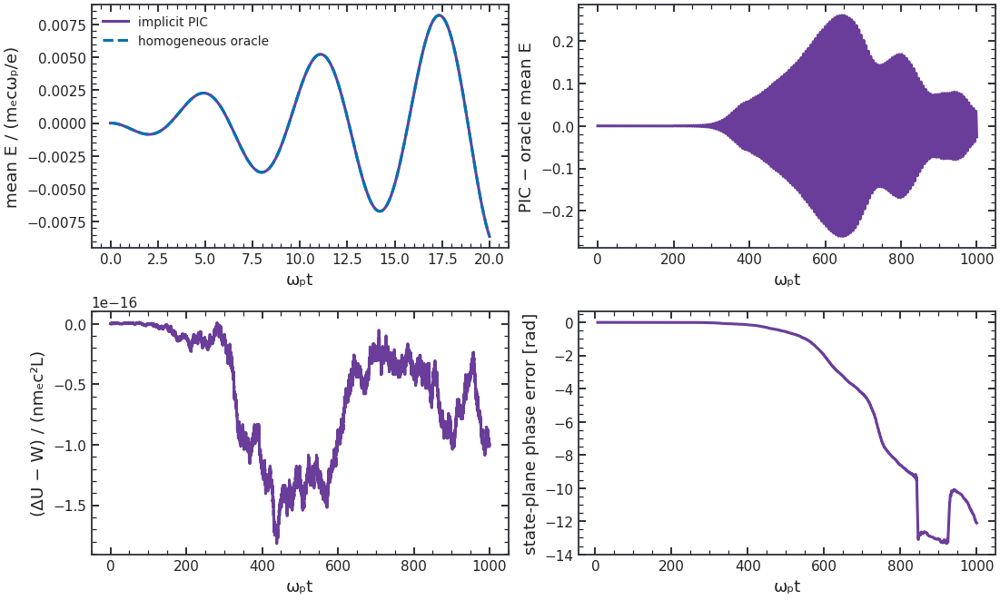
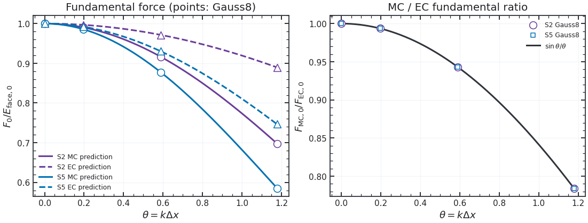

# The ghost's memory bill

The explicit Maxwell–Proca step has no linear system, so SOLVAX is not used for fields. We measured its `checkpointed_fori_loop` only as an optional way to differentiate a long fixed recurrence, against native `lax.scan`, rematerialized scan, and an equivalent native segmented recurrence. All four call the same production PIC transition and scalar density objective. The test parameters are 16 cells, 64 particles, float64 CPU, $p=0.97$, checkpoint width 32. The exact case has 256 steps; the tail case has 955 steps and a nondivisible final segment. Each row ran in a fresh process, with five synchronized warm primal and gradient samples. [Raw measurements](_static/figures/recurrence_benchmark.json) include the range, first-call time, host load and process memory for every row.

| 955-step method | Warm gradient median (s) | Compiler temporary estimate (MiB) | Process peak (MiB) | First gradient call incl. compile (s) |
|---|---:|---:|---:|---:|
| Native scan | {{ tail_scan_grad_s }} | {{ tail_scan_temp_mib }} | {{ tail_scan_rss_mib }} | {{ tail_scan_first_grad_s }} |
| Native rematerialized scan | {{ tail_remat_grad_s }} | {{ tail_remat_temp_mib }} | {{ tail_remat_rss_mib }} | {{ tail_remat_first_grad_s }} |
| Native segmented | {{ tail_segmented_grad_s }} | {{ tail_segmented_temp_mib }} | {{ tail_segmented_rss_mib }} | {{ tail_segmented_first_grad_s }} |
| SOLVAX checkpointed | {{ tail_solvax_grad_s }} | {{ tail_solvax_temp_mib }} | {{ tail_solvax_rss_mib }} | {{ tail_solvax_first_grad_s }} |

The 256-step exact-segment case gives native scan **{{ exact_scan_grad_s }}** s warm gradient and **{{ exact_scan_temp_mib }}** MiB compiler temporaries; SOLVAX gives **{{ exact_solvax_grad_s }}** s and **{{ exact_solvax_temp_mib }}** MiB. Objective and gradient agree across methods to the benchmark's strict numerical checks, including the tail.

The compiler estimate is the executable's temporary-buffer estimate, **not** the full process footprint. Process peak includes Python, JAX, compilation, imports and the runtime allocator; the methods were isolated but shared-host load varied. SOLVAX reduced estimated temporaries relative to plain scan but had similar warm speed and memory to the native segmented method. Its full installation also requires `equinox>=0.13.3`; the tested compatible versions were SOLVAX 0.27.0, Equinox 0.13.8 and JAX 0.10.2. We therefore **defer adopting SOLVAX as a package dependency**. The native recurrence remains the default. Set `all_cases=True` in the [recurrence script](scripts/benchmark_recurrence.py), then run:

```sh
python -m pip install solvax==0.27.0
python docs/scripts/benchmark_recurrence.py
python docs/scripts/make_all.py
```

The calibration example's own [run record](_static/figures/density_calibration/run.json) includes total scan time and compiler-first-call measurements.

## Cost of the actual field step

With 128 cells, 8,192 electrons, 256 steps, float64 CPU, one final diagnostic and identical loading, we measured the parent `Simulation` against a configured zero-coupling Proca field and an active field. Each case ran in a fresh process; the [record](_static/figures/field_cost.json) contains five synchronized warm samples, first-call time including compile, process peak memory and host load.

| Case | Warm run median (ms) | First call incl. compile (s) | Process peak (MiB) |
|---|---:|---:|---:|
| JAX-in-Cell, no dark model | {{ field_parent_warm_ms }} | {{ field_parent_first_s }} | {{ field_parent_rss_mib }} |
| Proca configured, $\eta=0$ | {{ field_eta_zero_warm_ms }} | {{ field_eta_zero_first_s }} | {{ field_eta_zero_rss_mib }} |
| Proca active, $\eta=0.05$ | {{ field_active_warm_ms }} | {{ field_active_first_s }} | {{ field_active_rss_mib }} |

The **dark-disabled route is the parent `Simulation` itself**, so its source and execution path are unchanged. A configured $\eta=0$ model still evolves a free massive field, costs time and memory, and must not be called disabled. Its ordinary-field checksum agrees with the parent; the active case differs physically. Process peaks include imports and compilation. These are one-device measurements, not a portable overhead factor or a GPU claim. Reproduce them on an otherwise quiet host with [benchmark_field_cost.py](../docs/scripts/benchmark_field_cost.py) with `all_cases=True`, then [make_all.py](../docs/scripts/make_all.py) to refresh the MyST numbers.

The same isolated script also has a [131,072-particle CPU run](_static/figures/field_cost_large.json) on 128 cells for 256 steps. Five warm runs in each fresh process give median times of **{{ large_parent_warm_s }} s** for the parent, **{{ large_eta_zero_warm_s }} s** for configured $\eta=0$, and **{{ large_active_warm_s }} s** for active Proca. First-call times are {{ large_parent_first_s }}, {{ large_eta_zero_first_s }} and {{ large_active_first_s }} s; process peaks are {{ large_parent_rss_mib }}, {{ large_eta_zero_rss_mib }} and {{ large_active_rss_mib }} MiB. System load rose from 11.9 to 32.3 across the cases, so these measurements establish that the larger loading executes within the recorded memory but **do not give a reliable fractional overhead**. The first call includes compilation or executable-cache loading. Reproduce with [benchmark_field_cost.py](../docs/scripts/benchmark_field_cost.py) with `all_cases=True, particles=131072, steps=256, output='docs/_static/figures/field_cost_large.json'` on a quiet host. This is a timing workload; the kinetic runs above provide physics-resolution checks.

## Sparse particle histories

The reduced run keeps both field histories, per-species kinetic energy and all-step conservation maxima while omitting particle trajectories from the sampled output. A [fresh-process CPU comparison](_static/figures/storage_cost.json) used 120,000 electrons, 128 cells, 128 steps and 16 stored samples. Both cases consumed the final closed energy and all-step maximum; the full case also consumed every stored position, velocity and weight array.

| History | Warm median (s) | First call incl. compile (s) | Process peak (MiB) |
|---|---:|---:|---:|
| Sparse particle history | {{ storage_sparse_warm_s }} | {{ storage_sparse_first_s }} | {{ storage_sparse_rss_mib }} |
| Full particle history | {{ storage_full_warm_s }} | {{ storage_full_first_s }} | {{ storage_full_rss_mib }} |

The final complete energy and all-step maximum balance agree exactly between these runs. The memory and timing figures include compilation and shared-host load, so they characterize this workload and machine, not a universal speedup. Reproduce with [benchmark_field_cost.py](../docs/scripts/benchmark_field_cost.py) with `storage_all=True, particles=120000, steps=128, stride=8`, then refresh substitutions with [make_all.py](../docs/scripts/make_all.py) with `records_only=True`.

### Dense forcing and sparse local moments

The [pair-waveform example](../examples/dark_reservoir.py) accepts `scalar_dt` in $1/\omega_0$ units. Setting `scalar_dt=.2, output_dt=.2` samples species density and local variance at that cadence while retaining every native mean dark field, potential and species velocity needed to reconstruct the actual Boris forcing. Both Gauss laws, charge, momentum and full energy/sector-work maxima still cover every step. Blocks contain complete scalar intervals; complete particle/field restart is unchanged. The default remains dense sampling. Window reductions use the recorded scalar cadence, which must be refined separately from the physical timestep.

[Sampling benchmark](scripts/benchmark_field_cost.py) · `waveform_sampling=True, cells=4096, particles_per_cell=128, dt=.003125, steps=512, stride=64`. It compares three synchronized calls to each compiled diagnostic mode, including compile time and compiler memory, full final states, dense forcing and all-step maxima. A short sampling/cost check does not establish late conversion accuracy.

The producer also accepts `initial_state='artifacts/pair_waveform/coupled/initial_state.npz'` to restore the complete zero-time coupled preparation and diagnostic ledger. It checks loading, model, timestep and requested mean dark force, and records the archive hash without its path. Keep the other named inputs fixed for an execution repeat. A prescribed-force repeat must additionally retain its exact archived table; restarting the coupled preparation alone does not freeze the force history derived from that trajectory.

The matched float64 fixture has **1,048,576 total particles** and two local smoothing lengths. On one RTX A4000 with JAX/CUDA packages 0.6.2, the [native record](_static/figures/pair_waveform_controls/sampling_cost.json) gives:

| Recording | Compilation (s) | Median warm block (s) | Compiler temporaries (MiB) |
|---|---:|---:|---:|
| Every-step local moments | {{ pair_sampling_dense_compile_s }} | {{ pair_sampling_dense_warm_median_s }} | {{ pair_sampling_dense_compiler_temporary_MiB }} |
| Local moments every 64 steps; dense mean forcing | {{ pair_sampling_sparse_moments_compile_s }} | {{ pair_sampling_sparse_moments_warm_median_s }} | {{ pair_sampling_sparse_moments_compiler_temporary_MiB }} |

Full-state and scalar comparisons pass the declared $10^{-10}$ normalized tolerance; the largest state discrepancy is $1.05\times10^{-14}$ in normalized charge density. Mean-force error is $1.03\times10^{-14}$ of the initial bare field. All-step conservation maxima and final ledgers also pass. Within each mode, repeated calls vary at roundoff and are not bitwise equal. Process peak is 1,419.6 MiB with both executables present. Warm blocks exclude host copies/fingerprints; these short-run timings characterize this fixture, while physical and diagnostic-cadence refinement remain separate checks.

## Which clock to trust

The source-free [time-step experiment](scripts/benchmark_time_integrators.py) uses the same staggered 1D Proca difference operators as the package, in normalized units $c=\Omega_D=\epsilon_0=1$. Its initial field contains longitudinal and both transverse components, with $\phi_D=-D E_{D,x}$, $B_D=\operatorname{curl} A_D=0$. The matrix exponential of the **same spatially discrete generator** is the temporal oracle. The 16-cell run lasts $\Omega_Dt=200$; these are vacuum field tests, without particles or current deposition.


| Method | $\Delta t\Omega_D$ | Max $\lvert\Delta U_D/U_D(0)\rvert$ | Final state error against $e^{tL}$ | Max dark Gauss residual |
|---|---:|---:|---:|---:|
| Current kick–drift–kick | 0.2 | 2.37% | 1.03 | $3.3\times10^{-15}$ |
| Current kick–drift–kick | 0.1 | 0.577% | 0.356 | $5.4\times10^{-15}$ |
| Implicit midpoint, sparse LU | 0.2 | $5.4\times10^{-14}$ | 1.53 | $2.5\times10^{-15}$ |
| Implicit midpoint, sparse LU | 0.1 | $6.6\times10^{-14}$ | 0.633 | $3.9\times10^{-15}$ |
| Adaptive DOP853, $10^{-9}$ relative tolerance | output every 0.2 | $1.3\times10^{-9}$ | $3.0\times10^{-8}$ | $2.7\times10^{-15}$ |

The split method's energy error is bounded and falls about fourfold when the step halves. Midpoint keeps this **quadratic vacuum-field energy** to roundoff because the discrete generator is skew symmetric, but has *larger phase error* than the split at either tested step. DOP853 accurately follows this smooth source-free system; it needed 20,129 right-hand-side evaluations. The exploratory SciPy wall times include sparse factorization and NumPy-loop overhead, so they are **incomparable with the compiled JAX PIC path**. The [record](_static/figures/time_integrators/run.json) and [arrays](_static/figures/time_integrators/data.npz) include the measured times; `quick=True` shortens the horizon to 20.

For the **coupled** two-stream problem, halving $\Delta t\omega_p$ from 0.025 to 0.0125 at the same 64 cells and loading changes the largest sampled total-energy drift from 0.677% to 0.680%. At fixed $\Delta t\omega_p=0.0125$, independently doubling quiet-start particles and grid cells shows where the error lies: particle doubling changes dark total drift by less than $10^{-9}$ in fractional units, while grid doubling reduces it from **{{ saturation_short_coarse_drift_percent }}%** to **{{ saturation_short_refined_drift_percent }}%**. The dark-field source-work residual falls from $1.91\times10^{-5}$ to $4.65\times10^{-6}$ of the maximum dark work transfer on time refinement. The 200/$\omega_p$ replay keeps the same $0.5/\omega_p$ sampling interval; its largest sampled dark total-energy changes are **{{ saturation_long_coarse_drift_percent }}%** and **{{ saturation_long_refined_drift_percent }}%**. A different vacuum field integrator would address the already small dark-field work error, not the dominant coupled spatial error in this case. Exact field-only conservation does **not** imply exact PIC conservation: the current deposit and particle work must use conjugate space-time weights. The [factorial record](_static/figures/two_stream_saturation/run.json) and [extended record](_static/figures/two_stream_extended/run.json) support this narrower conclusion.

[Markidis and Lapenta](https://arxiv.org/abs/1108.1959) use a jointly implicit particle/Maxwell midpoint solve for exact coupled energy. [Kormann and Sonnendrücker](https://arxiv.org/abs/1910.04000) derive discrete-gradient variants and identify the extra condition needed to keep Gauss. [Chen *et al.*](https://arxiv.org/abs/1903.01565) use a time-centred particle solve with leapfrog Maxwell fields to retain light-wave dispersion and conserve charge and energy. [Ricketson and Hu](https://arxiv.org/abs/2411.09605) give an explicit particle correction with very small energy error; their [2026 relativistic extension](https://arxiv.org/abs/2605.18542) covers Yee and PSATD field solvers. Either correction requires changing the particle-field coupling, not just this Proca clock. [SHARP](https://arxiv.org/abs/1702.04732) shows why higher-order particle shapes and separate grid/particle convergence matter for long kinetic runs. The parent uses quadratic weights by default, with optional quintic weighting. Its Boris pusher already sees $\mathbf E+\eta\mathbf E_D$ and $\mathbf B+\eta\mathbf B_D$; a separate dark-force rotation would solve the same Lorentz equation. [Ripperda *et al.*](https://arxiv.org/abs/1710.09164) compare Boris, Vay, Higuera–Cary and implicit particle pushers for regimes where relativistic trajectory error can justify changing the pusher.

The relativistic [pair-reservoir replay](_static/figures/oscillating_dark_pair/run.json) provides another coupled check through $\omega_0t=170$. At fixed $\Delta t\omega_0=0.00625$ and 32 markers per cell, the largest complete-energy change falls from **{{ dark_pair_grid_drift }}** at 2,048 cells to **{{ dark_pair_energy_drift }}** at 4,096 and **{{ dark_pair_large_grid_drift }}** at 8,192. Doubling the timestep at 4,096 cells changes that drift to **{{ dark_pair_clock_drift }}**. The late coherent fraction still moves from **{{ dark_pair_grid_control }}** to **{{ dark_pair_coherent }}** to **{{ dark_pair_large_grid }}** on spatial refinement. Energy conservation is improving, but this nonlinear observable is not converged.

The present tests favour keeping the explicit coupled step while improving spatial convergence. The $\omega_pt=200$ first-mode difference reverses sign between 128 and 256 cells at fixed timestep even as the finest closed-energy drift falls to **{{ saturation_long_fine_drift_percent }}%**. Further grid refinement and a warm, seeded ensemble should precede a production change to interpolation order. An implicit or IMEX mass solve becomes worth revisiting for $\Omega_D\Delta t$ near the explicit stability limit, with a charge-conserving current and full PIC work balance. An adaptive DOP853 field clock would require synchronized particle trajectories and current integration at its internal stages; applying it to frozen deposits would test another model. None of these source-free timings establishes a faster or more accurate nonlinear PIC solver.

## Coupled kinetic methods

The pinned parent provides an ordinary Crank–Nicolson PIC method with fixed Picard iterations and particle substeps. Its longitudinal force is the discrete gradient conjugate to the trajectory continuity current; transverse current is the transpose of the field gather. Once the particle orbit and fields converge together, particle work cancels mesh work. This is the mechanism of [Chen, Chacón and Barnes](https://arxiv.org/abs/1101.3701) and the discrete-gradient construction of [Kormann and Sonnendrücker](https://arxiv.org/abs/1910.04000). Energy and Gauss can be conserved together while momentum has a finite error. The coupled Proca method uses the explicit compatible split described in [the equations](physics.md).

### Conservation with the same particles

The [coupled benchmark](scripts/benchmark_pic_conservation.py) loads two warm electron beams and mobile ions identically in each row: 8,192 markers per population, $u_e=\pm0.05c$, $\sigma_e=0.003c$, $m_i/m_e=1836$, $T_i=T_e$, $ku_e/\omega_p=0.5$ and a $10^{-4}$ density seed on one beam. Here $\omega_p$ is the total **electron** plasma frequency. The inherited three-velocity solver evolves a longitudinal, Newtonian experiment through $\omega_pt=40$. The massive-field counterpart has $\Omega_D/\omega_p=0.7$, $\eta=0.3$ and the specified bare initialization $E_D=\eta E$, $\phi_D=0$. These Proca rows change the physical interaction; the ordinary rows compare algorithms for the same equations.


The upper panels show sampled defects in complete energy and continuum momentum; the table uses maxima from **every step**. The lower panels show the first complex electric mode and its phase relative to $\omega_pt=8$. Dashed amplitude segments use the kinetic pole growth rate over the fit window. A flat phase would describe a pure symmetric growing eigenmode; the curved traces expose the loading transient.

| Method | Cells | $\Delta t\omega_p$ | Max $\lvert\Delta U\rvert/U_0$ | Max $\lvert\Delta P\rvert/(nm_ecL)$ | Fitted $\gamma/\omega_p$ | Fitted $\omega_r/\omega_p$ |
|---|---:|---:|---:|---:|---:|---:|
| Ordinary explicit | 128 | 0.002 | {{ pic_explicit_energy }} | {{ pic_explicit_momentum }} | {{ pic_explicit_growth }} | {{ pic_explicit_frequency }} |
| Ordinary implicit, 4 iterations | 128 | 0.002 | {{ pic_implicit4_energy }} | {{ pic_implicit4_momentum }} | {{ pic_implicit4_growth }} | {{ pic_implicit4_frequency }} |
| Ordinary implicit, 8 iterations | 128 | 0.002 | {{ pic_implicit8_energy }} | {{ pic_implicit8_momentum }} | {{ pic_implicit8_growth }} | {{ pic_implicit8_frequency }} |
| Ordinary implicit, 8 iterations | 128 | 0.02 | {{ pic_implicit_large_energy }} | {{ pic_implicit_large_momentum }} | {{ pic_implicit_large_growth }} | {{ pic_implicit_large_frequency }} |
| Proca explicit | 128 | 0.002 | {{ pic_proca_energy }} | {{ pic_proca_momentum }} | {{ pic_proca_growth }} | {{ pic_proca_frequency }} |
| Proca explicit | 128 | 0.001 | {{ pic_proca_halfstep_energy }} | {{ pic_proca_halfstep_momentum }} | {{ pic_proca_halfstep_growth }} | {{ pic_proca_halfstep_frequency }} |
| Proca explicit | 256 | 0.002 | {{ pic_proca_fine_energy }} | {{ pic_proca_fine_momentum }} | {{ pic_proca_fine_growth }} | {{ pic_proca_fine_frequency }} |

The ordinary implicit solver uses two particle substeps. At $\Delta t\omega_p=0.002$, one Picard iteration gives $8.79\times10^{-4}$ energy error, two give $9.50\times10^{-10}$, and four, eight and twelve reach roundoff. Increasing the count beyond four changes the fitted growth by less than $2\times10^{-11}$; it leaves the finite momentum defect. This reproduces the energy/charge mechanism of the cited implicit methods without demonstrating exact discrete momentum conservation. The explicit momentum agreement is specific to this neutral longitudinal loading; the separate travelling-wave check exercises the longitudinal Proca potential term.

Across all twelve rows, particle charge is unchanged, grid charge changes by at most $3.67\times10^{-16}enL$, and grid/particle charge differs by at most $3.65\times10^{-16}enL$. The continuity residual is below $4.57\times10^{-13}en\omega_p$; ordinary and dark Gauss residuals are below $2.65\times10^{-13}en/\epsilon_0$ and $6.59\times10^{-14}en/\epsilon_0$. These normalizations use the fixed total electron density $n$. For Proca, the dark-sector defect $|\Delta U_D-W_D|/U_0$ falls from $2.08\times10^{-11}$ to $5.20\times10^{-12}$ when the step halves. The larger complete-energy defect falls about fourfold on grid doubling and is almost unchanged by time refinement. The spatial particle/mesh work error dominates this experiment.

### Growth, phase and cost

The multispecies kinetic determinant gives $\gamma/\omega_p=0.3383986$ for ordinary Maxwell and $0.3478317$ for the coupled field, with $\omega_r\simeq0$. Its root routine uses the combined electron-plus-ion plasma frequency; the record converts to the electron convention by $\sqrt{1+1/1836}$. Fits use all 81 samples in the inclusive window $8\le\omega_pt\le16$. Their regression standard errors are approximately 0.0030; the ordinary and Proca slopes differ from their poles by about 2.4% and 1.3%. The phase excursions reach 0.42 and 0.35 radians despite small average frequencies. These are transient initial-value traces, with unresolved preparation and fit-window error. The small mixed-minus-ordinary growth shift is consequently **not confirmed** by this benchmark.

Time refinement from $\Delta t\omega_p=0.002$ to 0.001 changes the ordinary explicit growth by $1.6\times10^{-8}$ and the Proca growth by $1.2\times10^{-8}$. Earlier strict floating-point endpoint selection dropped two samples in some rows and produced a spurious time-fit difference; [the record](_static/figures/pic_conservation/run.json) preserves those original fits and the corrected analysis hash. Increasing the implicit step tenfold changes growth by $6.6\times10^{-6}$ in this short growing-mode test. Resolving driven oscillation phase and late nonlinear observables needs separate long-time checks.

| Method | $\Delta t\omega_p$ | Compile (s) | Synchronized warm run (s) | Compiler temporaries (MiB) | Process peak (MiB) |
|---|---:|---:|---:|---:|---:|
| Ordinary explicit | 0.002 | {{ pic_explicit_compile }} | {{ pic_explicit_warm }} | {{ pic_explicit_temp_mib }} | {{ pic_explicit_rss_mib }} |
| Ordinary implicit, 4 iterations | 0.002 | {{ pic_implicit4_compile }} | {{ pic_implicit4_warm }} | {{ pic_implicit4_temp_mib }} | {{ pic_implicit4_rss_mib }} |
| Ordinary implicit, 8 iterations | 0.002 | {{ pic_implicit8_compile }} | {{ pic_implicit8_warm }} | {{ pic_implicit8_temp_mib }} | {{ pic_implicit8_rss_mib }} |
| Ordinary implicit, 8 iterations | 0.02 | {{ pic_implicit_large_compile }} | {{ pic_implicit_large_warm }} | {{ pic_implicit_large_temp_mib }} | {{ pic_implicit_large_rss_mib }} |

Each row ran in a fresh process with JAX 0.6.2, float64 and one synchronized warm sample on an RTX A4000 GPU. Compilation is separated from execution, and the entire reduced diagnostic run is consumed. Other device activity and one timing sample limit performance conclusions: the large-step implicit and small-step explicit times are similar here, without an established speed advantage. Compiler temporaries exclude the runtime, imports and allocator; process peak includes them. Complete timings, first executions, memory, constraints and all twelve rows are in the [computation record](_static/figures/pic_conservation/run.json) and [compressed scalar histories](_static/figures/pic_conservation/data.npz).

Reproduce the campaign serially, or refit and render its saved arrays without running dynamics. The default full benchmark takes one warm sample; increase `samples` for timing statistics. A separate overhead mode compares the reduced validation runner against production sparse particle output and checks the final energy and all-step energy maximum agree:

Edit inputs in each linked script, then run it with Python.

| Script | Inputs |
|---|---|
| [benchmark_pic_conservation.py](../docs/scripts/benchmark_pic_conservation.py) | `full=True, samples=1` |
| [benchmark_pic_conservation.py](../docs/scripts/benchmark_pic_conservation.py) | `render_only=True, output='docs/_static/figures/pic_conservation'` |
| [benchmark_pic_conservation.py](../docs/scripts/benchmark_pic_conservation.py) | `compare_overhead=True, particles=40000` |

The [long resonant-drive replay](kinetic.md#time-refinement-through-the-nonlinear-transition) recovers early second-order behavior but fails the nonlinear field-convergence check. A same-step prefix replay also develops finite trajectory differences. Those gates remain necessary before transferring this short benchmark's timestep or cost conclusions to a late driven result.

### Choosing a coupled method

The [uniform-drive prototype](scripts/benchmark_implicit_drive.py) reuses the parent's relativistic implicit orbit solve. During one step it shifts the electric field by the uniform midpoint force $\mathbf F=\eta\mathbf D_0\cos[\Omega_D(t+h/2)+\varphi]$, then restores the physical field. The accepted trajectory current supplies the external work,

$$
\Delta W=h\Delta x\sum_i\overline{\mathbf J}_i\cdot\mathbf F.
$$

Periodic mean Ampère evolution makes the physical energy-minus-work defect equal to the shifted parent's energy defect. Nonuniform-charge tests independently check this identity and continuity at one and eight Picard iterations. Cold analytic response, relativistic homogeneous orbits, finite differences and an analytic tangent ODE test accuracy and derivatives; complete native restart checks retain absolute drive phase and work.

#### Energy balance and resolved phase

The first long control has 256 cells, $L=2\pi c/\omega_p$, 4,096 particles, eight weighted velocity nodes per species, eight Picard iterations and two particle substeps. Its drive and temperatures match the strong paper case, but its velocity distribution comprises eight cold beams. Its homogeneous accuracy check applies while nonzero modes remain negligible; late Maxwellian behavior requires a resolved velocity distribution.

| $h\omega_p$ | Mean-field relative $L^2$ error through $\tau=40$ (%) | Max $\lvert\Delta U-W\rvert/(nm_ec^2L)$ through 1000 | Max $\lvert\Delta P\rvert/(nm_ecL)$ | Compile / warm median (s) |
|---|---:|---:|---:|---:|
| 0.04 | {{ implicit_drive_dt04_early_wave_percent }} | {{ implicit_drive_dt04_balance }} | {{ implicit_drive_dt04_momentum }} | {{ implicit_drive_dt04_compile }} / {{ implicit_drive_dt04_warm }} |
| 0.02 | {{ implicit_drive_dt02_early_wave_percent }} | {{ implicit_drive_dt02_balance }} | {{ implicit_drive_dt02_momentum }} | {{ implicit_drive_dt02_compile }} / {{ implicit_drive_dt02_warm }} |



Halving the step reduces early field and phase error approximately fourfold even though both energy defects are already at roundoff. Nonzero spatial fields subsequently grow at both steps. The late PIC-minus-homogeneous curve and state-plane phase then include spatial dynamics and velocity-loading effects, and cannot be interpreted as timestep error alone. Finite-beam equilibria have a different spectrum from a smooth Maxwellian; increasing velocity resolution is essential ([Dawson's multibeam limit](https://doi.org/10.1103/PhysRev.118.381)). The finite momentum defects remain an accuracy gate: a neutral periodic plasma under this uniform electric force has zero net applied impulse.

At $\tau=8$, gradients of final mean-field energy with respect to drive amplitude, density, frequency and phase agree with centered finite differences to **{{ implicit_drive_dt02_fd_relative }}** in maximum relative error. Density includes particle weights; thermal initialization has a separate derivative test. Against the independent Fréchet/tangent ODE, the error contracts from **{{ implicit_drive_dt04_frechet_relative }}** to **{{ implicit_drive_dt02_frechet_relative }}** on step halving. Warm gradient medians are **{{ implicit_drive_dt04_gradient_warm }} / {{ implicit_drive_dt02_gradient_warm }} s**, with **{{ implicit_drive_dt04_gradient_temp_mib }} / {{ implicit_drive_dt02_gradient_temp_mib }} MiB** compiler temporaries; compilation takes {{ implicit_drive_dt04_gradient_compile }} / {{ implicit_drive_dt02_gradient_compile }} s. These gradients validate the short physical objective, not the late kinetic state.

Both rows used float64 JAX 0.6.2 on one RTX A4000, with compilation separated and two synchronized warm samples. The primal temporary estimates are {{ implicit_drive_dt04_temp_mib }} / {{ implicit_drive_dt02_temp_mib }} MiB; process peaks are {{ implicit_drive_dt04_rss_mib }} / {{ implicit_drive_dt02_rss_mib }} MiB. [Coarser](_static/figures/implicit_drive_dt04/run.json) and [finer](_static/figures/implicit_drive_dt02/run.json) native records retain the scalar arrays, gradient checks and Gauss maxima. This prescribed-force prototype does not evolve a Proca reservoir.

Edit inputs in each linked script, then run it with Python.

| Script | Inputs |
|---|---|
| [benchmark_implicit_drive.py](../docs/scripts/benchmark_implicit_drive.py) | `cells=256, nodes=8, dt=0.04, iterations=8, horizon=1000, samples=2, gradient_horizon=8, output='artifacts/implicit_dt04'` |
| [benchmark_implicit_drive.py](../docs/scripts/benchmark_implicit_drive.py) | `cells=256, nodes=8, dt=0.02, iterations=8, horizon=1000, samples=2, gradient_horizon=8, output='artifacts/implicit_dt02'` |

#### Gaussian loading and a fixed compiled solver

The next control uses the resonant-drive fixture itself: 1,000 cells, $L=40c/\omega_p$, 103,000 particles per species, $T_e=T_i=10^{-3}m_ec^2$, and the same conditioned Gaussian draw as the explicit runs. Four Picard iterations and two orbit substeps advance $\Delta t\omega_p=0.01$ through $\tau=1000$. Initial momenta, weights and magnetic fields match exactly; supplied integer-time positions match the implicit initialization. Native leapfrog positions and initial grid charge differ with the methods' staggering. The comparison retains 2,001 common samples at $\Delta\tau=0.5$, without interpolation or phase alignment.


| Method | $\Delta t\omega_p$ | All-step max $\lvert\Delta U-W\rvert/(nm_ec^2L)$ | All-step max $\lvert\Delta P\rvert/(nm_ecL)$ |
|---|---:|---:|---:|
| Explicit | 0.01 | $5.41\times10^{-6}$ | $3.61\times10^{-15}$ |
| Explicit | 0.005 | $4.77\times10^{-6}$ | $4.03\times10^{-15}$ |
| Implicit, four iterations | 0.01 | {{ implicit_paper_balance }} | {{ implicit_paper_momentum }} |

The implicit defect is $1.54\times10^{-13}$ of peak work **recorded at the common cadence**; an all-step work maximum was not retained. Charge is unchanged and its Gauss residual is **{{ implicit_paper_gauss }}** in units $en/\epsilon_0$. A uniform electric drive supplies impulse $hQ_{\rm mobile}F_{\rm midpoint}$, which vanishes for these two neutral mobile species. The measured momentum change is referenced to the actual initial relativistic momentum. It already reaches $4.86\times10^{-5}nm_ecL$ by $\tau=40$.

Through $\tau=40$, implicit/explicit mean-field and nonzero-energy $L^2$ differences are **{{ implicit_paper_vs_explicit_mean_E_40 }}% / {{ implicit_paper_vs_explicit_nonzero_40 }}%**. Through $1000$, they reach **{{ implicit_paper_vs_explicit_mean_E_1000 }}% / {{ implicit_paper_vs_explicit_nonzero_1000 }}%**. Two calls with identical input to the **same compiled callable** differ by **{{ implicit_paper_repeat_mean_E_percent }}% / {{ implicit_paper_repeat_nonzero_percent }}%** over that horizon. One pair quantifies execution sensitivity rather than statistical uncertainty. These differences include particle–mesh coupling and nonlinear dynamics; energy balance does not assign their cause or establish a converged late trajectory.

An independent accepted-step test evaluates each particle impulse $m_pw_p\Delta u_p=q_pw_ph\overline E_{\mathrm{orbit},p}$ and its sum from the midpoint electric field, including the uniform drive. It also verifies the grid permutation under a whole-cell translation. This checks the momentum diagnostic and force update without assuming continuous translation symmetry of the discrete-gradient gather. [Campos Pinto, Kormann and Sonnendrücker, §7/Figure 3](https://link.springer.com/article/10.1007/s10915-022-01781-3#Fig3) likewise retain energy and Gauss while momentum develops a finite nonlinear defect.

Compilation takes **{{ implicit_paper_compile }} s**; the first and single warm synchronized calls take 1687.72 / **{{ implicit_paper_warm }} s**. Compiler temporaries are 81.98 MiB and process peak is 1016.59 MiB on an RTX A4000, float64 JAX 0.6.2. The explicit 0.01/0.005 runs take 221.75 / 440.21 s with compilation separate, fixed blocks of duration $100/\omega_p$ and host transfers included. Their cadence and timing protocols differ from the implicit whole-run executable, so these are workload records rather than a matched speed benchmark.

The [record](_static/figures/paper_implicit_comparison/run.json) retains native clean computation revisions `7d149ce` and `8acc513`, input hashes, common-clock checks, raw window norms and final implicit-call conservation maxima. [Compressed scalar arrays](_static/figures/paper_implicit_comparison/data.npz) retain both implicit executions at their original 0.1 cadence. Faint nonzero-energy curves are raw and thick curves average approximately one plasma period; metrics use raw samples. This legacy implicit run stores fields, work and momentum; species broadening needs the newer species/restart outputs. It remains a prescribed-force control.

Edit inputs in each linked script, then run it with Python.

| Script | Inputs |
|---|---|
| [benchmark_implicit_drive.py](../docs/scripts/benchmark_implicit_drive.py) | `paper_loading=True, dt=0.01, iterations=4, horizon=1000, samples=1, output='artifacts/implicit_paper', cells=1000, particles=103000` |
| [compare_replays.py](../docs/scripts/compare_replays.py) | `first='artifacts/paper_fixed_first', second='artifacts/implicit_paper', implicit=True, refined='artifacts/paper_fixed_fine', destination='docs/_static/figures/paper_implicit_comparison'` |

#### Independent implicit orbit and iteration checks

A shorter Gaussian control starts both four/eight-iteration runs from **all 50 identical native initial arrays**, including the field, charge and work ledger. Each uses two particle substeps, $\Delta t\omega_p=0.01$, 206,000 particles and 401 samples through $\tau=40$; a first and one warm execution use the same compiled callable.

| Picard iterations | All-step $\lvert\Delta U-W\rvert/(nm_ec^2L)$ | All-step $\lvert\Delta P\rvert/(nm_ecL)$ | Warm synchronized time (s) |
|---|---:|---:|---:|
| 4 | {{ implicit_iterations_4_balance }} | {{ implicit_iterations_4_momentum }} | {{ implicit_iterations_4_warm }} |
| 8 | {{ implicit_iterations_8_balance }} | {{ implicit_iterations_8_momentum }} | {{ implicit_iterations_8_warm }} |

Raw four/eight relative $L^2$ differences are **{{ implicit_iterations_mean_E_l2 }}** for mean electric field and **{{ implicit_iterations_nonzero_l2 }}** for nonzero-mode energy. Electron/ion RMS differences are $1.03\times10^{-12}/4.13\times10^{-14}$. More iterations cost approximately twice as much in this matched workload while leaving the early momentum defect unchanged.

The independent NumPy reference solves two particle substeps in each accepted midpoint field using

$$
\Delta u=(q/m)h\overline E_{\rm orbit},\qquad
\Delta x=h\frac{u^-+u^+}{\gamma^-+\gamma^+},\qquad
\gamma=\sqrt{1+(u/c)^2},\qquad h=\Delta t/2.
$$

It integrates the linear face-field interpolant exactly, splitting at a crossed face and including the uniform midpoint drive. Independent quadratic endpoint deposits reconstruct the continuity current and retain its mean displacement current. This reference uses neither the production gather nor potential transpose. Four/eight one-step probes share the same complete checkpoint at $\tau=0$ and $40$.

At the latter checkpoint the accepted momentum increment is $1.435\times10^{-8}nm_ecL$; the neutral drive's impulse is below $1.2\times10^{-23}nm_ecL$. Across all four probes, independent weighted impulse disagreement is at most **{{ implicit_orbit_momentum_disagreement }} $nm_ecL$**. The maximum individual $u/c$ discrepancy is $1.84\times10^{-11}$; it includes native potential-evaluation roundoff and finite-iteration error. These residuals concern a separately converged **frozen accepted-field orbit**, rather than inaccessible internal parent iterates. They verify the measured impulse and give no evidence that insufficient four-iteration convergence explains the early momentum drift. The spatial and substep controls below test those sensitivities before a longer implicit calculation or coupled Proca extension.

The [record](_static/figures/implicit_iteration_control/run.json) retains both native computations, complete initial hashes, raw norms and four independently produced orbit audits; [compressed arrays](_static/figures/implicit_iteration_control/data.npz) retain both executions and species traces. Native producers are `bc59e5e` and `cc2c1ad`, with the parent pinned above. Both short runs reuse the initial archive produced by the preceding Gaussian example:

Edit inputs in each linked script, then run it with Python.

| Script | Inputs |
|---|---|
| [benchmark_implicit_drive.py](../docs/scripts/benchmark_implicit_drive.py) | `paper_loading=True, dt=0.01, iterations=4, horizon=40, samples=1, initial_state='artifacts/implicit_paper/initial_state.npz', output='artifacts/implicit_picard4_exact_40', cells=1000, particles=103000` |
| [benchmark_implicit_drive.py](../docs/scripts/benchmark_implicit_drive.py) | `paper_loading=True, dt=0.01, iterations=8, horizon=40, samples=1, initial_state='artifacts/implicit_paper/initial_state.npz', output='artifacts/implicit_picard8_exact_40', cells=1000, particles=103000` |
| [benchmark_implicit_drive.py](../docs/scripts/benchmark_implicit_drive.py) | `paper_loading=True, dt=0.01, iterations=4, audit_state='artifacts/implicit_picard4_exact_40/final_state.npz', output='artifacts/orbit_final_4', cells=1000, particles=103000` |

#### Mesh and particle-substep controls

Four Gaussian runs keep the same 206,000 physical particles, box, drive, $\Delta t\omega_p=0.01$, four Picard iterations and $\tau=40$ horizon. The 1,000-cell runs reuse every array of one complete initial archive; only the orbit substep count changes. The 2,000/4,000-cell runs use identical particle positions, momenta and weights, with charge and longitudinal field initialized on each finer mesh. Thus $\Delta x/\lambda_{D0}$ changes from 1.265 to 0.632 to 0.316 at fixed total particle number; markers per cell per species decrease from 103 to 51.5 to 25.75, and the quadratic deposition width changes with the mesh. All four native computations use source `39a4a7c`, float64 JAX 0.6.2 and the same GPU/runtime.


| Cells | Particle substeps | All-step $\lvert\Delta U-W\rvert/(nm_ec^2L)$ | All-step $\lvert\Delta P\rvert/(nm_ecL)$ | Compile / warm (s) |
|---:|---:|---:|---:|---:|
| 1000 | 2 | {{ implicit_method_1000_2_balance }} | {{ implicit_method_1000_2_momentum }} | {{ implicit_method_1000_2_compile }} / {{ implicit_method_1000_2_warm }} |
| 1000 | 4 | {{ implicit_method_1000_4_balance }} | {{ implicit_method_1000_4_momentum }} | {{ implicit_method_1000_4_compile }} / {{ implicit_method_1000_4_warm }} |
| 2000 | 2 | {{ implicit_method_2000_2_balance }} | {{ implicit_method_2000_2_momentum }} | {{ implicit_method_2000_2_compile }} / {{ implicit_method_2000_2_warm }} |
| 4000 | 2 | {{ implicit_method_4000_2_balance }} | {{ implicit_method_4000_2_momentum }} | {{ implicit_method_4000_2_compile }} / {{ implicit_method_4000_2_warm }} |

The raw relative $L^2$ differences in mean electric field / nonzero-mode energy are **{{ implicit_method_substep_mean_E_percent }}% / {{ implicit_method_substep_nonzero_percent }}%** for orbit refinement, **{{ implicit_method_mesh_mean_E_percent }}% / {{ implicit_method_mesh_nonzero_percent }}%** for 1,000→2,000 cells, and **{{ implicit_method_refined_mesh_mean_E_percent }}% / {{ implicit_method_refined_mesh_nonzero_percent }}%** for 2,000→4,000 cells. Comparisons use 401 native samples at $\Delta\tau=0.1$, without interpolation, phase alignment or smoothing. The figure and momentum norms subtract each actual initial momentum. RMS/kinetic norms include the initial thermal baseline and do not isolate heating increments. Conservation maxima cover every step of the final timed call. Each workload has a separate compilation, first call and one synchronized warm call; those timings do not establish a general performance ranking.

Four orbit substeps leave the momentum maximum unchanged to $2.1\times10^{-6}$ fraction while doubling warm runtime. Mesh refinement reduces its maximum from $4.86\times10^{-5}$ to $7.36\times10^{-6}$ to $3.83\times10^{-6}nm_ecL$, with a changing momentum history; these levels do not establish an asymptotic order. Nonzero-energy differences remain 31.34% and 18.91% over successive mesh levels, well above first/warm execution differences of at most $1.13\times10^{-8}$ in relative $L^2$. The mean-field disagreements with the homogeneous oracle are 0.216%, 0.435% and 0.523%; the oracle excludes spatial modes, so this is not a full-PIC error estimate. Lower momentum drift alone does not establish overall accuracy.

Particle charge is unchanged. Maximum continuity and Gauss residuals across these controls are $9.38\times10^{-14}en\omega_p$ and $1.92\times10^{-14}en/\epsilon_0$, respectively. Initial transverse fields vanish; each neutralizing background equals minus its mesh's initial mean charge, with differences below $2\times10^{-17}en$. The measured constraints give no evidence of a sizable residual for projection to remove; a field projection also changes energy and does not enforce a particle-force momentum identity.

[Chen, Chacón and Barnes, §§3.1–3.4](https://arxiv.org/html/1101.3701), distinguish matched particle/field work from orbit accuracy and momentum. [Campos Pinto, Kormann and Sonnendrücker, §§3.1–3.2 and §7.5/Figure 3](https://link.springer.com/article/10.1007/s10915-022-01781-3#Fig3), require additional antisymmetric force-map identities for exact momentum; their energy/Gauss scheme has finite nonlinear momentum error. Those results motivate these separate controls, without identifying the cause of this fixture's drift. The fractional-cell audits below extend the whole-cell permutation check. Any changed force map must retain work, continuity, mean-current response, phase/growth and derivatives.

The [native records](_static/figures/implicit_method_controls/run.json) retain exact loading hashes, first/warm variability, all-step constraints, timing and memory. [Compressed scalar histories](_static/figures/implicit_method_controls/data.npz) retain all four controls, both timed executions and species traces. Complete initial/final restarts were validated separately. This short method study does not establish late heating or conversion convergence.

Edit inputs in each linked script, then run it with Python.

| Script | Inputs |
|---|---|
| [benchmark_implicit_drive.py](../docs/scripts/benchmark_implicit_drive.py) | `paper_loading=True, cells=1000, dt=0.01, iterations=4, substeps=2, horizon=40, samples=1, initial_state='artifacts/implicit_paper/initial_state.npz', output='artifacts/implicit_mesh1000_sub2', particles=103000` |
| [benchmark_implicit_drive.py](../docs/scripts/benchmark_implicit_drive.py) | `paper_loading=True, cells=1000, dt=0.01, iterations=4, substeps=4, horizon=40, samples=1, initial_state='artifacts/implicit_mesh1000_sub2/initial_state.npz', output='artifacts/implicit_mesh1000_sub4', particles=103000` |
| [benchmark_implicit_drive.py](../docs/scripts/benchmark_implicit_drive.py) | `paper_loading=True, cells=2000, dt=0.01, iterations=4, substeps=2, horizon=40, samples=1, output='artifacts/implicit_mesh2000_sub2', particles=103000` |
| [benchmark_implicit_drive.py](../docs/scripts/benchmark_implicit_drive.py) | `paper_loading=True, cells=4000, dt=0.01, iterations=4, substeps=2, horizon=40, samples=1, output='artifacts/implicit_mesh4000_sub2', particles=103000` |
| [compare_replays.py](../docs/scripts/compare_replays.py) | `first='artifacts/implicit_mesh1000_sub2', second='artifacts/implicit_mesh1000_sub4', method_controls=True, refined='artifacts/implicit_mesh2000_sub2', finer_mesh='artifacts/implicit_mesh4000_sub2', destination='docs/_static/figures/implicit_method_controls'` |

#### Fractional-cell force audit

A short neutral 1V fixture tests the particle–mesh force before another long run. Two opposed electron cohorts and mobile ions have 64 markers each, or **192 total**. A sinusoidal displacement of $0.03/k$ seeds a smooth charge mode. The box, particles and physical velocities remain fixed while the entire loading is translated by $0$, $\Delta x/4$ and $\Delta x/2$. Initial charge is independently redeposited on each 16-, 32- and 64-cell mesh, and the longitudinal electric field closes Gauss with zero mean. The explicit initialization retains its half-position staggering. Both methods use relativistic 1V mechanics; no external force acts.

For one accepted step, the normalized net force is

$$
\mathcal F_h=\frac{P^{n+1}-P^n}{\Delta\tau\,nm_ecL},\qquad
\Delta\tau=\omega_p\Delta t,\qquad
P=\sum_p m_pw_pu_p.
$$

Here $n$ is total electron density. There is no longitudinal field momentum in this ordinary electrostatic fixture. The continuum net force vanishes for any translation. The explicit quadratic charge-transpose gather and compatible periodic Gauss derivative also give the discrete cancellation $\sum_i\rho_i(E_i+E_{i-1})/2=0$. The implicit orbit-averaged force closes particle–field work but need not obey that cancellation.

| Mesh / translation | Implicit $\mathcal F_h$, $\Delta\tau=0.004$ | Implicit $\mathcal F_h$, $\Delta\tau=0.002$ |
|---|---:|---:|
| 16 / quarter cell | $-1.10\times10^{-8}$ | $-5.50\times10^{-9}$ |
| 32 / quarter cell | $+1.24\times10^{-8}$ | $+6.18\times10^{-9}$ |
| 64 / quarter cell | $-2.25\times10^{-7}$ | $-2.25\times10^{-7}$ |

The explicit force is below $10^{-13}$ in all 18 rows. Implicit relative energy defects are below $3\times10^{-16}$, and charge, Gauss and continuity remain near roundoff. Independent NumPy integration in the accepted midpoint face field reproduces final implicit momentum per unit mass $u$ to $3.7\times10^{-16}c$ and the weighted impulse to $1.1\times10^{-14}nm_ecL$. The reference rejects unconverged orbits. For explicit PIC, an independent half-time quadratic deposit, Gauss integration and centre-field gather reconstruct the kick and its telescoping grid impulse.

The quarter-cell force on the finest mesh survives timestep halving, while signs and magnitudes vary with mesh phase. This small loading has only one marker per cohort per cell on that mesh; it is **not** a continuum momentum-convergence test, a Proca test or a late Gaussian heating result. It distinguishes a verified accepted-orbit force from nonlinear-solver residuals. Energy conservation alone cannot select the late solver; the larger Gaussian translation study follows below.

[Companion script](scripts/benchmark_pic_conservation.py): `translations=True, particles=64, dt=0.004, output='artifacts/translation_audit'`. The [36-row record](_static/figures/translation_audit.json) includes clean source/runtime, independent reference errors and orbit closure. Complete native initial/final restarts are retained outside the repository; only the small scalar ledger is published.

#### Gaussian grid-phase controls

Nine prescribed-drive runs translate the conditioned Gaussian loading by $0$, $\Delta x/4$ and $\Delta x/2$ on each 1,000-, 2,000- and 4,000-cell mesh. They retain 103,000 particles per species, $L=40c/\omega_p$, $T_e=T_i=10^{-3}m_ec^2$, the same momenta and weights, four Picard iterations and two orbit substeps. The clock is $\Delta t\omega_p=0.01$ through $\tau=40$, with 401 native samples. Charge is redeposited and the initial longitudinal field closes Gauss after each translation. One archived neutralizing background supplies all 1,000-cell translations; fresh fine-mesh initializations differ in that background by at most $1.71\times10^{-17}en$.


[Simulation and orbit audit](scripts/benchmark_implicit_drive.py) · `paper_loading=True`, `grid_phase=0`, `.25` or `.5`; [comparison and plot](scripts/compare_replays.py) · `phase_controls` ([full input sets](scripts/make_all.py)).

The table gives the range across translations of each run's all-step maximum. Momentum subtracts its actual initial value. The step-force norm is $\max_n|P^{n+1}-P^n-I_{\rm drive}^n|/(\Delta\tau\,nm_ecL)$, with the uniform-drive impulse $I_{\rm drive}^n$ evaluated at the midpoint and proportional to total particle charge.

| Cells | Maximum $\lvert\Delta P\rvert/(nm_ecL)$, range | Maximum step-force norm, range |
|---:|---:|---:|
| 1000 | $1.78\times10^{-5}$–{{ phase_momentum_1000 }} | $[5.04,5.41]\times10^{-6}$ |
| 2000 | $7.36\times10^{-6}$–{{ phase_momentum_2000 }} | $[2.78,3.11]\times10^{-6}$ |
| 4000 | $3.68\times10^{-6}$–{{ phase_momentum_4000 }} | $[2.62,3.24]\times10^{-6}$ |

Across all nine runs, energy-minus-source-work error is at most **{{ phase_balance }}** $nm_ec^2L$, Gauss is **{{ phase_gauss }}** $en/\epsilon_0$ and continuity is **{{ phase_continuity }}** $en\omega_p$. The largest step-force norm is **{{ phase_force_max }}**. Raw nonzero-mode energy differs by **{{ phase_nonzero_min_percent }}–{{ phase_nonzero_max_percent }}%** between translated and zero-translation histories on the same mesh. Each norm uses all 401 samples without interpolation, smoothing or alignment. The first/warm calls to the same compiled executable and input differ by at most **{{ phase_repeat_nonzero_l2 }}** in relative $L^2$ for that observable. This single repeat pair per case measures execution variability, not loading-ensemble uncertainty.

Four independent NumPy orbit/deposition checks take one step from the quarter-cell initial and final states on 1,000 and 4,000 cells, with the accepted midpoint field held fixed. All reference orbit solves converge; their weighted impulses agree with the native accepted impulses to **{{ phase_orbit_impulse }}** $nm_ecL$. This verifies those accepted steps, rather than every orbit through the run. A neutral uniform drive supplies zero continuum net impulse; the measured energy/Gauss closure does not supply the additional discrete force identity needed for exact momentum.

Native calculations use clean source `c9b3503`, float64 JAX 0.6.2 and an RTX A4000. Compilation is separate from the first and one synchronized warm call; warm times span **{{ phase_warm_min }}–{{ phase_warm_max }} s**, compiler temporaries peak at **{{ phase_temp_mib }} MiB**, and process peak at **{{ phase_rss_mib }} MiB**. The [record](_static/figures/implicit_grid_phase/run.json) retains all nine native results, six phase comparisons, four orbit checks and provenance hashes; [compressed histories](_static/figures/implicit_grid_phase/data.npz) retain both executions. The publisher is `529a838`.

The momentum envelopes shrink over these meshes, with differing signed histories. Fixed total particles and mesh-tied quadratic shapes do not establish a continuum convergence order. This is an early prescribed-force method check; late heating, reservoir transfer and dynamical Proca accuracy require their own refinement and loading controls.

#### Smooth force symbols



[Companion benchmark](scripts/benchmark_pic_conservation.py): `symbols=True, symbol_cells=32, symbol_modes=(0,1,3,6)`. The [record](_static/figures/smooth_force_symbols/run.json) and [arrays](_static/figures/smooth_force_symbols/data.npz) retain continuous quadrature points, both shape functions and derivatives, grid operators, complete force arrays and fundamental projections. This calculation uses NumPy, not particle dynamics; its runtime and linear-algebra binary hashes are recorded separately from the imported JAX environment.

Let $D$ be the periodic face-to-centre divergence at unit spacing and $T=-D^+$ its zero-mean inverse. The continuity current is $J=T\dot\rho+\langle J\rangle$. For a charge spline $S_p$, the momentum-conserving (MC) force averages adjacent face fields before gathering; the energy-conserving (EC) force uses $S_p' T^T E+\langle E\rangle$. Projecting a face mode onto its continuous-particle fundamental gives, for $\theta=k\Delta x$,

$$
\begin{aligned}
\widehat S_p(\theta)&=\left[\frac{\sin(\theta/2)}{\theta/2}\right]^{p+1},\\
F_{\mathrm{MC},0}/E_0&=\cos(\theta/2)\widehat S_p(\theta),\\
F_{\mathrm{EC},0}/E_0&=\frac{\theta/2}{\sin(\theta/2)}\widehat S_p(\theta),\\
F_{\mathrm{MC},0}/F_{\mathrm{EC},0}&=\frac{\sin\theta}{\theta}.
\end{aligned}
$$

The mean-mode limit is one and is restored explicitly. These are fundamental coefficients, not a pointwise identity: the full saved force arrays retain aliases. The difference starts at $-\theta^2/6$ even for $p=5$; increasing shape order suppresses aliases without eliminating this grid-dependent work/force difference.

[Brackbill, §§3.3–3.5 and §4.2/Eq. (46)](https://arxiv.org/pdf/1510.08741#page=13) identifies the related $\sin(k\Delta x)/(k\Delta x)-1$ factor from adjacent-field averaging. Potential-derived and centered-field forces have different work and momentum identities. The present quadratic/quintic quadrature checks those operators; attributing a late PIC work defect requires the accepted particle/current work decomposition.

Independent cardinal-spline evaluation and four/eight-point Gauss quadrature split every half-cell knot interval. On modes 0, 1, 3 and 6, the finest ratio error is **{{ symbol_ratio_error }}**, restored-mean error is **{{ symbol_mean_error }}**, and $\max_{ij}|(DT+I-P_0)_{ij}|$ is **{{ symbol_continuity_error }}**, where $P_0$ projects onto the mean. These measured operator coefficients complement the [discrete-gradient work construction](https://arxiv.org/abs/1910.04000) and [SHARP's joint shape/grid/loading tests](https://arxiv.org/abs/1702.04732). They do not identify the cause of a particular finite-particle late error or establish a new conservation theorem.

#### Experimental quintic implicit control

[benchmark_implicit_drive.py](scripts/benchmark_implicit_drive.py) accepts `shape_order=5` with the separate [experimental parent change](https://github.com/uwplasma/JAX-in-Cell/pull/65), based on the explicit quintic [parent feature](https://github.com/uwplasma/JAX-in-Cell/pull/64). The installed dependency retains quadratic implicit PIC. The experimental accepted-orbit current, fractional-grid-phase impulse, work, complete restart and cold-objective derivatives are checked against an independent Cox–de Boor spline/orbit integral and a Cayley-map Fréchet derivative. Knot-split three-point Gauss quadrature integrates each quartic face-field piece exactly, including tiny orbits and periodic wraps. These fixtures establish local algorithm checks; GPU cost and resolved long-time Gaussian accuracy remain to be measured before method adoption.

#### Coupling an implicit dark field

A conservative dynamical Proca extension requires one accepted orbit current and conjugate particle work:

$$
\Delta K=h\Delta x\sum_i\overline{\mathbf J}_i\cdot
(\overline{\mathbf E}_i+\eta\overline{\mathbf E}_{D,i}).
$$

With midpoint fields, compatible curls and the divergence/gradient adjoint cancel the field terms against this work. The particles and both fields must converge together while preserving both [Gauss laws](physics.md#constraint-propagation-and-divergence-control). Vacuum midpoint energy conservation and phase tests establish only the field part of this construction; the coupled method must resolve physical oscillation phase and growth.

[ECSIM](https://arxiv.org/abs/1602.06326) uses a linear mass-matrix field solve for energy conservation, without guaranteeing local charge. [ChECSIM](https://doi.org/10.1016/j.jcp.2021.110912) adds compatible deposition/coupling to conserve both, with a different finite-element discretization. [iVPIC, Sections 3.1–3.3](https://arxiv.org/html/1903.01565v2) combines implicit particles with leapfrog fields to retain light-wave dispersion under the CFL restriction; its conserved magnetic energy uses staggered-time products. These ordinary Maxwell methods need a separate Proca work derivation.

[Christlieb, Chacón and Gong, Sections 4–5.3](https://arxiv.org/html/2606.15035v1) isolate orbit-chain-rule and mesh/particle work defects in nonrelativistic potential-based PIC: their unsplit-orbit control retains Gauss while accumulating energy error. Their [relativistic Part II, Sections 4–5](https://arxiv.org/html/2609.36383v1) matches Higuera–Cary mechanics, orbit current and kinetic secant velocity in a coupled potential solve. Energy accuracy depends on nonlinear tolerance and orbit quadrature; its late Weibel traces differ under timestep refinement. Its self-adjoint Nyquist filter acts throughout source/gather/field coupling, and Gauss uses continuity-evolved charge. Independently redeposited endpoint charge and physical momentum need separate checks.

[Ricketson and Hu's relativistic explicit correction, Eq. (40)](https://arxiv.org/html/2605.18542v1#S3.E40) radially rescales proper momentum to enforce particle work when its square root is real; its FDTD total-energy invariant uses the staggered magnetic product in [Eq. (29)](https://arxiv.org/html/2605.18542v1#S2.E29). Neither correction is implemented here. [Campos Pinto, Kormann and Sonnendrücker, Figure 3](https://link.springer.com/article/10.1007/s10915-022-01781-3#Fig3) demonstrate finite momentum defects alongside conserved energy and Gauss. Their numerical model has fixed ions and subtracts mean current, [Eq. (108)](https://link.springer.com/article/10.1007/s10915-022-01781-3#Equ108); this comparator retains the dynamical mean response. A discrete-gradient work identity alone does not establish translation symmetry of the mesh coupling.

[SHARP, §§6.2–6.3/Figures 17–19](https://arxiv.org/html/1702.04732v2) tests higher-order particle shapes and joint grid/loading refinement. [Adams, Werner and Cary, §I/Figure 1](https://arxiv.org/html/2503.13697v2) distinguish coherent interpolation aliases from finite-particle stochastic heating; mesh and particle count therefore need separate controls. [Adams, Werner and Cary](https://arxiv.org/html/2503.13697v2) show that higher-order field differences alone do not remove grid instability in their explicit electrostatic schemes. [Schmitz, Sections 3–4](https://arxiv.org/html/2603.06509v1) compares relativistic pushers and higher-order compositions in prescribed fields; improving the pusher alone does not establish the order or conservation of a coupled PIC update.

SHARP's Eq. 67 holds the mode-to-noise energy ratio proportional to $\lambda^2N_p$ at fixed box and density contrast. For wavelengths proportional to the cell size, halving $\Delta x$ requires four times the total particles to retain that ratio; particles per cell then double. Keeping particles per cell fixed does not meet this criterion. The paper's measured convergence rate applies to its algorithm and test problem.

[Evstatiev and Shadwick, §2.3/Eqs. (57)–(74)](https://arxiv.org/pdf/1210.3743#page=17) and [Campos Pinto et al., §3.3/Theorem 1](https://link.springer.com/article/10.1007/s10915-024-02708-w) derive translation-invariant Fourier particle coupling with conserved physical momentum and energy in their nonrelativistic semidiscrete models. An FFT field solve alone does not supply that coupling. Finite timesteps still need separate energy and momentum checks; the latter paper's splitting conserves a modified energy (§5.7). Relativistic mobile ions, the mean current and the Proca sector require additional derivations before adoption here.

### Repeated execution and compiled horizons

Archive the complete initial state and fix dtype, package versions, chunk length, output shapes and sampling when comparing repeated execution. Reuse one compiled callable to separate execution variability from changes of executable. JAX specializes compilation to argument shapes and static values ([compilation guide](https://docs.jax.dev/en/latest/201/jit.html)); changing a static scan horizon can produce another executable. A fixed-shape chunk can be reused across longer runs, with output transferred between chunks.

The parent deposit uses repeated-index `.at.add` updates, whose accumulation order can be implementation-dependent ([JAX indexing semantics](https://docs.jax.dev/en/latest/_autosummary/jax.numpy.ndarray.at.html)). That API permits variability but does not identify the cause of the observed prefix differences. [JAX's compatibility policy](https://docs.jax.dev/en/latest/api_compatibility.html#numerics-and-randomness) also leaves exact numerics and PRNG samples unguaranteed across versions. Record the archived inputs and compiled configuration before attributing a nonlinear trajectory difference to a particular operation.

#### Repeating an archived waveform

[dark_reservoir.py](../examples/dark_reservoir.py) accepts `study='pair_repeat'`, `initial_state='artifacts/pair_control/realized_fine/initial_state.npz'`, `samples=2` and `output='artifacts/pair_repeat'`. The prescribed branch's sibling `run.json` and parent control record supply its physical loading, timestep, scalar cadence, block duration and smoothing lengths. The repeat loads the complete initial state and exact SI forcing samples from the archive; the coupled pump and homogeneous reference are not recomputed. The donor runtime, imported parent revision, compiler flags, zero clock/work and ordinary-array fingerprints are checked before execution.

Each execution starts from the same immutable state and table. With `samples>1`, `execution_1`, `execution_2`, … retain separate complete initial/final restarts, raw SI scalar histories, all nine conservation maxima, compilation and one postcompile execution time. Array equality, rather than NPZ byte equality, checks restoration because archive compression metadata can differ. The donor records and archive have SHA256 hashes; the new producer's source and script hash remain separate from the donor's source. Matching transition/helper code supports an algorithm-matched comparison, not identical complete producer or executable identity. These repeats measure execution sensitivity at fixed forcing; they supply neither timestep convergence nor a loading-ensemble uncertainty.

#### Extending native force coverage

[dark_reservoir.py](../examples/dark_reservoir.py) accepts `study='pair_force_extension'` with the fine prescribed branch's `initial_state` and a fresh output folder. It restores the sibling coupled final checkpoint, advances one genuine coupled step and appends its midpoint and endpoint force samples. The original table prefix remains byte-identical. Potentials, background, work, the original energy reference and all nine prior conservation maxima continue across that step. `force_extension_transition=(donor_git, producer_git)` records the reviewed full source SHAs when they differ.

The record keeps the checkpoint's three exact SI maxima separately from the nine conservative global bounds. Those bounds contain both the restored maxima and the independently accumulated diagnostic ledger; their floating-point energy reductions can differ. Continuation validation requires containment and verifies the exact checkpoint values against the native archive. Ordinary repeat and timestep comparisons retain their equality checks.

For `study='pair_dt'`, supply that folder as `force_extension` with the same transition. The consumer checks complete native restoration, hashes, runtime, physical parameters and candidate clocks before compilation. Every requested PIC midpoint must lie inside the original prefix; the extra samples provide strict final-endpoint coverage. [compare_replays.py](scripts/compare_replays.py), with `pair_pic_steps`, `pair_pic_transition` and `pair_pic_extension`, checks the independent endpoint energy/momentum and half-kick reconstruction. The extended table has a new hash and compilation shape, recorded separately from its unchanged force prefix.

#### Continuing a complete paper replay

[dark_reservoir.py](../examples/dark_reservoir.py) also accepts `study='paper_continue'`, `initial_state='artifacts/paper_replay/final_state.npz'`, `horizon=5000` and a distinct output folder. The horizon is the absolute target in $\omega_p t$, with the donor timestep, particle loading, cosine drive or bare Proca field, scalar cadence, compiled block duration and physical smoothing lengths retained. The original zero-time archive and final checkpoint are loaded directly; their runtime, parent revision, compiler flags, model, clocks, background, work and initial-energy ledgers are checked. The original snapshot remains the conservation reference across the continued blocks. All nine prior measured maxima are reconstructed as conservative SI bounds from the donor's normalized results, rounded upward and checked against its exact native energy/Gauss maxima.

The output retains complete `initial_state.npz`, `segment_initial_state.npz` and `final_state.npz` restarts. Exact `prefix_run.json` and `prefix_data.npz` copies preserve the donor evidence; `segment_data.npz` holds raw SI segment scalars, while `data.npz` joins the unchanged normalized prefix and new normalized scalars with one boundary sample. Prefix-only analytic curves remain in the prefix file. Archive/data/record hashes, segment clocks and separate producer sources record the lineage; timing refers to the new segment. This extends one trajectory and does not establish late convergence or equivalence to a single uninterrupted executable.

[compare_replays.py](scripts/compare_replays.py) audits prescribed continuations with `continuation=True, variant='dt'`, explicit oldest-first `continuation_donors=((donor0,), (donor1,))` and reviewed `continuation_transitions=((old_SHA,new_SHA),)`. Complete donor/checkpoint leaves, exact prefix files, SI normalization, native repeated-addition clocks and all nine inherited bounds are checked. The duplicated scalar boundary retains the producer's $2\times10^{-12}$ endpoint tolerance and reports its raw roundoff separately; the joined histories and checkpoint leaves remain exact. The fixed $800$–$1000$ and $4800$–$5000$ windows use global conservation budgets. A vanishing transfer remains a failed relative budget. The additive rate envelope bounds accounting alone, not temporal, spatial or execution uncertainty.

#### Bounded GPU repeatability test

The [default](_static/figures/pic_reproducibility/default/run.json) and [flagged](_static/figures/pic_reproducibility/deterministic/run.json) controls use an RTX A4000, float64 and version 0.6.2 of JAX, jaxlib, CUDA12 plugin and PJRT. Both restore identical loading fingerprints and all **29 numerical initial-state leaves**. Each process compiles the quadratic deposit once and the prescribed-drive PIC run once, then calls each object three times from its original inputs. The PIC control has 2,000 cells, 206,000 particles per species, $\Delta t\omega_p=0.005$, 100 steps and initial/final scalar output: its horizon is only $0.5/\omega_p$.

| Measurement | Default | `--xla_gpu_exclude_nondeterministic_ops` |
|---|---:|---:|
| Deposit compile (s) | {{ replay_default_deposition_compile_s }} | {{ replay_deterministic_deposition_compile_s }} |
| Deposit warm median, range (ms) | {{ replay_default_deposition_warm }} | {{ replay_deterministic_deposition_warm }} |
| Deposit compiler temporary memory (MiB) | {{ replay_default_deposition_compiler_temporary_MiB }} | {{ replay_deterministic_deposition_compiler_temporary_MiB }} |
| PIC compile (s) | {{ replay_default_short_run_compile_s }} | {{ replay_deterministic_short_run_compile_s }} |
| PIC warm median, range (s) | {{ replay_default_short_run_warm }} | {{ replay_deterministic_short_run_warm }} |
| PIC compiler temporary memory (MiB) | {{ replay_default_short_run_compiler_temporary_MiB }} | {{ replay_deterministic_short_run_compiler_temporary_MiB }} |
| Process peak RSS (MiB) | {{ replay_default_rss }} | {{ replay_deterministic_rss }} |
| Three deposit outputs bitwise identical | No | Yes |
| Three complete PIC outputs bitwise identical | No | Yes |
| Independent NumPy deposit error, $\max\lvert\delta\rho\rvert/(en)$ | `{{ replay_default_numpy_max_error_over_en }}` | `{{ replay_deterministic_numpy_max_error_over_en }}` |
| Integrated deposit charge error, $\lvert\delta Q\rvert/(enL)$ | `{{ replay_default_integrated_charge_error_over_enL }}` | `{{ replay_deterministic_integrated_charge_error_over_enL }}` |
| Loading and complete initial leaf hashes | Identical between controls | Identical between controls |
| Computation source | [3243e71](https://github.com/uwplasma/Dark-JAX-in-Cell/tree/3243e71731603f7f78b17c5f6c273820a3b9fe74) | Same |

[Benchmark script](scripts/benchmark_field_cost.py) · `replay=True`, `cells=2000`, `particles=206000`, `steps=100`, `stride=100`, `dt=0.005`, `seed=0`, with `initial_state` pointing to the same complete zero-time archive. Set these named inputs in the script and use separate processes for the two controls. For the flagged process, set the environment before Python imports JAX:

```sh
XLA_FLAGS=--xla_gpu_exclude_nondeterministic_ops python docs/scripts/benchmark_field_cost.py
```

Warm times synchronize the device and exclude host copies and hashing. Ranges cover three calls, not confidence intervals; process RSS includes initialization, both kernels and host reference work. The deposit passes the independent $10^{-11}en$ tolerance in both controls. PIC equality compares all 51 returned numerical leaves, including final state, diagnostics and all-step maxima. The measured median cost ratios are {{ replay_deposition_cost_ratio }}× for deposition and {{ replay_short_run_cost_ratio }}× for this short PIC workload. They do not establish costs on other devices, shapes or long horizons, nor cross-process or cross-version bitwise agreement. This test leaves the cause of the earlier nonlinear trajectory differences unresolved; a long, matched-input comparison is still required before selecting a production setting.

[JAX 0.6.2 pins XLA](https://github.com/jax-ml/jax/blob/jax-v0.6.2/third_party/xla/workspace.bzl#L22) to `3d5ece6`. At that revision, the [flag definition](https://github.com/openxla/xla/blob/3d5ece64321630dade7ff733ae1353fc3c83d9cc/xla/xla.proto#L501) and [upstream test](https://github.com/openxla/xla/blob/3d5ece64321630dade7ff733ae1353fc3c83d9cc/xla/service/gpu/determinism_test.cc#L225) distinguish deterministic execution from compilation autotuning: this exclusion flag keeps autotuning enabled. The [current OpenXLA guide](https://openxla.org/xla/determinism), updated July 2026, describes additional autotuning behavior and must not be treated as the pinned release's contract. Unsupported deterministic lowerings can reject compilation; the two recorded kernels compile successfully on the recorded package/device combination.
